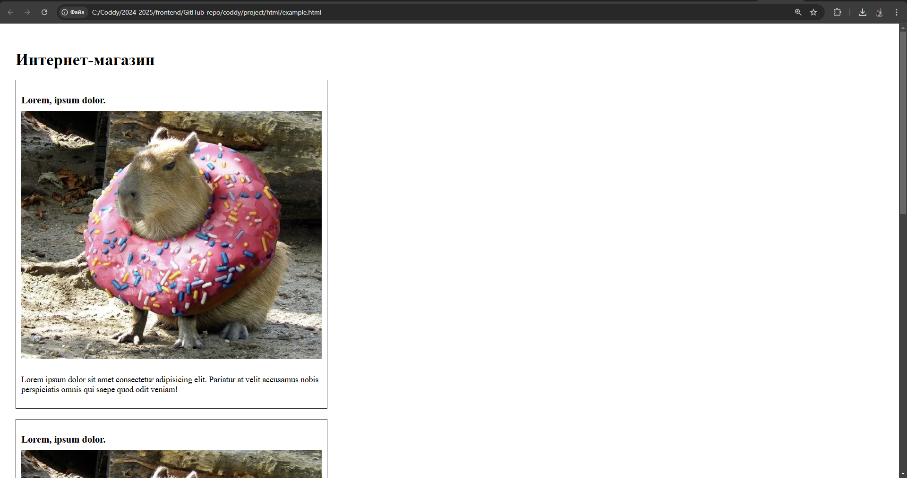

# Домашка к 2024-11-03

Сегодня на занятии мы продолжили рассмотрение CSS-стилизации.

## Теория

### Логические блоки, header-main-footer
Для упорядочивания информации на страничках принято выделять логически законченные блоки в элемент-контейнер (например, `div`). Логически законченными блоками часто бывают: различные списки (например, статей или карточек товаров), элементы этих списков (например, статьи или карточки товаров), блоки навигаций, формы отправки данных и многие другие:
```html
<!-- Блок навигации -->
<div>
    <a href="">Home</a>
    <a href="">About</a>
</div>

<!-- Блок с карточками товаров -->
<div class="cards">
    <!-- Карточка товара -->
    <a href="" class="card">
        <h4>Lorem ipsum dolor sit amet.</h4>
        <p>Lorem ipsum dolor sit amet consectetur adipisicing elit.</p>
    </a>
    <!-- Еще одна карточка товара -->
    <a href="" class="card">
        <h4>Lorem ipsum dolor sit amet.</h4>
        <p>Lorem ipsum dolor sit amet consectetur adipisicing elit.</p>
    </a>
</div>

<!-- Блок с информацией о разработчиках -->
<ul class="footer-list">
    <li><a href="https://t.me/katehok_1" target="_blank">@katehok_1</a></li>
    <li>&copy;&nbsp;2024</li>
    <li><a href="censored.url" target="_blank">@developer</a></li>
</ul>
```
Большинство (а возможно и все) сайты состоят из трех самых больших логических блоков, в роли которых мы пока что будем использовать тэги `div` со следующими классами:
1) `header` - это голова сайта. В этом блоке обычно размещают логотип сайта/компании, навигацию по сайту и (при наличии) кнопки `sign in`, `sign up`, `cart` (для интернет-магазинов) и прочие.
2) `main` - это основная часть сайта. В этом блоке располагают основной контент странички: различные статьи, карточки товаров и многое другое.
3) `footer` - это подвал сайта. В этом блоке обычно размещают организационную информацию: ссылки на компании-партнеры, информацию о правах/правообладателях и прочее.

Таким образом, стандартная структура нашего html-документа принимает вид:
```html
<!DOCTYPE html>
<html lang="en">
<head>
    <!-- Служебные тэги -->
</head>
<body class="body">

    <div class="header">
        <!-- Логотип сайта/компании, блок навигации, кнопки регистрации/авторизации -->
    </div>

    <div class="main">
        <!-- Основной контент страницы (главный заголовок сайта, статьи, формы отправки данных) -->
    </div>

    <div class="footer">
        <!-- Служебная информация о сайте (инфа о разработчике, инфа о правах, ссылки на партнеров компании) -->
    </div>
    
</body>
</html>
```
И теперь если мы заполним эту базовую структуру контентом, может получиться что-то типа такого:
```html
<!DOCTYPE html>
<html lang="en">
<head>
    <meta charset="UTF-8">
    <meta name="viewport" content="width=device-width, initial-scale=1.0">
    <title>Document</title>
</head>
<body class="body">
    <div class="header">
        <div>
            <a href="">Home</a>
            <a href="">About</a>
        </div>
    </div>

    <div class="main">
        <div class="cards">
            <a href="" class="card">
                <h4>Lorem ipsum dolor sit amet.</h4>
                <p>Lorem ipsum dolor sit amet consectetur adipisicing elit.</p>
            </a>
            <a href="" class="card">
                <h4>Lorem ipsum dolor sit amet.</h4>
                <p>Lorem ipsum dolor sit amet consectetur adipisicing elit.</p>
            </a>
        </div>
    </div>

    <div class="footer">
        <ul class="footer-list">
            <li><a href="https://t.me/katehok_1" target="_blank">@katehok_1</a></li>
            <li>&copy;&nbsp;2024</li>
            <li><a href="censored.url" target="_blank">@developer</a></li>
        </ul>
    </div>
</body>
</html>
```

### width, height
При помощи css-свойств `width` и `height` можно задавать ширину и высоту блочных элементов.

[width | MDN](https://developer.mozilla.org/ru/docs/Web/CSS/width)
[height | MDN](https://developer.mozilla.org/ru/docs/Web/CSS/height)

Помимо непосредственного указания ширины и высоты блоков можно указывать для них пороговые значения:
- `max-width` - максимальная ширина блока ([max-width | MDN](https://developer.mozilla.org/ru/docs/Web/CSS/max-width))
- `min-width` - минимальная ширина блока ([min-width | MDN](https://developer.mozilla.org/ru/docs/Web/CSS/min-width))
- `max-height` - максимальная высота ([max-height | MDN](https://developer.mozilla.org/ru/docs/Web/CSS/max-height))
- `min-height` - минимальная высота блока ([min-height | MDN](https://developer.mozilla.org/ru/docs/Web/CSS/min-height))

Для указания упомянутых свойств блока используют различные единицы измерения, среди которых:
- `px` - пиксели. Буквально размер в пикселях (`100px` - 100 пикселей, `1920px` - 1920 пикселей и тд)
- `%` - процент размера родительского объекта (`100%` - весь родительский объект, `20%` - 1/5 родительского объекта и тд)
- `vw` - Viewport Width. Процент от ширины экрана (`100vw` - на всю ширину экрана, `50vw` - на половину ширины экрана)
- `vh` - Viewport Height. Процент от высоты экрана (`46vh` - 46 процентов от высоты экрана, `3vh` - 3 процента от высоты экрана)
```html
<div class="container">
    <div class="block-1 bgc-red">1</div>
    <div class="block-2 bgc-green">2</div>
    <div class="block-3 bgc-blue">3</div>
    <div class="block-4 bgc-blueviolet">4</div>
</div>
```
```css
.container {
    box-sizing: border-box;

    width: 1080px;
    height: 720px;
    border: 5px solid black;
}

.block-1 {
    width: 500px;
    height: 200px;
}

.block-2 {
    width: 80%;
    height: 30%
}

.block-3 {
    width: 70vw;
    height: 10vh;
}

.block-4 {
    width: 30%;
    height: 20%;

    max-width: 500px;
    min-width: 300px;

    max-height: 100px;
    min-height: 50px;
}
```


### margin, padding, border
Каждый html-объект имеет три поля, окружающих его:
- `padding` - внутренний отступ элемента (расстояние между рамкой и контентом элемента)
- `border` - граница элемента (рамка)
- `margin` - внешний отступ элемента (расстояние между ним и другими элементами)
```html
<div class="bgc-red">Block before</div>
<div class="block-5 bgc-green">Content</div>
<div class="bgc-blue">Block after</div>
```
```css
.block-5 {
    width: 100px;
    height: 100px;

    padding: 5px;
    border: 2px solid black;
    margin: 10px;
}
```


#### border
Как было указано ранее, свойство [`border`](https://developer.mozilla.org/ru/docs/Web/CSS/border) задается при помощи трех параметров: ширина рамки, структура рамки и цвет рамки. Ширина задается при помощи стандартных единиц измерения размеров (обычно `px` - пиксели), цвет задается так же, как цвет заднего фона или цвет шрифта (словом, в формате [HEX](https://developer.mozilla.org/en-US/docs/Web/CSS/hex-color), при помощи [`rgb()`](https://developer.mozilla.org/en-US/docs/Web/CSS/color_value/rgb) и другими)

Структура рамки имеет следующие варианты:
- `solid` - сплошная линия
- `dashed` - пунктирная линия
- `double` - двойная сплошная линия
- `ridge` - рельефная
```html
    <div class="block-6 bgc-red">5px solid black</div>
    <br>
    <div class="block-7 bgc-green">10px dashed grey</div>
    <br>
    <div class="block-8 bgc-blue">15px double lightgreen</div>
    <br>
    <div class="block-9 bgc-blueviolet">20px ridge lightblue</div>
```
```css
.block-6 {
    width: 500px;
    height: 50px;
    
    border: 5px solid black;
}

.block-7 {
    width: 500px;
    height: 50px;
    
    border: 10px dashed grey;
}

.block-8 {
    width: 500px;
    height: 50px;
    
    border: 15px double lightgreen;
}

.block-9 {
    width: 500px;
    height: 50px;
    
    border: 20px ridge lightblue;
}
```


#### padding и margin
Внутренний отступ [`padding`](https://developer.mozilla.org/ru/docs/Web/CSS/padding) и внешний [`margin`](https://developer.mozilla.org/ru/docs/Web/CSS/margin) - задаются при помощи указания их размеров несколькими параметрами. Параметров может быть от одного до четырех, где каждый отвечает за размер отступа с определенной стороны: `top` - верхний, `right` - правый, `bottom` - нижний, `left` - левый (то есть, параметры задают размеры сторон, начиная с верхней и далее по часовой стрелке). Если параметров менбше, чем четыре, то они неявным образом копируются и подставляются снова, дополняя до четырех.
```html
<hr>
<div class="block-10 bgc-red">One parameter</div>
<hr>
<div class="block-11 bgc-green">Two parameters</div>
<hr>
<div class="block-12 bgc-blue">Three parameters</div>
<hr>
<div class="block-13 bgc-blueviolet">Four parameters</div>
<hr>
```
```css
.block-10 {
    width: 500px;
    border: 2px solid black;

    /* применяется ко всем сторонам */
    padding: 10px;
    margin: 10px;
}

.block-11 {
    width: 500px;
    border: 2px solid black;

    /* первый задает top и bottom */
    /* второй задает right и left */
    padding: 50px 10px;
    margin: 50px 10px;
}

.block-12 {
    width: 500px;
    border: 2px solid black;

    /* первый задает top */
    /* второй задает right и left */
    /* третий задает bottom */
    padding: 10px 50px 30px;
    margin: 10px 50px 30px;
}

.block-13 {
    width: 500px;
    border: 2px solid black;
    
    /* первый задает top */
    /* второй задает right */
    /* третий задает bottom */
    /* четвертый задает left */
    padding: 10px 50px 30px 0;
    margin: 10px 50px 30px 0;
}
```

Также можно использовать свойства `margin` и `padding` с постфиксами:
- `-top` - размер отступа сверху ([`margin-top`](https://developer.mozilla.org/ru/docs/Web/CSS/margin-top), [`padding-top`](https://developer.mozilla.org/en-US/docs/Web/CSS/padding-top))
- `-right` - размер отступа справа ([`margin-right`](https://developer.mozilla.org/ru/docs/Web/CSS/margin-right), [`padding-right`](https://developer.mozilla.org/ru/docs/Web/CSS/padding-right))
- `-bottom` - размер отступа снизу ([`margin-bottom`](https://developer.mozilla.org/ru/docs/Web/CSS/margin-bottom), [`padding-bottom`](https://developer.mozilla.org/en-US/docs/Web/CSS/padding-bottom))
- `-left` - размер отступа слева ([`margin-left`](https://developer.mozilla.org/ru/docs/Web/CSS/margin-left), [`padding-left`](https://developer.mozilla.org/ru/docs/Web/CSS/padding-left))

### box-sizing
Свойство [`box-sizing`](https://developer.mozilla.org/ru/docs/Web/CSS/box-sizing) определяет, что задают параметры `width` и `height`:
- `content-box` (значение по умолчанию) - определяет, что параметры ширины и высоты задаются для контента
- `border-box` - определяет, что параметры ширины и высоты задаются для внешней краницы рамки
```html
<hr>
<div class="block-14 bgc-red">content-box (default)</div>
<hr>
<div class="block-15 bgc-green">border-box</div>
<hr>
```
```css
.block-14 {
    width: 500px;
    border: 10px solid black;
    padding: 20px;

    /* значение content-box - по умолчанию */
    /* box-sizing: content-box; */
}

.block-15 {
    width: 500px;
    border: 10px solid black;
    padding: 20px;
    
    box-sizing: border-box;
}
```

Для первого блока указанное свойство `width` задает размер только для контента, а для второго блока свойство `width` задает размер для внешней стороны рамки (в этом случае размер контента будет вычислен путем вычитания из значения `width` размера рамки (`10px` + `10px`) и размера внутреннего отступа `padding` (`20px` + `20px`)). Таким образом размер контента второго блока составит `500px - (10px + 10px) - (20px + 20px) = 440px`. Этот момент всегда надо учитывать.

## Home Work

### Download changes
Подгружаем из своего репозитория на ГитХабе изменения, которые мы вносили в конце урока (открываете git-bash в папке вашего локального git-репозитория и вводите):
```bash
# Копируете путь до вашей папки с проектом
# У меня он такой: C:\Coddy\2024-2025\frontend\GitHub-repo\coddy
# Переходим в папку с проктом (путь до папки проекта указываем в кавычках, иначе гит-баш может ругаться)
cd 'C:\Coddy\2024-2025\frontend\GitHub-repo\coddy'

# Скачиваем  изменения из удаленного репозитория на гитхабе
git pull
```
Вводите парольную фразу - и все изменения с ГитХаба скачаются в ваш локальный git-репозиторий

### example.html и example.css
Удалить всё из файлов `example.html` и `example.css`.

Добавляете базовую структуру в `example.html` (смотрите теорию о логических блоках), подключаете css-файл `example.css` (он должен лежать в папке `style/`).

В `example.css` для `body` указываете все внутренние отступы `30` пикселей. Все внешние отступы для `body` указываете равными нулю. Для `body` указываете минимальную высоту, равную `100` процентам от высоты экрана, ширину указываете `100` процентов от ширины экрана, максимальную ширину указываете равной `1600` пикселей, минимальную ширину указываете - `720` пикселей. При всем при этом учтите, что размеры должны отсчитываться по внешнему краю рамки (смотрите свойство `box-sizing`).

Внутрь блока `main` добавляете заголовок первого уровня (`h1`) с классом `main-heading` с текстом `Интернет-магазин`

У главного заголовка должен быть внешний нижний отступ размером в `20` пикселей

После него добавляете блок `div` с классом `cards`, внутри которого добавляете три карточки товаров. Карточка товара - это блок `div`, внутри которого - заголовок третьего уровня (`h3`) с классом `card-title` (название товара), картинка (`img`) с классом `card-img` (картинка товара) и небольшой текстовый блок (`p`) с классом `txt` (краткое описание товара).

У каждой карточки товара должна быть ширина в `600` пикселей, внешний нижний отступ в `20` пикселей, внутренние отступы в `10` пикселей, сплошная черная рамка толщиной в один пиксель. Все размеры карточек товаров также как и у блока `body` должны отсчитываться от внешних границ рамки (смотрите свойство `box-sizing`).

Заголовок внутри каждой карточки товаров должен иметь внешний нижний отступ размером в `10` пикселей.

Картинка внутри каждой карточки товаров должна иметь ширину, равную `100` процентам ширины самой карточки, а также иметь внешний нижний отчтуп в `10` пикселей.

Для текста можете изменить размер и начертание шрифта (при желании).

Таким образом, ваш `example.html` должен выглядеть примерно так:


### Project
Для тех, кто не сделал на занятии:
- удалите заголовок из блока навигации
- базовая структура всех страничек нашего проекта теперь должна быть, как указано в блоке теории (то есть внутри `body` три блока: `header`, `main` и `footer` - можете сделать аналогично [моим страничкам](https://github.com/KATEHOK/coddy/tree/main/project/html))
- в самом начале файла `style.css` вставьте стили по умолчанию для всез объектов (без внешних отступов, без внутренних отступов, считать размер блока по внешним границам его рамки):
```css
* {
    margin: 0;
    padding: 0;
    box-sizing: border-box;
}
```
- добавьте для `body` внутренние отступы размером в `30` пикселей
- если вы делали блок навигации через список (`ul` или `ol`), то добавьте ему внутренний левый отступ размером в `15` пикселей
- добавьте блокам `header` и `main` внешний нижний отступ размером в `20` пикселей
- добавьте всем элементам с классом `heading` внешний нижний отступ в `10` пикселей
- добавьте всем элементам с классом `main-heading` внешний нижний отступ в `20` пикселей

### Passing task
Когда выполнили все задания, добавляете измененные файлы проекта в индекс гита, создаете коммит, отправляете на GitHub:
```bash
# Добавляем измененные файлы в индекс гита (. - добавить все)
git add .

# Создаем коммит на основании изщменений, добавленных в индекс гита, задаем сообщение коммита
git commit -m "Finally done my homework to 2024-10-27"

# Загружаем изменения в удаленный репозиторий на гитхабе
git push
```
После этого скидываете мне в личку ссылку на ваш гитхаб-репозиторий. Если скинете до пятницы 6 часов вечера, то в течение суток гарантированно получите обратную связь с разбором ошибок и предложениями по улучшению.

### Recomendations
- группируйте CSS-селекторы разных объектов вместе, если задаете им одинаковые правила,
- делайте и сдавайте дз как можно раньше, чтобы я успел проверить и дать фидбэк.

#### Всем удачи!