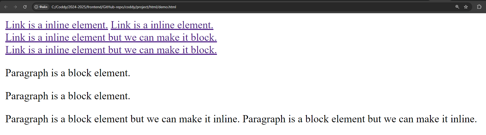
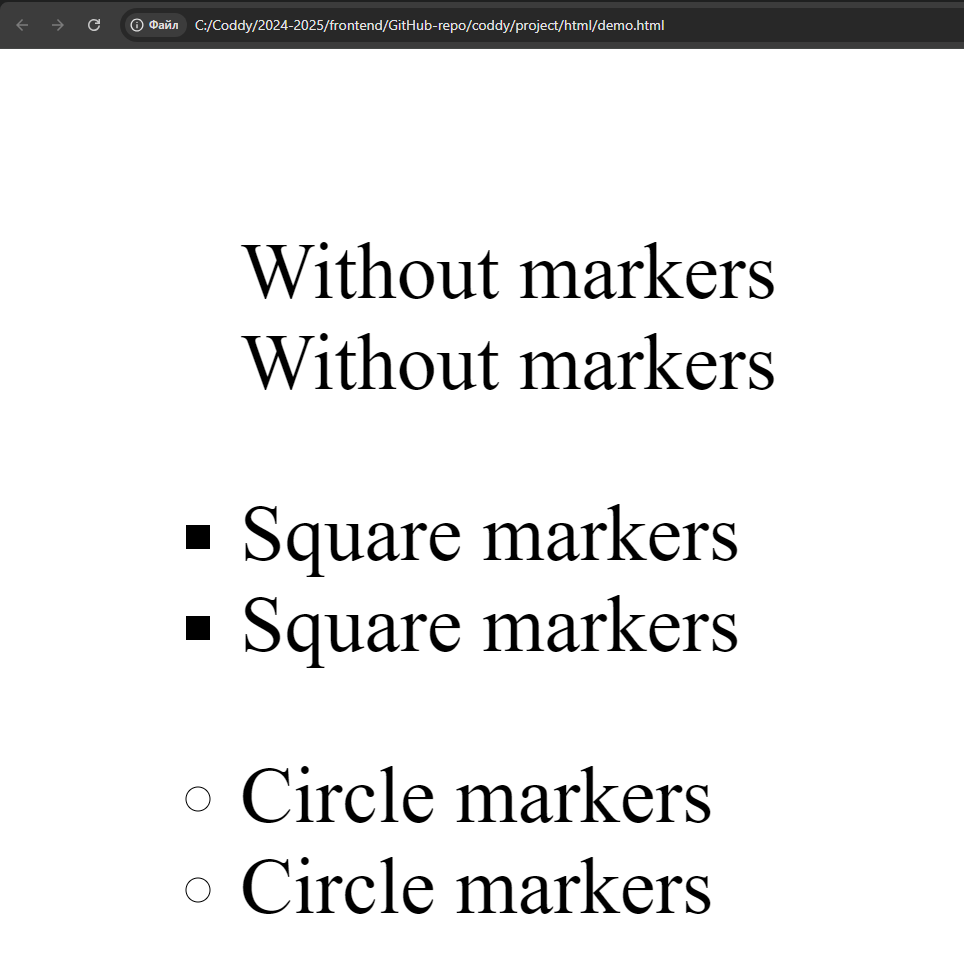
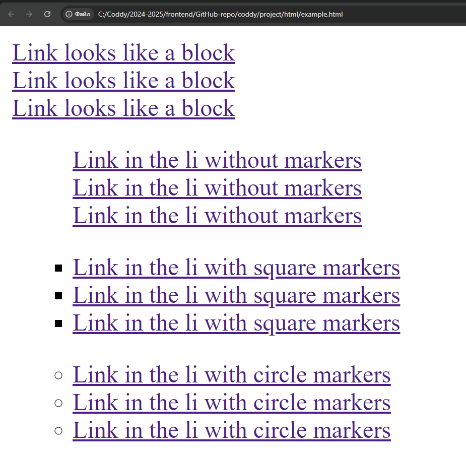
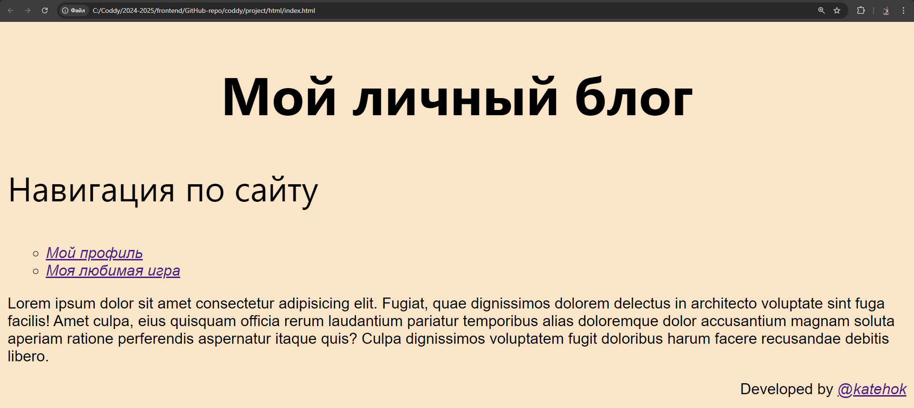

# Домашка к 2024-10-27

Сегодня на занятии мы продолжили рассмотрение CSS-стилизации.

## Теория

### display
Как вы помните, html-объекты делятся на блочные и строчные. CSS-свойство `display` может менять эту характеристику объекта:
```html
<a href="">Link is a inline element.</a>
<a href="">Link is a inline element.</a>
<a href="" class="block">Link is a inline element but we can make it block.</a>
<a href="" class="block">Link is a inline element but we can make it block.</a>

<p>Paragraph is a block element.</p>
<p>Paragraph is a block element.</p>
<p class="inline">Paragraph is a block element but we can make it inline.</p>
<p class="inline">Paragraph is a block element but we can make it inline.</p>
```
```css
.block {
    /* Элементы с классом block будут теперь блочными */
    display: block;
}

.inline {
    /* Элементы с классом inline будут теперь строчными */
    display: inline;
}
```
[display - CSS | MDN](https://developer.mozilla.org/ru/docs/Web/CSS/display)


### list-style-type
Свойство `list-style-type` устанавливает тип маркера для отображения у списка:
```html
<ul class="marker-none">
    <li>Without markers</li>
    <li>Without markers</li>
</ul>

<ul class="marker-square">
    <li>Square markers</li>
    <li>Square markers</li>
</ul>

<ul class="marker-circle">
    <li>Circle markers</li>
    <li>Circle markers</li>
</ul>
```
```css
.marker-none {
    /* Без маркера */
    list-style-type: none;
}

.marker-square {
    /* Маркер - квадрат */
    list-style-type: square;
}

.marker-circle {
    /* Маркер - окружность */
    list-style-type: circle;
}
```
[list-style-type - CSS | MDN](https://developer.mozilla.org/en-US/docs/Web/CSS/list-style-type)


## Home Work

### Download changes
Подгружаем из своего репозитория на ГитХабе изменения, которые мы вносили в конце урока (открываете git-bash в папке вашего локального git-репозитория и вводите):
```bash
# Копируете путь до вашей папки с проектом
# У меня он такой: C:\Coddy\2024-2025\frontend\GitHub-repo\coddy
# Переходим в папку с проктом (путь до папки проекта указываем в кавычках, иначе гит-баш может ругаться)
cd 'C:\Coddy\2024-2025\frontend\GitHub-repo\coddy'

# Скачиваем  изменения из удаленного репозитория на гитхабе
git pull
```
Вводите парольную фразу - и все изменения с ГитХаба скачаются в ваш локальный git-репозиторий

### example.html
Вставить 4 блока навигации:
1) внутри элемента `div` три элемента `a` с классом `nav-item` и любым текстом
2) ненумерованный список (`ul`) с классом `nav-none-markers`, внутри - три элемента `li`, в каждом из которых - `a` с любым текстом
3) ненумерованный список (`ul`) с классом `nav-square-markers`, внутри - три элемента `li`, в каждом из которых - `a` с любым текстом
4) ненумерованный список (`ul`) с классом `nav-circle-markers`, внутри - три элемента `li`, в каждом из которых - `a` с любым текстом

### example.css
Создайте в папке `style/` и подключите файл стилей `example.css` к страничке `example.html`

Добавьте в `example.css` стили для классов:
1) `nav-item` - блочное отображение (свойство `display`)
2) `nav-none-markers` - отключите отображение маркеров (свойство `list-style-type`)
3) `nav-square-markers` - измените маркеры на квадраты (свойство `list-style-type`)
4) `nav-circle-markers` - измените маркеры на окружности (свойство `list-style-type`)

Теперь ваша страничка `example.html` должна выглядеть примерно так:


По желанию можете аналогичным образом добавить еще блоки навигации с другими маркерами, подключенными с использованием `list-style-type`.

### Project
Рассмотрите варианты навигации, сделанные в предыдущем пункте, и выберете наиболее понравившийся. Измените ваши блоки навигации на всех страничках проекта согласно выбранному (не забудьте про классы `link` и `txt` для ссылок)

Например, мне понравился вариант с маркерами в виде окружности:


### Passing task
Когда выполнили все задания, добавляете измененные файлы проекта в индекс гита, создаете коммит, отправляете на GitHub:
```bash
# Добавляем измененные файлы в индекс гита (. - добавить все)
git add .

# Создаем коммит на основании изщменений, добавленных в индекс гита, задаем сообщение коммита
git commit -m "Finally done my homework to 2024-10-27"

# Загружаем изменения в удаленный репозиторий на гитхабе
git push
```
После этого скидываете мне в личку ссылку на ваш гитхаб-репозиторий. Если скинете до пятницы 6 часов вечера, то в течение суток гарантированно получите обратную связь с разбором ошибок и предложениями по улучшению.

### Recomendations
- группируйте CSS-селекторы разных объектов вместе, если задаете им одинаковые правила,
- делайте и сдавайте дз как можно раньше, чтобы я успел проверить и дать фидбэк.

#### Всем удачи!