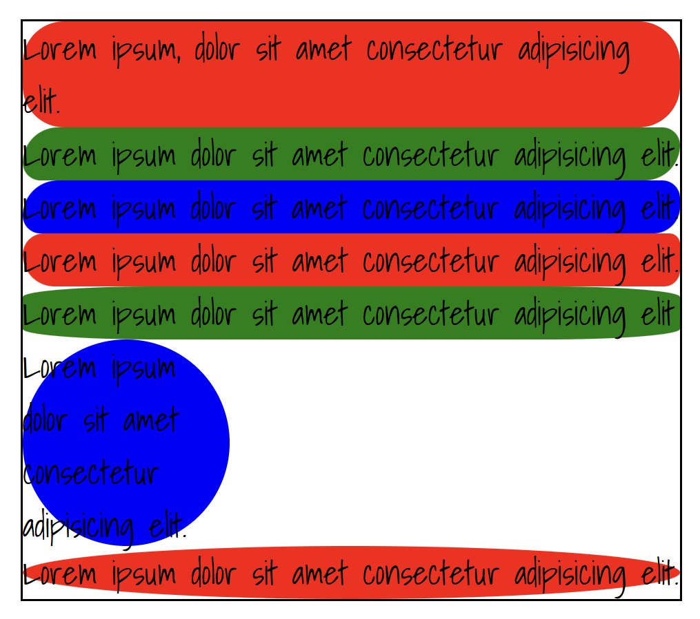
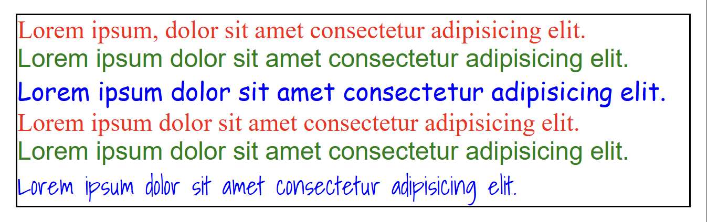
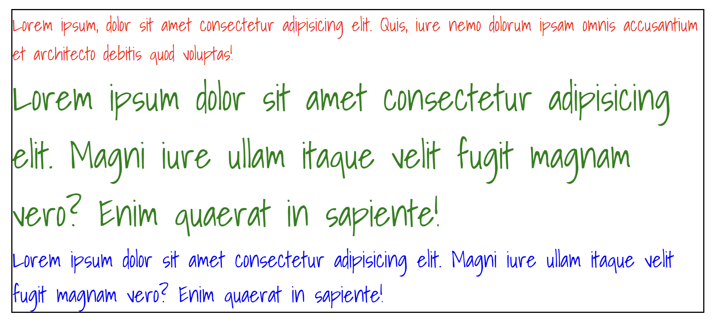
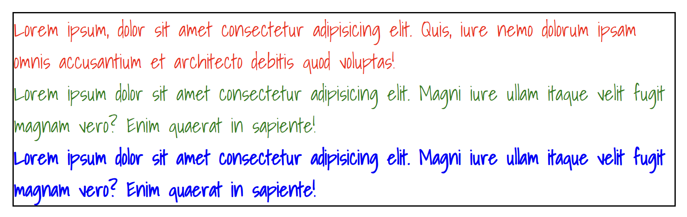
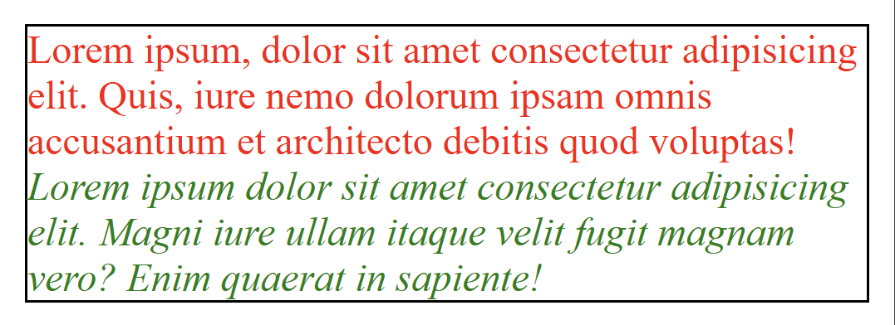
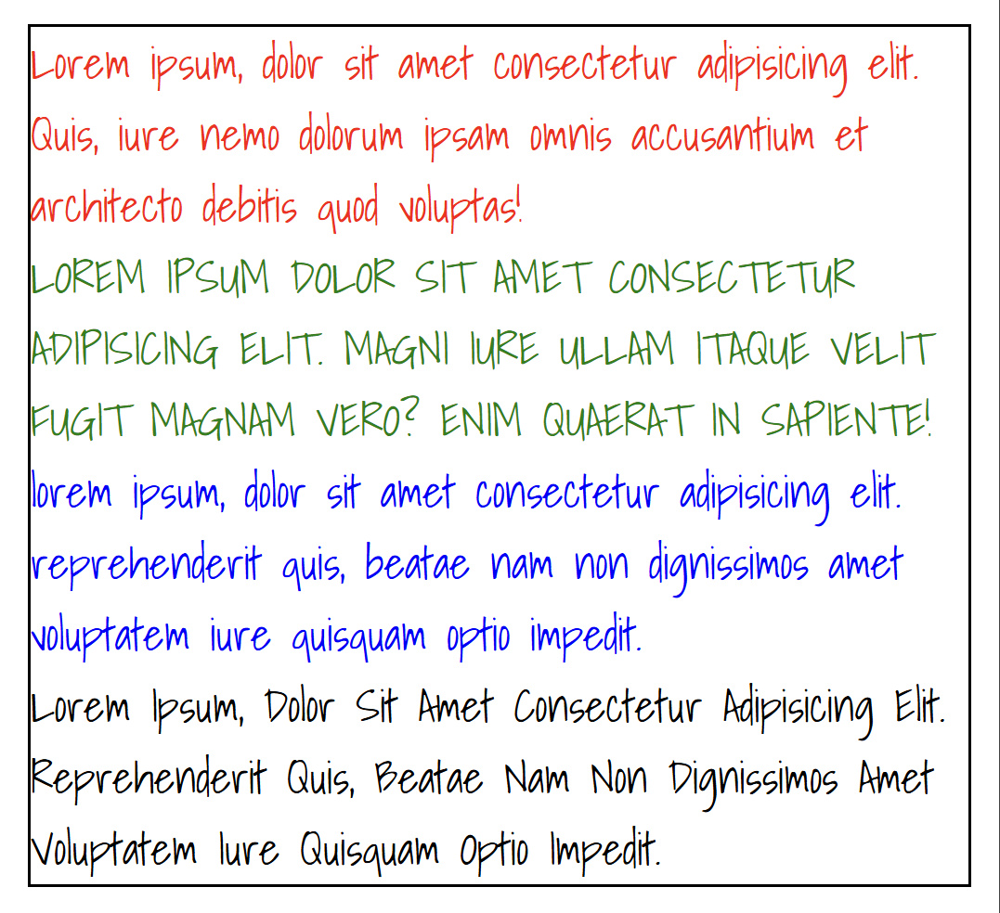
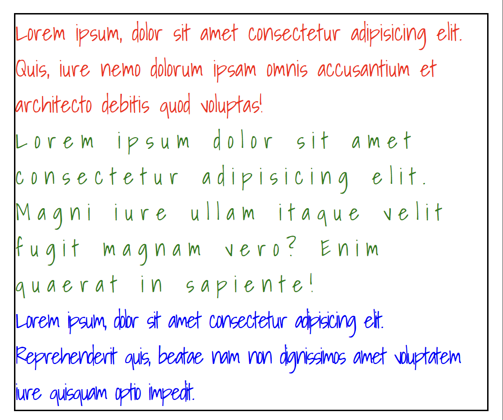
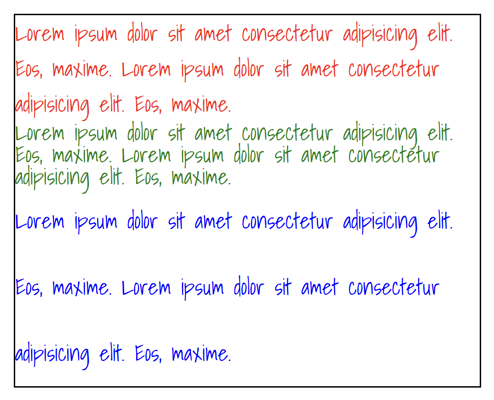
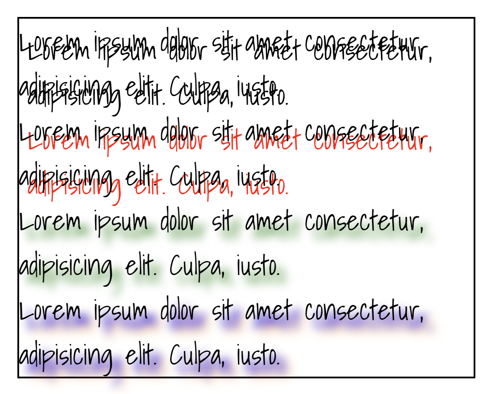
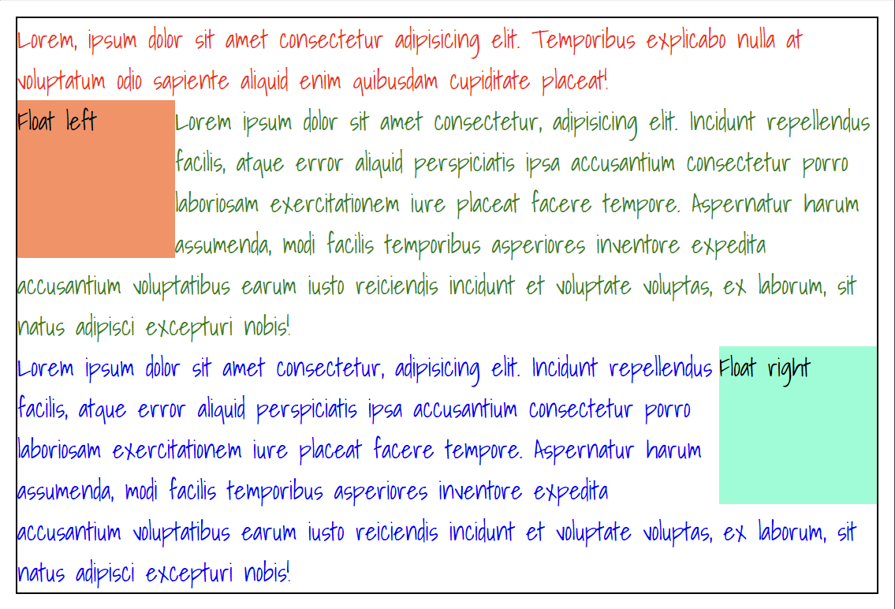

# Домашка к 2024-11-10

Сегодня на занятии мы продолжили рассмотрение CSS-стилизации.

Посмотреть "вживую" на примерчики с занятия и из теоретического блока (который ниже) можно тут: [html-файл](./project/html/demo.html), [css-файл](./project/style/demo.css).

## Теория

### [border-radius](https://developer.mozilla.org/ru/docs/Web/CSS/border-radius)

`border-radius` — это CSS-свойство, позволяющее разработчикам определять, как скругляются границы блока. Закруглённость каждого угла определяется с помощью одного или двух радиусов, определяя его форму: круг или эллипс.

```html
<div class="bordered">
    <p class="border-radius-1">
        Lorem ipsum, dolor sit amet consectetur adipisicing elit.
    </p>
    <p class="border-radius-2">
        Lorem ipsum dolor sit amet consectetur adipisicing elit.
    </p>
    <p class="border-radius-3">
        Lorem ipsum dolor sit amet consectetur adipisicing elit.
    </p>
    <p class="border-radius-4">
        Lorem ipsum dolor sit amet consectetur adipisicing elit.
    </p>
    <p class="border-radius-5">
        Lorem ipsum dolor sit amet consectetur adipisicing elit
    </p>
    <p class="border-radius-6">
        Lorem ipsum dolor sit amet consectetur adipisicing elit.
    </p>
    <p class="border-radius-7">
        Lorem ipsum dolor sit amet consectetur adipisicing elit.
    </p>
</div>
```
```css
.border-radius-1 {
    background-color: red;
    border-radius: 20px;
}
.border-radius-2 {
    background-color: green;
    border-radius: 20px 10px;
}
.border-radius-3 {
    background-color: blue;
    border-radius: 20px 10px 15px;
}
.border-radius-4 {
    background-color: red;
    border-radius: 20px 10px 15px 30px;
}
.border-radius-5 {
    background-color: green;
    border-radius: 20%;
}
.border-radius-6 {
    background-color: blue;
    height: 100px;
    width: 100px;
    border-radius: 50%;
}
.border-radius-7 {
    background-color: red;
    border-radius: 50%;
}
```



### [font-family](https://developer.mozilla.org/ru/docs/Web/CSS/font-family)

CSS-свойство `font-family` определяет приоритетный список из одного или нескольких названий семейства шрифтов и/или общее имя шрифта для выбранного элемента.

Помимо использования стандартных шрифтов можно подключать и другие, например, с сайта [Google Fonts](https://fonts.google.com/).

Внутри `head`:

```html
<link rel="preconnect" href="https://fonts.googleapis.com">
<link rel="preconnect" href="https://fonts.gstatic.com" crossorigin>
<link href="https://fonts.googleapis.com/css2?family=Shadows+Into+Light&family=Tiny5&display=swap" rel="stylesheet">
```

Внутри `body`:

```html
<div class="bordered">
    <p class="font-family-1">
        Lorem ipsum, dolor sit amet consectetur adipisicing elit.
    </p>
    <p class="font-family-2">
        Lorem ipsum dolor sit amet consectetur adipisicing elit.
    </p>
    <p class="font-family-3">
        Lorem ipsum dolor sit amet consectetur adipisicing elit.
    </p>
    <p class="font-family-4">
        Lorem ipsum dolor sit amet consectetur adipisicing elit.
    </p>
    <p class="font-family-5">
        Lorem ipsum dolor sit amet consectetur adipisicing elit.
    </p>
    <p class="font-family-6">
        Lorem ipsum dolor sit amet consectetur adipisicing elit.
    </p>
</div>
```
```css
.font-family-1 {
    color: red;
    font-family: serif;
}
.font-family-2 {
    color: green;
    font-family: sans-serif;
}
.font-family-3 {
    color: blue;
    font-family: cursive;
}
.font-family-4 {
    color: red;
    font-family: 'Times New Roman', Times, serif;
}
.font-family-5 {
    color: green;
    font-family: Arial, Helvetica, sans-serif;
}
.font-family-6 {
    color: blue;
    font-family: "Shadows Into Light", cursive;;
}
```



### [font-size](https://developer.mozilla.org/ru/docs/Web/CSS/font-size)

CSS Свойство `font-size` определяет размер шрифта. Это свойство также используется для вычисления размера `em`, `ex` и других относительных единиц.

```html
<div class="bordered">
    <p class="font-size-1">
        Lorem ipsum, dolor sit amet consectetur adipisicing elit. Quis, iure nemo dolorum ipsam omnis accusantium et architecto debitis quod voluptas!
    </p>
    <p class="font-size-2">
        Lorem ipsum dolor sit amet consectetur adipisicing elit. Magni iure ullam itaque velit fugit magnam vero? Enim quaerat in sapiente!
    </p>
    <p class="font-size-3">
        Lorem ipsum dolor sit amet consectetur adipisicing elit. Magni iure ullam itaque velit fugit magnam vero? Enim quaerat in sapiente!
    </p>
</div>
```
```css
.font-size-1 {
    color: red;
    font-size: 16px;
}
.font-size-2 {
    color: green;
    font-size: 200%;
}
.font-size-3 {
    color: blue;
    font-size: 1.2rem;
}
```



### [font-weight](https://developer.mozilla.org/ru/docs/Web/CSS/font-weight)

CSS свойство `font-weight` устанавливает жирность шрифта. Некоторые шрифты доступны только в нормальном или полужирном начертании.

```html
<div class="bordered">
    <p class="font-weight-1">
        Lorem ipsum, dolor sit amet consectetur adipisicing elit. Quis, iure nemo dolorum ipsam omnis accusantium et architecto debitis quod voluptas!
    </p>
    <p class="font-weight-2">
        Lorem ipsum dolor sit amet consectetur adipisicing elit. Magni iure ullam itaque velit fugit magnam vero? Enim quaerat in sapiente!
    </p>
    <p class="font-weight-3">
        Lorem ipsum dolor sit amet consectetur adipisicing elit. Magni iure ullam itaque velit fugit magnam vero? Enim quaerat in sapiente!
    </p>
</div>
```
```css
.font-weight-1 {
    color: red;
    font-weight: normal;
}
.font-weight-2 {
    color: green;
    font-weight: light;
}
.font-weight-3 {
    color: blue;
    font-weight: bold;
}
```



### [font-style](https://developer.mozilla.org/ru/docs/Web/CSS/font-style)

`font-style` это CSS-свойство определяющее каким образом шрифт должен быть стилизирован, будь это normal, italic, или oblique face из его font-family.

```html
<div class="bordered">
    <p class="font-style-1">
        Lorem ipsum, dolor sit amet consectetur adipisicing elit. Quis, iure nemo dolorum ipsam omnis accusantium et architecto debitis quod voluptas!
    </p>
    <p class="font-style-2">
        Lorem ipsum dolor sit amet consectetur adipisicing elit. Magni iure ullam itaque velit fugit magnam vero? Enim quaerat in sapiente!
    </p>
</div>
```
```css
.font-style-1 {
    font-family: serif;
    color: red;
    font-style: normal;
}
.font-style-2 {
    font-family: serif;
    color: green;
    font-style: italic;
}
```



### [text-transform](https://developer.mozilla.org/en-US/docs/Web/CSS/text-transform)

Свойство CSS `text-transform` определяет, как сделать текст элемента заглавным. Его можно использовать для того, чтобы текст отображался полностью заглавными или полностью строчными буквами, или чтобы каждое слово было заглавным.

```html
<div class="bordered">
    <p class="text-transform-1">
        Lorem ipsum, dolor sit amet consectetur adipisicing elit. Quis, iure nemo dolorum ipsam omnis accusantium et architecto debitis quod voluptas!
    </p>
    <p class="text-transform-2">
        Lorem ipsum dolor sit amet consectetur adipisicing elit. Magni iure ullam itaque velit fugit magnam vero? Enim quaerat in sapiente!
    </p>
    <p class="text-transform-3">
        Lorem ipsum, dolor sit amet consectetur adipisicing elit. Reprehenderit quis, beatae nam non dignissimos amet voluptatem iure quisquam optio impedit.
    </p>
    <p class="text-transform-4">
        Lorem ipsum, dolor sit amet consectetur adipisicing elit. Reprehenderit quis, beatae nam non dignissimos amet voluptatem iure quisquam optio impedit.
    </p>
</div>
```
```css
.text-transform-1 {
    color: red;
    text-transform: none;
}
.text-transform-2 {
    color: green;
    text-transform: uppercase;
}
.text-transform-3 {
    color: blue;
    text-transform: lowercase;
}
.text-transform-4 {
    color: black;
    text-transform: capitalize;
}
```



### [letter-spacing](https://developer.mozilla.org/ru/docs/Web/CSS/letter-spacing)

Свойство `letter-spacing` определяет межбуквенное расстояние в тексте.

```html
<div class="bordered">
    <p class="letter-spacing-1">
        Lorem ipsum, dolor sit amet consectetur adipisicing elit. Quis, iure nemo dolorum ipsam omnis accusantium et architecto debitis quod voluptas!
    </p>
    <p class="letter-spacing-2">
        Lorem ipsum dolor sit amet consectetur adipisicing elit. Magni iure ullam itaque velit fugit magnam vero? Enim quaerat in sapiente!
    </p>
    <p class="letter-spacing-3">
        Lorem ipsum, dolor sit amet consectetur adipisicing elit. Reprehenderit quis, beatae nam non dignissimos amet voluptatem iure quisquam optio impedit.
    </p>
</div>
```
```css
.letter-spacing-1 {
    color: red;
    letter-spacing: normal;
}
.letter-spacing-2 {
    color: green;
    letter-spacing: 5px;
}
.letter-spacing-3 {
    color: blue;
    letter-spacing: -1px;
}
```



### [line-height](https://developer.mozilla.org/ru/docs/Web/CSS/line-height)

Свойство CSS `line-height` устанавливает величину пространства между строками, например в тексте. В блочных элементах оно указывает минимальную высоту блоков строк внутри элемента.

```html
<div class="bordered">
    <p class="line-height-1">
        Lorem ipsum dolor sit amet consectetur adipisicing elit. Eos, maxime.
        Lorem ipsum dolor sit amet consectetur adipisicing elit. Eos, maxime.
    </p>
    <p class="line-height-2">
        Lorem ipsum dolor sit amet consectetur adipisicing elit. Eos, maxime.
        Lorem ipsum dolor sit amet consectetur adipisicing elit. Eos, maxime.
    </p>
    <p class="line-height-3">
        Lorem ipsum dolor sit amet consectetur adipisicing elit. Eos, maxime.
        Lorem ipsum dolor sit amet consectetur adipisicing elit. Eos, maxime.
    </p>
</div>
```
```css
.line-height-1 {
    color: red;
    line-height: normal;
}
.line-height-2 {
    color: green;
    line-height: 16px;
}
.line-height-3 {
    color: blue;
    line-height: 300%;
}
```



### [text-shadow](https://developer.mozilla.org/ru/docs/Web/CSS/text-shadow)

CSS-свойство `text-shadow` добавляет тени к тексту. Свойство задаётся разделённым запятыми списком теней, которые будут применены к тексту. Любая тень описывается комбинацией смещений по осям X и Y относительно элемента, радиусом размытия и цветом.

```html
<div class="bordered">
    <p class="shadow-1">
        Lorem ipsum dolor sit amet consectetur, adipisicing elit. Culpa, iusto.
    </p>
    <p class="shadow-2">
        Lorem ipsum dolor sit amet consectetur, adipisicing elit. Culpa, iusto.
    </p>
    <p class="shadow-3">
        Lorem ipsum dolor sit amet consectetur, adipisicing elit. Culpa, iusto.
    </p>
    <p class="shadow-4">
        Lorem ipsum dolor sit amet consectetur, adipisicing elit. Culpa, iusto.
    </p>
</div>
```
```css
.shadow-1 {
    text-shadow: 5px 5px;
}
.shadow-2 {
    text-shadow: 5px 5px red;
}
.shadow-3 {
    text-shadow: 5px 5px 5px green;
}
.shadow-4 {
    text-shadow: 5px 5px 5px blue, 7px 7px 7px darkorange;
}
```



### [float](https://developer.mozilla.org/ru/docs/Web/CSS/float)

Свойство `float` CSS указывает, что элемент должен быть взят из нормального потока и помещён вдоль левой или правой стороны его контейнера, где текст и встроенные элементы будут обтекать его.

Что это значит?

Нормальный поток - это, по сути, последовательное расположение элементов - один под другим. Свойство `float` позволяет изменить такое поведение объекта, приклеивая его к левой или правой границе блока-родителя. При этом текст и строчные элементы будут обтекать этот объект справа или слева (в зависимостри от значения рассматриваемого свойства).

```html
<div class="bordered">
    <p class="red-text">
        Lorem, ipsum dolor sit amet consectetur adipisicing elit. Temporibus explicabo nulla at voluptatum odio sapiente aliquid enim quibusdam cupiditate placeat!
    </p>
    <div class="float-left">Float left</div>
    <p class="green-text">
        Lorem ipsum dolor sit amet consectetur, adipisicing elit. Incidunt repellendus facilis, atque error aliquid perspiciatis ipsa accusantium consectetur porro laboriosam exercitationem iure placeat facere tempore. Aspernatur harum assumenda, modi facilis temporibus asperiores inventore expedita accusantium voluptatibus earum iusto reiciendis incidunt et voluptate voluptas, ex laborum, sit natus adipisci excepturi nobis!
    </p>
    <div class="float-right">Float right</div>
    <p class="blue-text">
        Lorem ipsum dolor sit amet consectetur, adipisicing elit. Incidunt repellendus facilis, atque error aliquid perspiciatis ipsa accusantium consectetur porro laboriosam exercitationem iure placeat facere tempore. Aspernatur harum assumenda, modi facilis temporibus asperiores inventore expedita accusantium voluptatibus earum iusto reiciendis incidunt et voluptate voluptas, ex laborum, sit natus adipisci excepturi nobis!
    </p>
</div>
```
```css
.bordered {
    margin: 10px;
    border: 1px solid black;
}

.red-text {
    color: red;
}
.green-text {
    color: green;
}
.blue-text {
    color: blue;
}

.float-left {
    height: 100px;
    width: 100px;
    background-color: #ff8d5f;

    float: left;
}
.float-right {
    height: 100px;
    width: 100px;
    background-color: aquamarine;

    float: right;
}
```


## Домашка

### Download changes

Перед непосредственным выполнением домашней работы необходимо синхронизировать локальный и удаленный репозитории. Для этого скачиваем все изменения из удаленного репозитория с помощью команды:

```bash
git pull
```

Если на этом этапе возникает ошибка или нестандартное поведение программы, пишите мне в личку, прикладывая скрин проблемы/ошибки.

###

### Pass task
Когда выполнили все задания, добавляете измененные файлы проекта в индекс гита, создаете коммит, отправляете на GitHub:
```bash
# Добавляем измененные файлы в индекс гита (. - добавить все)
git add .

# Создаем коммит на основании изщменений, добавленных в индекс гита, задаем сообщение коммита
git commit -m "Finally done my homework to 2024-11-10"

# Загружаем изменения в удаленный репозиторий на гитхабе
git push
```
После этого скидываете мне в личку ссылку на ваш гитхаб-репозиторий. Если скинете до пятницы 6 часов вечера, то в течение суток гарантированно получите обратную связь с разбором ошибок и предложениями по улучшению.

### Recomendations
- группируйте CSS-селекторы разных объектов вместе, если задаете им одинаковые правила,
- делайте и сдавайте дз как можно раньше, чтобы я успел проверить и дать фидбэк.

#### Всем удачи!