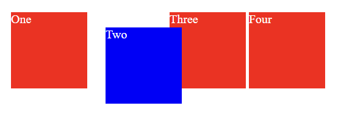
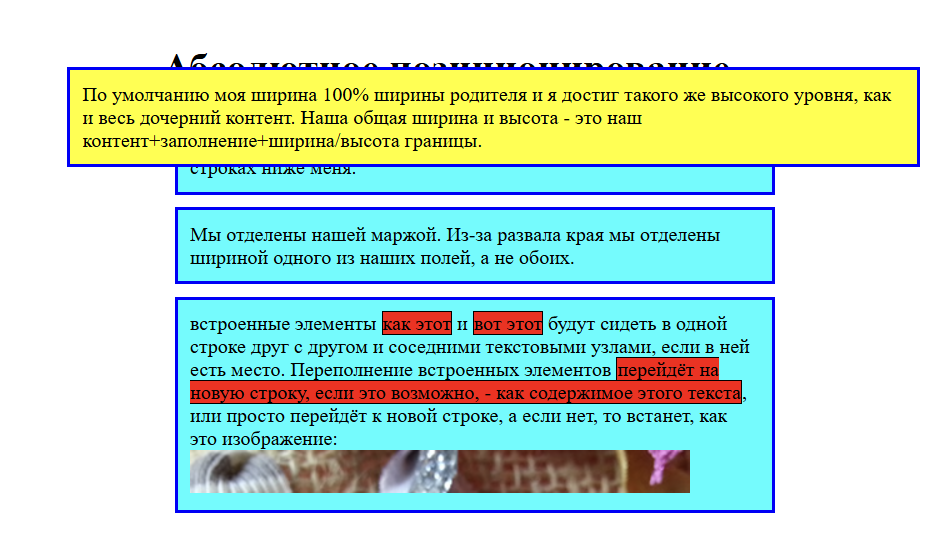
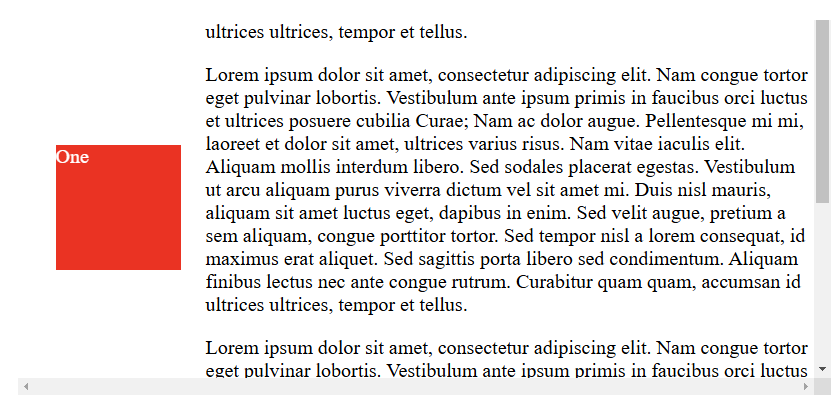
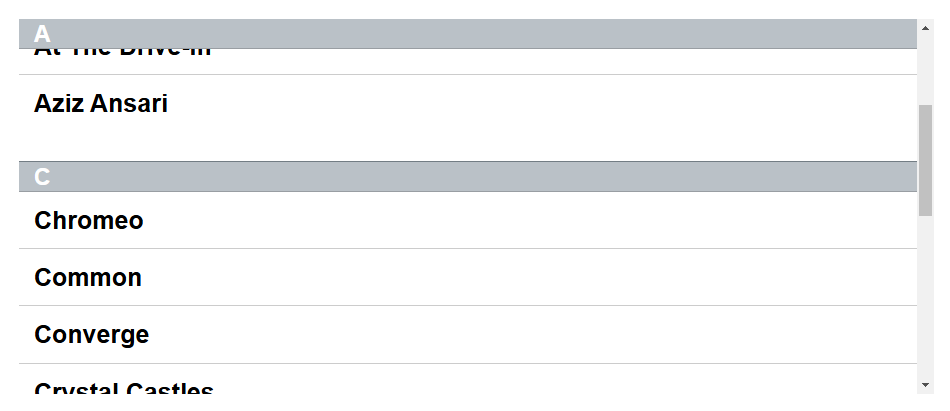
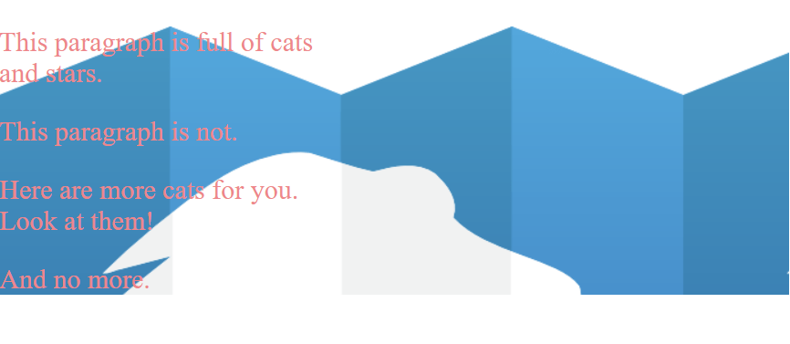
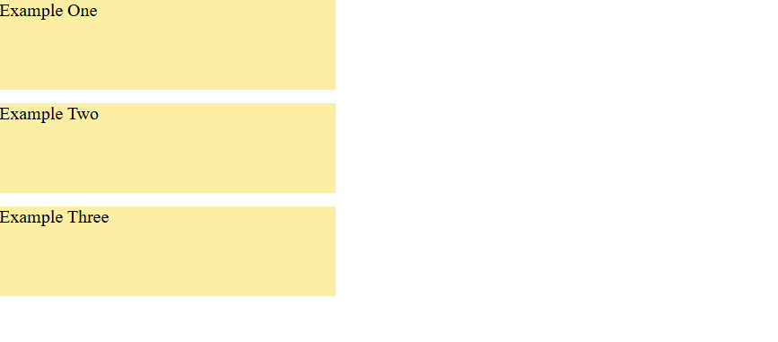
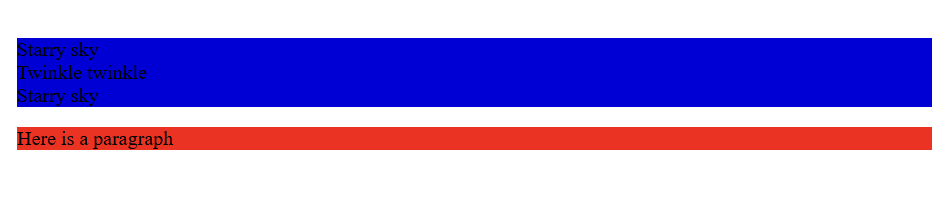
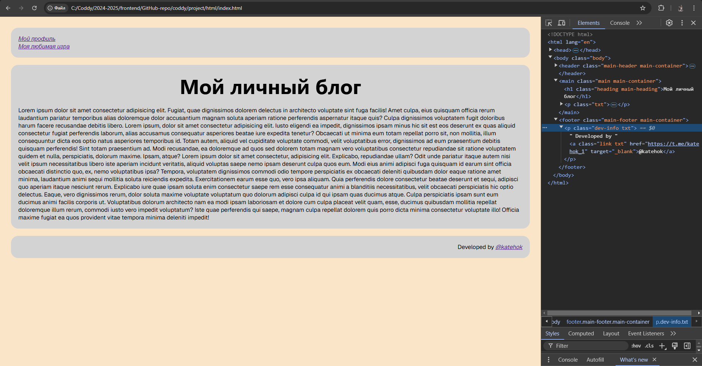
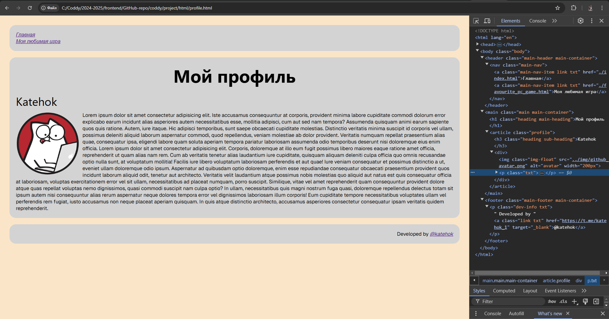
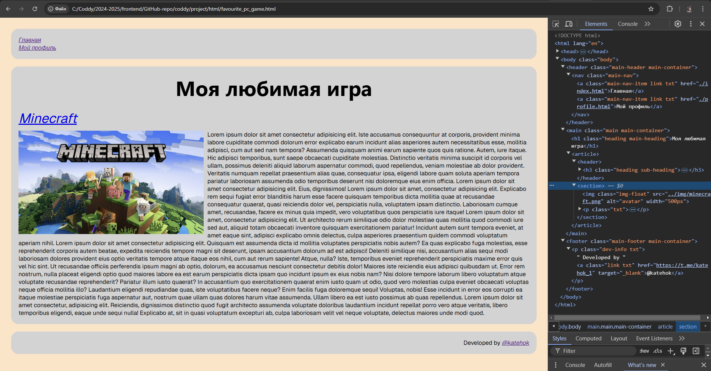

# Домашка к 2024-11-24

Сегодня на занятии мы продолжили рассмотрение CSS-стилизации.

## Теория

### [position](https://developer.mozilla.org/ru/docs/Web/CSS/position)

Свойство CSS position указывает, как элемент позиционируется в документе. [top](https://developer.mozilla.org/ru/docs/Web/CSS/top), [right](https://developer.mozilla.org/ru/docs/Web/CSS/right), [bottom](https://developer.mozilla.org/ru/docs/Web/CSS/bottom) и [left](https://developer.mozilla.org/en-US/docs/Web/CSS/left) определяют конечное местоположение позиционированных элементов.

Свойство `position` имеет несколько значений:

- [`static`](https://developer.mozilla.org/ru/docs/Web/CSS/position#static)
- [`relative`](https://developer.mozilla.org/ru/docs/Web/CSS/position#relative)
- [`absolute`](https://developer.mozilla.org/ru/docs/Web/CSS/position#absolute)
- [`fixed`](https://developer.mozilla.org/ru/docs/Web/CSS/position#fixed)
- [`sticky`](https://developer.mozilla.org/ru/docs/Web/CSS/position#sticky)

#### [static](https://developer.mozilla.org/ru/docs/Web/CSS/position#static)

Это значение позволяет элементу находиться в обычном его состоянии, расположенном на своём месте в документе. Свойства `top`, `right`, `bottom`, `left` и `z-index` не применяются к данному элементу. Это значение по умолчанию.

#### [relative](https://developer.mozilla.org/ru/docs/Web/CSS/position#%D0%BE%D1%82%D0%BD%D0%BE%D1%81%D0%B8%D1%82%D0%B5%D0%BB%D1%8C%D0%BD%D0%BE%D0%B5_%D0%BF%D0%BE%D0%B7%D0%B8%D1%86%D0%B8%D0%BE%D0%BD%D0%B8%D1%80%D0%BE%D0%B2%D0%B0%D0%BD%D0%B8%D0%B5)

Элемент позиционируется в соответствии с нормальным потоком документа, а затем смещается относительно себя на основе значений свойств `top`, `right`, `bottom` и `left`.

Смещение не влияет на положение любых других элементов, то есть пространство, выделяемое для элемента в макете страницы, такое же, как если бы позиция была `static`.

Значение `relative` создаёт новый контекст наложения, когда значение `z-index` не `auto`.

```html
<div class="box" id="one">One</div>
<div class="box" id="two">Two</div>
<div class="box" id="three">Three</div>
<div class="box" id="four">Four</div>
```
```css
.box {
  display: inline-block;
  width: 100px;
  height: 100px;
  background: red;
  color: white;
}

#two {
  position: relative;
  top: 20px;
  left: 20px;
  background: blue;
}
```


#### [absolute](https://developer.mozilla.org/ru/docs/Web/CSS/position#%D0%B0%D0%B1%D1%81%D0%BE%D0%BB%D1%8E%D1%82%D0%BD%D0%BE%D0%B5_%D0%BF%D0%BE%D0%B7%D0%B8%D1%86%D0%B8%D0%BE%D0%BD%D0%B8%D1%80%D0%BE%D0%B2%D0%B0%D0%BD%D0%B8%D0%B5)

Элемент удаляется из обычного потока документа, и для элемента в макете страницы не выделяется дополнительное пространство. Он располагается относительно своего ближайшего спозиционированного предка, если такой есть; в противном случае он помещается относительно исходного содержащего блока.

Конечная позиция элемента определяется свойствами: `top`, `right`, `bottom`, и `left`.

Значение `absolute` создаёт новый контекст наложения, когда значение z-index не auto.

Внешние отступы абсолютно спозиционированных блоков не схлопываются с отступами других блоков.

```html
<h1>Абсолютное позиционирование</h1>
<p>
    Я базовый элемент уровня блока. Мои соседи сидят на новых строках ниже меня.
</p>
<p class="positioned">
    По умолчанию моя ширина 100% ширины родителя и я достиг такого же высокого уровня, как и весь дочерний контент. Наша общая ширина и высота - это наш контент+заполнение+ширина/высота границы.
</p>
<p>
    Мы отделены нашей маржой. Из-за развала края мы отделены шириной одного из наших полей, а не обоих.
</p>
<p>
    встроенные элементы <span>как этот</span> и <span>вот этот</span> будут сидеть в одной строке друг с другом и соседними текстовыми узлами, если в ней есть место. Переполнение встроенных элементов <span>перейдёт на новую строку, если это возможно, - как содержимое этого текста</span>, или просто перейдёт к новой строке, а если нет, то встанет, как это изображение:
</p>
```
```css
body {
    width: 500px;
    margin: 0 auto;
}

p {
    background: aqua;
    border: 3px solid blue;
    padding: 10px;
    margin: 10px;
}

span {
    background: red;
    border: 1px solid black;
}

.positioned {
    position: absolute;
    background: yellow;
    top: 30px;
    left: 30px;
}
```


#### [fixed](https://developer.mozilla.org/ru/docs/Web/CSS/position#%D1%84%D0%B8%D0%BA%D1%81%D0%B8%D1%80%D0%BE%D0%B2%D0%B0%D0%BD%D0%BD%D0%BE%D0%B5_%D0%BF%D0%BE%D0%B7%D0%B8%D1%86%D0%B8%D0%BE%D0%BD%D0%B8%D1%80%D0%BE%D0%B2%D0%B0%D0%BD%D0%B8%D0%B5)

Элемент выбивается из обычного потока документа, и для элемента в макете страницы не создаётся пространство.

Он позиционируется относительно окна браузера.

Конечная позиция элемента определяется свойствами: `top`, `right`, `bottom`, и `left`.

```html
<div class="outer">
    <p>
        Lorem ipsum dolor sit amet, consectetur adipiscing elit. Nam congue tortor eget pulvinar lobortis. Vestibulum ante ipsum primis in faucibus orci luctus et ultrices posuere cubilia Curae; Nam ac dolor augue. Pellentesque mi mi, laoreet et dolor sit amet, ultrices varius risus. Nam vitae iaculis elit. Aliquam mollis interdum libero. Sed sodales placerat egestas. Vestibulum ut arcu aliquam purus viverra dictum vel sit amet mi. Duis nisl mauris, aliquam sit amet luctus eget, dapibus in enim. Sed velit augue, pretium a sem aliquam, congue porttitor tortor. Sed tempor nisl a lorem consequat, id maximus erat aliquet. Sed sagittis porta libero sed condimentum. Aliquam finibus lectus nec ante congue rutrum. Curabitur quam quam, accumsan id ultrices ultrices, tempor et tellus.
    </p>
    <p>
        Lorem ipsum dolor sit amet, consectetur adipiscing elit. Nam congue tortor eget pulvinar lobortis. Vestibulum ante ipsum primis in faucibus orci luctus et ultrices posuere cubilia Curae; Nam ac dolor augue. Pellentesque mi mi, laoreet et dolor sit amet, ultrices varius risus. Nam vitae iaculis elit. Aliquam mollis interdum libero. Sed sodales placerat egestas. Vestibulum ut arcu aliquam purus viverra dictum vel sit amet mi. Duis nisl mauris, aliquam sit amet luctus eget, dapibus in enim. Sed velit augue, pretium a sem aliquam, congue porttitor tortor. Sed tempor nisl a lorem consequat, id maximus erat aliquet. Sed sagittis porta libero sed condimentum. Aliquam finibus lectus nec ante congue rutrum. Curabitur quam quam, accumsan id ultrices ultrices, tempor et tellus.
    </p>
    <p>
        Lorem ipsum dolor sit amet, consectetur adipiscing elit. Nam congue tortor eget pulvinar lobortis. Vestibulum ante ipsum primis in faucibus orci luctus et ultrices posuere cubilia Curae; Nam ac dolor augue. Pellentesque mi mi, laoreet et dolor sit amet, ultrices varius risus. Nam vitae iaculis elit. Aliquam mollis interdum libero. Sed sodales placerat egestas. Vestibulum ut arcu aliquam purus viverra dictum vel sit amet mi. Duis nisl mauris, aliquam sit amet luctus eget, dapibus in enim. Sed velit augue, pretium a sem aliquam, congue porttitor tortor. Sed tempor nisl a lorem consequat, id maximus erat aliquet. Sed sagittis porta libero sed condimentum. Aliquam finibus lectus nec ante congue rutrum. Curabitur quam quam, accumsan id ultrices ultrices, tempor et tellus.
    </p>
    <div class="box" id="one">One</div>
</div>
```
```css
.box {
    background: red;
    width: 100px;
    height: 100px;
    margin: 20px;
    color: white;
}
#one {
    position: fixed;
    top: 80px;
    left: 10px;
}
.outer {
    width: 500px;
    height: 500px;
    overflow: scroll;
    padding-left: 150px;
}
```


#### [sticky](https://developer.mozilla.org/ru/docs/Web/CSS/position#%D0%BB%D0%B8%D0%BF%D0%BA%D0%BE%D0%B5_%D0%BF%D0%BE%D0%B7%D0%B8%D1%86%D0%B8%D0%BE%D0%BD%D0%B8%D1%80%D0%BE%D0%B2%D0%B0%D0%BD%D0%B8%D0%B5)

Элемент позиционируется в соответствии с нормальным потоком документа, а затем смещается относительно его ближайшего прокручивающего предка и содержащего блока (ближайший родительский уровень блока), включая элементы, связанные с таблицей, на основе значений `top`, `right`, `bottom`, и `left`.

Смещение не влияет на положение любых других элементов. 

Это значение всегда создаёт новый контекст наложения.

Обратите внимание, что липкий элемент «прилипает» к его ближайшему предшественнику, имеющему «механизм прокрутки» (созданный при overflow равном `hidden`, `scroll`, `auto` или `overlay`), даже если тот не является ближайшим фактически прокручивающим предком.

```html
<div>
    <dl>
        <dt>A</dt>
        <dd>Andrew W.K.</dd>
        <dd>Apparat</dd>
        <dd>Arcade Fire</dd>
        <dd>At The Drive-In</dd>
        <dd>Aziz Ansari</dd>
    </dl>
    <dl>
        <dt>C</dt>
        <dd>Chromeo</dd>
        <dd>Common</dd>
        <dd>Converge</dd>
        <dd>Crystal Castles</dd>
        <dd>Cursive</dd>
    </dl>
    <dl>
        <dt>E</dt>
        <dd>Explosions In The Sky</dd>
    </dl>
    <dl>
        <dt>T</dt>
        <dd>Ted Leo & The Pharmacists</dd>
        <dd>T-Pain</dd>
        <dd>Thrice</dd>
        <dd>TV On The Radio</dd>
        <dd>Two Gallants</dd>
    </dl>
</div>
```
```css
* {
    box-sizing: border-box;
}

dl {
    margin: 0;
    padding: 24px 0 0 0;
}

dt {
    background: #b8c1c8;
    border-bottom: 1px solid #989ea4;
    border-top: 1px solid #717d85;
    color: #fff;
    font:
    bold 18px/21px Helvetica,
    Arial,
    sans-serif;
    margin: 0;
    padding: 2px 0 0 12px;
    position: -webkit-sticky;
    position: sticky;
    top: -1px;
}

dd {
    font:
    bold 20px/45px Helvetica,
    Arial,
    sans-serif;
    margin: 0;
    padding: 0 0 0 12px;
    white-space: nowrap;
}

dd + dd {
    border-top: 1px solid #ccc;
}
```


### [Семантические тэги](https://habr.com/ru/companies/htmlacademy/articles/546500/)

(статья по ссылке заголовка выше - обязательна к прочтению)

Давным-давно (лет 20 назад) почти все делали сайты и не переживали о том, что под капотом. Верстали таблицами, использовали всё, что попадётся под руку (а попадались в основном `div` и `span`) и не особо заморачивались о доступности. А потом случился HTML5 и понеслось.

Семантическая вёрстка — подход к разметке, который опирается не на внешний вид сайта, а на смысловое предназначение каждого блока и логическую структуру документа. Даже в этой статье есть заголовки разных уровней — это помогает читателю выстроить в голове структуру документа. Так и на странице сайта — только читатели будут немного другими.

#### Почему семантика важна?

Зрячие пользователи могут без проблем с первого взгляда понять, где какая часть страницы находится — где заголовок, списки или изображения. Для незрячих или частично незрячих всё сложнее. Основной инструмент для просмотра сайтов не браузер, который отрисовывает страницу, а скринридер, который читает текст со страницы вслух. Этот инструмент «зачитывает» содержимое страницы, и семантическая структура помогает ему лучше определять, какой сейчас блок, а пользователю понимать, о чём идёт речь. Таким образом семантическая разметка помогает большему количеству пользователей взаимодействовать с вашим сайтом. Например, наличие заголовков помогает незрячим в навигации по странице. У скринридеров есть функция навигации по заголовкам, что ускоряет знакомство с информацией на сайте.

Компании, которые создают поисковики, не разглашают правила ранжирования, но известно, что наличие семантической разметки страниц помогает поисковым ботам лучше понимать, что находится на странице, и в зависимости от этого ранжировать сайты в поисковой выдаче.

Ну и представьте, насколько проще читать `<nav></nav>` вместо `<div class="nav"></div>`. Или вот такой код. Смотрите и сразу понятно, что тут и зачем.

#### header

- Значение: вводная часть смыслового раздела или всего сайта, обычно содержит подсказки и навигацию. Чаще всего повторяется на всех страницах сайта.
- Особенности: этих элементов может быть несколько на странице.
- Типовые ошибки: использовать только как шапку сайта.

#### main

- Значение: основное, не повторяющееся на других страницах, содержание страницы.
- Особенности: должен быть один на странице, исходя из определения.
- Типовые ошибки: включать в этот тег то, что повторяется на других страницах (навигацию, копирайты и так далее).

#### footer

- Значение: заключительная часть смыслового раздела или всего сайта, обычно содержит информацию об авторах, список литературы, копирайт и так далее. Чаще всего повторяется на всех страницах сайта.
- Особенности: этих элементов может быть несколько на странице. Тег `footer` не обязан находиться в конце раздела.
- Типовые ошибки: использовать только как подвал сайта.

#### nav

- Значение: навигационный раздел со ссылками на другие страницы или другие части страниц.
- Особенности: используется для основной навигации, а не для всех групп ссылок. Основной является навигация или нет — на усмотрение верстальщика. Например, меню в подвале сайта можно не оборачивать в `nav`. В подвале обычно появляется краткий список ссылок (например, ссылка на главную, копирайт и условия) — это не является основной навигацией, семантически для такой информации предназначен `footer` сам по себе.
- Типовые ошибки: многие считают, что в `nav` может быть только список навигационных ссылок, но согласно спецификации там может быть навигация в любой форме.

#### article

- Значение: независимая, отделяемая смысловая единица, например комментарий, твит, статья, виджет ВК и так далее.
- Особенности: желателен заголовок внутри.
- Типовые ошибки: путают с тегами `section` и `div`.

#### section

- Значение: смысловой раздел документа. Неотделяемый, в отличие от `article`.
- Особенности: желателен заголовок внутри.
- Типовые ошибки: путают с тегами `article` и `div`.

#### aside

- Значение: побочный, косвенный для страницы контент.
- Особенности: может иметь свой заголовок. Может встречаться несколько раз на странице.
- Типовые ошибки: считать `aside` тегом для «боковой панели» и размечать этим тегом основной контент, который связан с окружающими его элементами.

### [background-image](https://developer.mozilla.org/ru/docs/Web/CSS/background-image)

Свойство CSS `background-image` устанавливает одно или несколько фоновых изображений для элемента. Изображения рисуются в слоях контекстов наложения одно поверх другого. Первый слой выводится так, чтобы он был ближе всего к пользователю.

Пример, взятый [отсюда](https://developer.mozilla.org/ru/docs/Web/CSS/background-image#%D0%BF%D1%80%D0%B8%D0%BC%D0%B5%D1%80%D1%8B):

```html
<div>
    <p class="catsandstars">This paragraph is full of cats<br>and stars.</p>
    <p>This paragraph is not.</p>
    <p class="catsandstars">Here are more cats for you.<br>Look at them!</p>
    <p>And no more.</p>
</div>
```
```css
pre,
p {
    font-size: 1.5em;
    color: #fe7f88;
    background-color: transparent;
}

div {
    background-image: url("mdn_logo_only_color.png");
}

p {
    background-image: none;
}

.catsandstars {
    background-image: url("startransparent.gif"), url("catfront.png");
    background-color: transparent;
}
```



### [background-repeat](https://developer.mozilla.org/ru/docs/Web/CSS/background-repeat)

Свойство `background-repeat` устанавливает, как фоновые изображения будет повторяться. Они могут повторяться по горизонтальной и вертикальной оси или не повторяться вовсе.

#### repeat

Изображения повторяются столько, сколько необходимо, чтобы полностью покрыть область элемента, последнее обрезается, если не хватает места.

#### space

Изображение повторяется в заданном направлении столько раз, сколько необходимо, чтобы покрыть большую часть области рисования фонового изображения, не обрезая изображение. Оставшееся незакрытое пространство равномерно распределено между изображениями. Первое и последнее изображения касаются края элемента. Значение CSS-свойства `background-position` игнорируется для рассматриваемого направления, за исключением случаев, когда отдельное изображение больше области рисования фонового изображения, что является единственным случаем, когда изображение может быть обрезано, когда используется значение space.

#### round

Изображение повторяется в заданном направлении столько раз, сколько необходимо, чтобы покрыть большую часть области рисования фонового изображения, не обрезая изображение. Если оно не покрывает точно область, плитки изменяются в этом направлении, чтобы соответствовать ей.

#### no-repeat

Изображение не повторяется (и, следовательно, область рисования фонового изображения не обязательно будет полностью покрыта). Расположение неповторяющегося фонового изображения определяется CSS-свойством `background-position`.

Примеры гляньте [здесь](https://developer.mozilla.org/ru/docs/Web/CSS/background-repeat#%D0%B8%D0%BD%D1%82%D0%B5%D1%80%D0%B0%D0%BA%D1%82%D0%B8%D0%B2%D0%BD%D1%8B%D0%B9_%D0%BF%D1%80%D0%B8%D0%BC%D0%B5%D1%80).

### [background-position](https://developer.mozilla.org/ru/docs/Web/CSS/background-position)

CSS свойство `background-position` устанавливает начальную позицию для каждого фонового изображения. Положение относительно уровня положения, установленного `background-origin`.

Пример, взятый [отсюда](https://developer.mozilla.org/ru/docs/Web/CSS/background-position#%D0%BF%D1%80%D0%B8%D0%BC%D0%B5%D1%80%D1%8B):

```html
<div class="exampleone">Example One</div>
<div class="exampletwo">Example Two</div>
<div class="examplethree">Example Three</div>
```
```css
/* Общий среди всех <div>-ов */
div {
    background-color: #ffee99;
    background-repeat: no-repeat;
    width: 300px;
    height: 80px;
    margin-bottom: 12px;
}

/* В этих примерах используется сокращённое свойство 'background' */
.exampleone {
    background: url("startransparent.gif") #ffee99 2.5cm bottom no-repeat;
}
.exampletwo {
    background: url("startransparent.gif") #ffee99 3em 50% no-repeat;
}

/* Несколько фоновых изображений: каждое изображение сопоставляется
с соответствующей позицией, от первого указанного до последнего. */
.examplethree {
    background-image: url("startransparent.gif"), url("catfront.png");
    background-position: 0px 0px, center;
}
```



### [background-size](https://developer.mozilla.org/ru/docs/Web/CSS/background-size)

Значение `background-size` в CSS позволяет задавать размер фонового изображения. Изображение может быть оставлено в исходном размере, растянуто, или подогнано под размеры доступного пространства.

#### [auto](https://developer.mozilla.org/ru/docs/Web/CSS/background-size#auto)

Значение позволяет изменять размер фонового изображения в соответствии с заданным направлением, сохраняя его пропорции.

#### [contain](https://developer.mozilla.org/ru/docs/Web/CSS/background-size#contain)

Масштабирует картинку так, чтобы она максимально накрыла собой весь блок. Картинка при этом не обрезается, а вписывается в блок с сохранением пропорций.

#### [cover](https://developer.mozilla.org/ru/docs/Web/CSS/background-size#cover)

Ключевое слово, обратное contain. Масштабирует изображение как можно больше c сохранением пропорций изображения (изображение не становится сплющенным). Когда изображение и контейнер имеют разные размеры, изображение обрезается либо влево / вправо, либо сверху / снизу.

Примеры можете глянуть [тута](https://developer.mozilla.org/ru/docs/Web/CSS/background-size#%D0%BF%D1%80%D0%B8%D0%BC%D0%B5%D1%80%D1%8B):

### [background](https://developer.mozilla.org/ru/docs/Web/CSS/background)

Сокращённое CSS свойство `background` устанавливает сразу все свойства стиля фона, такие как цвет, изображение, источник и размер, или метод повтора.

Пример, взятый [отсюда](https://developer.mozilla.org/ru/docs/Web/CSS/background-image#%D0%BF%D1%80%D0%B8%D0%BC%D0%B5%D1%80%D1%8B):

```html
<p class="topbanner">
    Starry sky<br>
    Twinkle twinkle<br>
    Starry sky
</p>
<p class="warning">Here is a paragraph</p>
<p></p>
```
```css
.warning {
    background: red;
}

.topbanner {
    background: url("starsolid.gif") #00d repeat-y fixed;
}
```



## Домашка

### Download changes

Перед непосредственным выполнением домашней работы необходимо синхронизировать локальный и удаленный репозитории. Для этого скачиваем все изменения из удаленного репозитория с помощью команды:

```bash
git pull
```

Если на этом или последующих этапе возникает вопрос, ошибка или нестандартное поведение программы, пишите мне в личку, прикладывая скрин проблемы/ошибки, постараюсь помочь.

### Новая базовая структура

Так как мы разобрали новые семантические тэги, настало время обновить нашу базовую структуру страниц.

Если [раньше](./home-work_to_2024-11-03.md) она была такой:

```html
<!DOCTYPE html>
<html lang="en">
<head>
    <!-- Служебные тэги -->
</head>
<body class="body">

    <div class="header">
        <!-- Логотип сайта/компании, блок навигации, кнопки регистрации/авторизации -->
    </div>

    <div class="main">
        <!-- Основной контент страницы (главный заголовок сайта, статьи, формы отправки данных) -->
    </div>

    <div class="footer">
        <!-- Служебная информация о сайте (инфа о разработчике, инфа о правах, ссылки на партнеров компании) -->
    </div>
    
</body>
</html>
```

То теперь она будет такой:

```html
<!DOCTYPE html>
<html lang="en">
<head>
    <!-- Служебные тэги -->
</head>
<body class="body">

    <header class="main-header">
        <!-- Логотип сайта/компании, блок навигации, кнопки регистрации/авторизации -->
    </header>

    <main class="main">
        <!-- Основной контент страницы (главный заголовок сайта, статьи, формы отправки данных) -->
    </main>

    <footer class="main-footer">
        <!-- Служебная информация о сайте (инфа о разработчике, инфа о правах, ссылки на партнеров компании) -->
    </footer>
    
</body>
</html>
```

То есть, блоки-контейнеры для шапки страницы, основного контента страницы и подвала страницы теперь будут реализованы с помощью тэгов `header`, `main` и `footer` - соответственно. Также обратите внимание, на измененные классы для этих блоков.

Итак, вам необходимо изменить базовую структуру html-файлов сайта собственного блога на новую (не забудьте изменить css-селекторы для этих блоков в файле `style.css`).

### Заметные базовые разделы

Для основных разделов сайта: `header.main-header`, `main.main` и `footer.main-footer` нужно добавить класс `main-container`. Этот класс будет использоваться для задания общих стилей для этих базовых блоков.

Всем базовым блокам нужно добавить какой-нибудь фоновый цвет, отличный от того, который ранее был задан для `body`. Цвет выбирайте на свой вкус, но желательно, чтобы он нормально сочетался со всем остальным.

Также всем базовым блокам нужно добавить внутренние отступы (`padding`) размером в 20 пикселей и скругление углов (`border-radius`) со значением тоже в 20 пикселей.

Ранее для всех базовых блоков были прописаны внешние нижние отступы в 20 пикселей. Перенесите это правило из собственных блоков стилизации этих объектов в общий (с селектором класса `main-container`). А блоку `footer.main-footer` нужно прописать нулевые внешние отступы.

### Липкая шапка

Думаю, вы замечали, что та многих сайтах при скроллинге страницы вниз шапка сайта никуда не съезжает. Для этого можно использовать свойство `position` со значением `sticky` (липкий) и свойство `top`. В таком случае при прокрутке сраницы шапка будет приклеиваться к верхней части экрана на расстоянии, равном значению свойства `top`, и оставаться всегда на виду у пользователя.

Для проверки работы этой штуки можете добавить побольше текста на главной странице сайта, чтобы появилась полоса прокрутки.

Так как этот пункт задания не очень очевидный, то в виде исключения я приведу готовое решение, однако я оставляю за собой право спросить вас на занятии, за что отвечает каждое добавленное правило, и что будет, если убрать какое-нибудь из них.

```css
.main-header {
    position: sticky;
    top: 0;
}
```

### Новая навигация

На занятии мы познакомились с семантическим тэгом `nav` - для навигации. В связи с этим необходимо переделать текущие блоки навигации на всех страничках сайта.

Теперь блок основной навигации (та, что в блоке `header`) будет представлять собой тэг `nav` с классом `main-nav`. Внутри `nav` теперь должны находяться ссылки из блока навигации предыдущей версии (тэги `a` с классами: `txt` и `link`). Ссылкам нужно добавить новый класс - `main-nav-item`, с помощью которого необходимо сделать их блочными элементами (свойство `display`).

Для примера мой блок навигации теперь выглядит так:

```html

<nav class="main-nav">
    <a class="main-nav-item link txt" href="./profile.html">Мой профиль</a>
    <a class="main-nav-item link txt" href="./favourite_pc_game.html">Моя любимая игра</a>
</nav>
```

### Обновление структуры для статей

Сейчас в файлах `profile.html` и `favourite_pc_game.html` после главного заголовка страницы у вас есть статьи: о вас и о любимой игре - соответственно.

Нужно изменить их структуру, чтобы она стала примерно такой:

```html
<!-- блок для статьи -->
<article class="profile">
    <!-- Шапка статьи -->
    <header>
        <!-- Заголовок статьи -->
        <h3 class="heading sub-heading">Article heading</h3>
    </header>

    <!-- секция-контейнер для основной информации статьи -->
    <section>
        <!-- Картинка -->
        

        <p class="txt">
            <!-- текст статьи -->
        </p>
    </section>
</article>
```

### Картинка, обтекаемая текстом

Для картинок в этих статьях нужно добавить класс `img-float`. Используя селектор этого класса необходимо сделать обтекание картинки текстом (свойство `float`). Также, чтобы текст не прилипал к картинке, ей нужно добавить внешние отступы: правый и нижний - размером в 10 пикселей.

### Результат

Таким образом, у вас должно получиться что-то похожее

#### `index.html`



#### `profile.html`



#### `favourite_pc_game.html`



### Pass task
Когда выполнили все задания, добавляете измененные файлы проекта в индекс гита, создаете коммит, отправляете на GitHub:
```bash
# Добавляем измененные файлы в индекс гита (. - добавить все)
git add .

# Создаем коммит на основании изщменений, добавленных в индекс гита, задаем сообщение коммита
git commit -m "Finally done my homework to 2024-11-10"

# Загружаем изменения в удаленный репозиторий на гитхабе
git push
```
После этого скидываете мне в личку ссылку на ваш гитхаб-репозиторий. Если скинете до пятницы 6 часов вечера, то в течение суток гарантированно получите обратную связь с разбором ошибок и предложениями по улучшению.

### Recomendations
- группируйте CSS-селекторы разных объектов вместе, если задаете им одинаковые правила,
- делайте и сдавайте дз как можно раньше, чтобы я успел проверить и дать фидбэк.

#### Всем удачи!