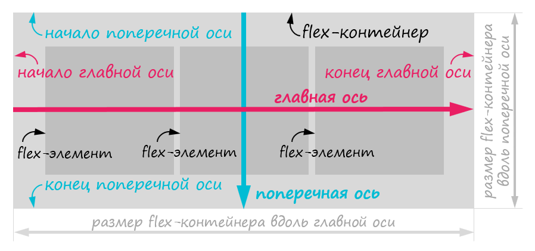
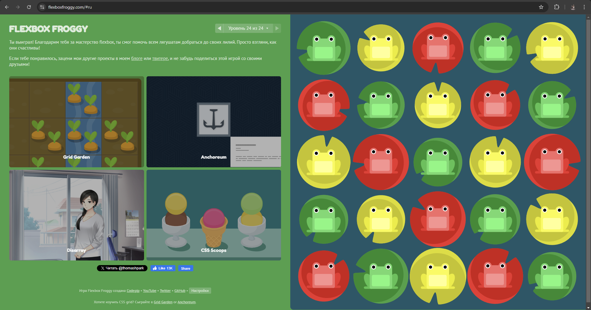
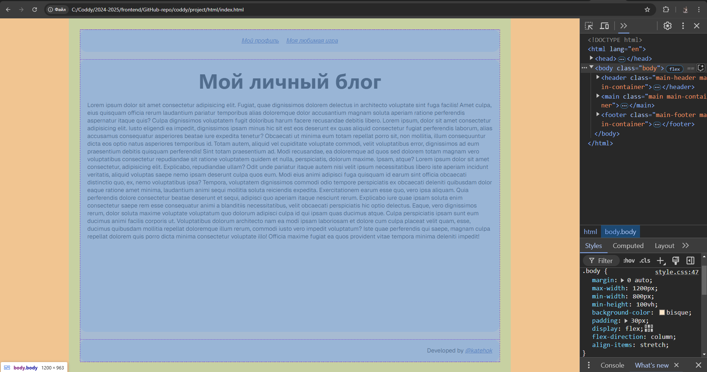
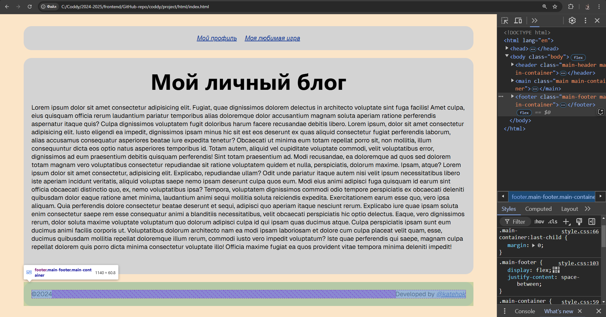

# Домашка к 2024-11-24

Сегодня на занятии мы продолжили рассмотрение CSS-стилизации.

## Теория

### [Псевдоклассы](https://developer.mozilla.org/ru/docs/Web/CSS/Pseudo-classes)

Псевдокласс в CSS — это ключевое слово, добавленное к селектору, которое определяет его особое состояние. Например, `:hover` может быть использован для изменения цвета кнопки при наведении курсора на неё.

Псевдоклассы дают возможность стилизовать элемент на основе не только отношений в DOM-дереве, но и основываясь на внешних факторах, таких как история посещений (например, `:visited`), состояние содержимого (вроде `:checked` у некоторых элементов формы) или позиции курсора мыши (например, `:hover` определяет, находится ли курсор мыши над элементом).

#### [`:link`](https://developer.mozilla.org/ru/docs/Web/CSS/:link)

CSS псевдокласс `:link` позволяет вам выбирать ссылки внутри элементов. Он выберет любую ссылку, которая ещё не была посещена, даже те, которые уже стилизованы, используя селекторы с другими, относящимися к ссылкам, псевдоклассам типа `:hover`, `:active` или `:visited`. Чтобы стилизовать ссылки должным образом, вам нужно вставлять правила `:link` до других, как определено `LVHA`-порядком: `:link` — `:visited` — `:hover` — `:active`. Псевдо-класс `:focus` обычно размещается прямо перед или сразу после :hover, в зависимости от ожидаемого эффекта.

#### [`:visited`](https://developer.mozilla.org/ru/docs/Web/CSS/:visited)

CSS псевдокласс `:visited` позволяет вам выбирать ссылки, которые были посещены. Этот стиль может переопределяться другими относящимися к ссылкам псевдоклассами, такими как `:link`, `:hover` и `:active`, появляющимися в соответствующем порядке.

#### [`:hover`](https://developer.mozilla.org/ru/docs/Web/CSS/:hover)

CSS псевдокласс `:hover` срабатывает, когда пользователь наводит на элемент мышью, но не обязательно активирует его. Этот стиль может переопределяться другими относящимися к ссылкам псевдоклассами, такими как `:link`, `:visited` и `:active`, появляющимися в соответствующем порядке. 

#### [`:active`](https://developer.mozilla.org/ru/docs/Web/CSS/:active)

Псевдокласс `:active` соответствует элементу в момент, когда он активируется пользователем. Он позволяет странице среагировать, когда элемент активируется. Взаимодействие элемента с мышью - это, как правило, время между нажатием и отпусканием пользователем кнопки мыши.

#### [`:first-child`](https://developer.mozilla.org/ru/docs/Web/CSS/:first-child)

CSS псевдокласс `:first-child` находит любой элемент, являющийся первым в своём родителе.

#### [`:last-child`](https://developer.mozilla.org/ru/docs/Web/CSS/:last-child)

CSS псевдокласс `:last-child` находит любой элемент, являющийся последним в его родителе.

#### [`:nth-child()`](https://developer.mozilla.org/ru/docs/Web/CSS/:nth-child)

CSS псевдокласс `:nth-child()` находит один или более элементов, основываясь на их позиции среди группы соседних элементов.

#### [`:nth-last-child()`](https://developer.mozilla.org/ru/docs/Web/CSS/:nth-last-child)

CSS псевдокласс `:nth-last-child(an+b)` находит элемент, имеющий `an+b-1` потомков после данной позиции в дереве документа, значение для `n` может быть положительным или нулевым, а также имеющий родительский элемент.

В результате, он функционирует так же, как и `:nth-child`, кроме того, что выбирает элементы, считая в обратном порядке, с конца списка потомков, не с начала.

### [`filter`](https://developer.mozilla.org/ru/docs/Web/CSS/filter)

#### [`blure()`](https://developer.mozilla.org/ru/docs/Web/CSS/filter#blur_%D1%80%D0%B0%D0%B7%D0%BC%D1%8B%D1%82%D0%B8%D0%B5)

Применяет гауссово размытие к входному изображению. Значение `radius` определяет значение стандартного отклонения для гауссовой функции или количество пикселей на экране, которые смешиваются друг с другом, поэтому большее значение создаст большее размытие. Если параметр не указан, то используется значение `0`. Параметр указывается как длина CSS, но не принимает процентные значения.

#### [`brightness()`](https://developer.mozilla.org/ru/docs/Web/CSS/filter#brightness_%D1%8F%D1%80%D0%BA%D0%BE%D1%81%D1%82%D1%8C)

Применяет линейный множитель к входному изображению, делая его более или менее ярким. Значение `0%` создаст изображение полностью черным. Значение `100%` оставляет входное изображение неизменным. Другие значения являются линейными множителями эффекта. Значения, превышающие `100%`, допускаются, обеспечивая более яркие результаты.

#### [`contrast()`](https://developer.mozilla.org/ru/docs/Web/CSS/filter#contrast_%D0%BA%D0%BE%D0%BD%D1%82%D1%80%D0%B0%D1%81%D1%82)

Регулирует контрастность входных данных. Значение `0%` создаст изображение полностью черным. Значение `100%` оставляет входные данные неизменными. Допускаются значения amount более `100%`, что обеспечивает результаты с меньшей контрастностью.

#### [`drop-shadow()`](https://developer.mozilla.org/ru/docs/Web/CSS/filter#drop-shadow_%D1%82%D0%B5%D0%BD%D1%8C)

Применяет эффект тени к входному изображению. Тень — это фактически размытая, смещенная версия альфа-маски входного изображения, нарисованная определенным цветом, наложенная под изображением. Эта функция похожа на более устоявшееся свойство `box-shadow`; разница в том, что с фильтрами некоторые браузеры обеспечивают аппаратное ускорение для лучшей производительности.

Параметры:
- `<offset-x>` `<offset-y>` (обязательно). Это два значения `<length>` для установки смещения тени. `<offset-x>` указывает горизонтальное расстояние. Отрицательные значения помещают тень слева от элемента. `<offset-y>` указывает вертикальное расстояние. Отрицательные значения помещают тень над элементом. Если оба значения равны `0`, тень помещается за элемент (и может создавать эффект размытия, если заданы `<blur-radius>` и/или `<spread-radius>`).
- `<blur-radius>` (необязательно). Это третье значение `<length>`. Чем больше это значение, тем больше размытие, поэтому тень становится больше и светлее. Отрицательные значения не допускаются. Если не указано, будет `0` (край тени резкий).
- `<spread-radius>` (необязательно). Это четвертое значение `<length>`. Положительные значения заставят тень расширяться и становиться больше, а отрицательные значения заставят тень сжиматься. Если не указано, будет `0` (тень будет того же размера, что и элемент).
- `<color>` (необязательно). Если не указано, цвет зависит от браузера.

#### [`grayscale()`](https://developer.mozilla.org/ru/docs/Web/CSS/filter#grayscale_%D0%BE%D1%82%D1%82%D0%B5%D0%BD%D0%BA%D0%B8_%D1%81%D0%B5%D1%80%D0%BE%D0%B3%D0%BE)

Преобразует входное изображение в оттенки серого. Значение `100%` полностью соответствует оттенкам серого. Значение `0%` оставляет входные данные неизменными. Значения от `0%` до `100%` являются линейными множителями эффекта.

#### [`hue-rotate()`](https://developer.mozilla.org/ru/docs/Web/CSS/filter#hue-rotate_%D0%B8%D0%B7%D0%BC%D0%B5%D0%BD%D0%B5%D0%BD%D0%B8%D0%B5_%D0%BE%D1%82%D1%82%D0%B5%D0%BD%D0%BA%D0%B0)

Применяет поворот оттенка к входному изображению. Значение угла определяет количество градусов вокруг цветового круга, на которое будут скорректированы входные образцы. Значение `0deg` градусов оставляет входные данные неизменными. Если параметр угла отсутствует, используется значение `0deg` градусов. Хотя максимального значения нет, эффект значений выше `360deg` градусов огибает.

#### [`invert()`](https://developer.mozilla.org/ru/docs/Web/CSS/filter#invert_%D0%B8%D0%BD%D0%B2%D0%B5%D1%80%D1%82%D0%B8%D1%80%D0%BE%D0%B2%D0%B0%D0%BD%D0%B8%D0%B5)

Инвертирует образцы во входном изображении. Значение `100%` полностью инвертирует. Значение `0%` оставляет входные данные неизменными. Значения от `0%` до `100%` являются линейными множителями эффекта.

#### [`opacity()`](https://developer.mozilla.org/ru/docs/Web/CSS/filter#opacity_%D0%BD%D0%B5%D0%BF%D1%80%D0%BE%D0%B7%D1%80%D0%B0%D1%87%D0%BD%D0%BE%D1%81%D1%82%D1%8C)

Применяет прозрачность к образцам входного изображения. Значение `0%` полностью прозрачно. Значение `100%` оставляет ввод неизменным. Значения от `0%` до `100%` являются линейными множителями эффекта. Эта функция похожа на более устоявшееся свойство `opacity`; разница в том, что с фильтрами некоторые браузеры обеспечивают аппаратное ускорение для лучшей производительности.

#### [`saturate()`](https://developer.mozilla.org/ru/docs/Web/CSS/filter#saturate_%D0%BD%D0%B0%D1%81%D1%8B%D1%89%D0%B5%D0%BD%D0%BD%D0%BE%D1%81%D1%82%D1%8C)

Насыщает входное изображение. Значение `0%` полностью ненасыщенное. Значение `100%` оставляет входные данные неизменными. Другие значения являются линейными множителями эффекта. Значения более `100%` допускаются, обеспечивая сверхнасыщенные результаты.

#### [`sepia()`](https://developer.mozilla.org/ru/docs/Web/CSS/filter#sepia_%D1%81%D0%B5%D0%BF%D0%B8%D1%8F)

Преобразует входное изображение в сепию.Значение `100%` — полная сепия. Значение `0%` оставляет входное изображение неизменным. Значения от `0%` до `100%` — линейные множители эффекта.

#### [Комбинирование функций](https://developer.mozilla.org/ru/docs/Web/CSS/filter#%D0%BA%D0%BE%D0%BC%D0%B1%D0%B8%D0%BD%D0%B8%D1%80%D0%BE%D0%B2%D0%B0%D0%BD%D0%B8%D0%B5_%D1%84%D1%83%D0%BD%D0%BA%D1%86%D0%B8%D0%B9)

Допускается комбинирование любого количества функций для управления рендерингом.

### [FlexBox](https://developer.mozilla.org/ru/docs/Web/CSS/CSS_flexible_box_layout)

Способ CSS раскладки Flexible Box (CSS Flexible Box Layout или Flexbox) — это способ CSS раскладки, означающий блочную модель CSS, оптимизированную для построения пользовательских интерфейсов. Во флекс-модели потомки флекс-контейнера могут выстраиваться в любом направлении (право/лево, верх/низ), растягиваться, заполняя свободное пространство, или сжиматься во избежание переполнения родительского контейнера. Доступно различное выравнивание потомков по горизонтали и вертикали. Комбинация из родительского и вложенных блоков позволяют создавать такой layout, при котором элементы автоматически выстраиваются в столбы или строки.

Определение основного блока навигации в качестве флекс-контейнера:
```html
<nav class="main-nav">
    <a class="main-nav-item" href="">First link</a>
    <a class="main-nav-item" href="">Second link</a>
</nav>
```
```css
.main-nav {
    display: flex;
}
```
Все дочерние элементы флекс-контейнера становятся флекс-элементами, которые по умолчанию являются блочными элементами. То есть, теперь ссылки, лежащие внутри флекс-контейнера являются блочными элементами.

#### [`flex-direction`](https://developer.mozilla.org/ru/docs/Web/CSS/flex-direction)

На рисунке представлена схема флекс-контейнера.



CSS-свойство `flex-direction` указывает, как flex-элементы располагаются во flex-контейнере по главной оси и направлению (обычном или обратном).

Значения:
- `row`. Главная ось flex-контейнера определена точно так же, как направление текста. Точки `main-start` и `main-end` совпадают с направлением контента.
- `row-reverse`. Ведёт себя аналогично row, но точки `main-start` и `main-end` переставлены местами.
- `column`. Главная и поперечная оси flex-контейнера поменены местами. Точки `main-start` и `main-end` такие же, как точки `before` и `after` режима записи (writing-mode).
- `column-reverse`. Ведёт себя как `column`, но точки `main-start` и `main-end` переставлены местами.

#### [`flex-wrap`](https://developer.mozilla.org/ru/docs/Web/CSS/flex-wrap)

Свойство CSS `flex-wrap` задаёт правила вывода flex-элементов — в одну строку или в несколько, с переносом блоков. Если перенос разрешён, то возможно задать направление, в котором выводятся блоки.

Значения:
- `nowrap`. Расположение в одну линию, может привести к переполнению контейнера. Свойство `cross-start` эквивалентно `start` или `before` в зависимости от значения `flex-direction`.
- `wrap`. Расположение в несколько линий. Свойство `cross-start` эквивалентно `start` или `before` в зависимости от значения `flex-direction` и свойство `cross-end` противоположно `cross-start`.
- `wrap-reverse`. Ведёт себя так же, как и `wrap`, но `cross-start` и `cross-end` инвертированы.

#### [`flex-flow`](https://developer.mozilla.org/ru/docs/Web/CSS/flex-flow)

CSS свойство `flex-flow` является сокращением для отдельных свойств `flex-direction` и `flex-wrap`.

#### [`order`](https://developer.mozilla.org/ru/docs/Web/CSS/order)

CSS свойство `order` определяет порядок, используемый для размещения `flex` элементов в их flex контейнере. Элементы располагаются в восходящем порядке по значению `order`. Элементы с одинаковым значением `order` располагаются в том порядке, в каком они находятся в исходном коде.

Значения:
- `<integer>`. Представляет порядковую группу, которая присвоена flex элементу.

#### [`gap`](https://developer.mozilla.org/ru/docs/Web/CSS/gap)

Свойство gap CSS задаёт отступы между колонками и рядами. Является сокращением для свойств `row-gap` и `column-gap`.

#### [`justify-content`](https://developer.mozilla.org/ru/docs/Web/CSS/justify-content)

CSS свойство `justify-content` определяет, как браузер распределяет пространство между и вокруг элементов контента вдоль главной оси flex контейнера.

Значения:
- `start`. Элементы располагаются друг за другом и прижимаются к началу контейнера по главной оси.
- `end`. Элементы располагаются друг за другом и прижимаются к концу контейнера по главной оси.
- `flex-start`. Элементы располагаются друг за другом и прижимаются к началу контейнера по главной оси, в зависимости от её направления (flex-direction). Для элементов, которые не являются дочерними элементами flex контейнера, это значение обрабатывается как `start`.
- `flex-end`. Элементы располагаются друг за другом и прижимаются к концу контейнера по главной оси, в зависимости от её направления (flex-direction). Для элементов, которые не являются дочерними элементами flex контейнера, это значение обрабатывается как end.
- `center`. Элементы располагаются друг за другом в центре контейнера по главной оси.
- `left`. Элементы располагаются друг за другом и прижимаются к левому краю контейнера по главной оси. Если главная ось не горизонтальна, это значение работает как `start`.
- `right`. Элементы располагаются друг за другом и прижимаются к правому краю контейнера по главной оси. Если главная ось не горизонтальна, это значение работает как `start`.
- `normal`. Элементы располагаются на своих обычных позициях, так как будто свойство `justify-content` не задано. Этот параметр ведёт себя как `stretch` в grid и flex контейнерах.
- `space-between`. Элементы равномерно распределены вдоль главной оси контейнера. Расстояния между каждой парой соседних элементов равны. Первый элемент прижат к началу контейнера по главной оси, а последний - к концу.
- `space-around`. Элементы равномерно распределены вдоль главной оси контейнера. Расстояния между каждой парой соседних элементов равны. Пустые пространства перед первым элементом и после последнего элемента равны половине расстояния между парами соседних элементов.
- `space-evenly`. Элементы равномерно распределены вдоль главной оси контейнера. Расстояния между каждой парой соседних элементов равны расстояниям от начала контейнера до первого элемента и от последнего элемента до конца контейнера.

#### [`align-items`](https://developer.mozilla.org/ru/docs/Web/CSS/align-items)

CSS свойство ё выравнивает flex-элементы текущей flex-линии по поперечной оси.

Значения:
- `normal`. Эффект этого ключевого слова зависит от режима макета, в котором мы находимся. Для flex элементов ключевое слово ведёт себя как `stretch`.
- `flex-start`. Край поперечного начала края гибкого элемента выровнен с краем поперечного начала линии.
- `flex-end`. Поперечный край поля гибкого элемента совпадает с поперечным краем линии.
- `center`. Внешний отступ полей гибкого элемента центрируется в пределах линии на поперечной оси. Если поперечный размер элемента больше, чем у гибкого контейнера, он будет одинаково переполнен в обоих направлениях.
- `stretch`. Элементы Flex растягиваются, на всю величину поперечного размера "строки" flex-контейнера.

#### [`align-self`](https://developer.mozilla.org/ru/docs/Web/CSS/align-self)

Свойство CSS `align-self` выравнивает flex-элементы по текущей flex-линии, переопределяя значение свойства `align-items`. Если у какого-либо flex-элемента `margin` в поперечной оси выставлен в `auto`, то `align-self` игнорируется.

Значения:
- `auto`. Вычисляет значение `align-items` родительского элемента.
- `normal`. Эффект этого ключевого слова зависит от режима макета, в котором мы находимся. Для гибких элементов ключевое слово ведет себя как `stetch`.
- `self-end`. Выравнивает элементы так, чтобы они были вровень с краем контейнера выравнивания, соответствующим конечной стороне элемента на поперечной оси.
- `flex-start`. Поперечный начальный край поля гибкого элемента совмещен с поперечным начальным краем линии.
- `flex-end`. Поперечный край поля гибкого элемента находится на одном уровне с поперечным краем линии.
- `center`. Поле поля элемента flex центрировано в пределах линии на поперечной оси. Если поперечный размер элемента больше контейнера flex, он будет переполняться одинаково в обоих направлениях.
- `stretch`. Если совокупный размер элементов вдоль поперечной оси меньше размера контейнера выравнивания и элемент имеет автоматический размер, его размер увеличивается равномерно (не пропорционально), при этом соблюдаются ограничения, налагаемые `max-height`/`max-width` (или эквивалентной функциональностью), так что совокупный размер всех элементов с автоматическим размером точно заполняет контейнер выравнивания вдоль поперечной оси.

#### [flex-grow](https://developer.mozilla.org/ru/docs/Web/CSS/flex-grow)

CSS-свойство `flex-grow` определяет как много свободного пространства во flex-контейнере должно быть назначено текущему элементу (flex grow factor — «коэффициент увеличения flex»). Свободное пространство — разница между размером flex-контейнера и размером всех его flex-элементов вместе. Если все sibling-элементы (sibling items — элементы одного уровня вложенности, состоящие по отношению друг к другу в родственной связи как брат или сестра), имеют одинаковый коэффициент `flex-grow`, то все они получат одинаковую долю свободного пространства, в противном случае оно распределяется в соответствии с соотношением, определённым различными коэффициентами `flex-grow`.

Значения:
- `<number>`. Отрицательные значения недопустимы. По умолчанию 0.

## Домашка

### Download changes

Перед непосредственным выполнением домашней работы необходимо синхронизировать локальный и удаленный репозитории. Для этого скачиваем все изменения из удаленного репозитория с помощью команды:

```bash
git pull
```

Если на этом или последующих этапе возникает вопрос, ошибка или нестандартное поведение программы, пишите мне в личку, прикладывая скрин проблемы/ошибки, постараюсь помочь.

### [Flexbox Froggy](https://flexboxfroggy.com/#ru)

Необходимо пройти игру - по ссылке из заголовка этого пункта.

Данная игрушка поможет вам улучшить понимание FlexBox в CSS.

Сначала пройтиде ее на простой сложности, потом - на средней. Если же после этого почувствуете в себе силы, пройдите ее на экспертном уровне.



### Гибкий `body.body`

Наверняка вы замесали, что многие сайты расягиваются до высоты экрана, даже если контента в них не очень много. Один из способов реализовать такое поведение - использовать FlexBox для контейнера `body.body`.

Итак, от вас требуется сделать так, чтобы минимальная высота блока `body.body` совпадала с размерами экрана, при этом блок `main.main` должен занимать все свободное пространство. Учтите, что по ширине флекс-элементы должны будут занимать все пространство своего флекс-контейнера.

Также нужно задать максимальную ширину для `body.body`, равную `1200px` а минимальную - в `800px`.

В этом задании вам понадобятся свойства:
- `max-width`
- `min-height`
- `display`
- `flex-direction`
- `align-items`
- `flex-grow`

После всего этого у вас получится, что блок `body.body` прижат к левой стороне экрана (это особенно заметно, если отдалиться - `Ctrl`+`-`). Чтобы центрировать его по горизонтали, добавьте ему css-правило `margin: 0 auto;`, устанавливающее автоматические левый и правый внешние отступы.

Если вы все сделаете правильно, у вас получится что-то типа:


### Универсальные отступы для `.main-container`

Измените добавление `margin`-ов для основных контейнеров. Теперь `margin-bottom` должен быть указан в блоке стилизации `.main-container`. Далее, используя один из псевдоклассов, уберите внешний нижний отступ у блока `footer.main-footer`.

### Мигающие ссылки

Используя необходимые псевдоклассы нужно добавить для всех ссылок (элементов `.link`) изменение цвета текста на какой-нибудь яркий (например, оттенок красного) при наведении на них курсора мыши, а при нажатии на эти элементы цвет их текста должен меняться на какой-нибудь темный (например, оттенок синиго).

Опционально: добавьте с помощью нужного псевдокласса изменение цвета текста тех ссылок, которые уже были посещены пользователем.

ВАЖНО: помните о правильном порядке использования псевдоклассов (`LVHA`-порядок).

ПРИМЕЧАНИЕ: выбирайте цвета так, чтобы они сочитались с цветом заднего фона объекта, в котором находятся ссылки.

### Гибкая навигация

Немного переделаем отображение блока навигации `nav.main-nav`. Необходимо с помощью возможностей FlexBox сделать так, чтобы ссылки в навигационном блоке размещались на одной строке, при этом они должны быть центрированы по горизонтали, а также иметь между собой отступы величиной в `20px`.

В этом задании вам понадобятся свойства:
- `display`
- `justify-content`
- `gap`

### Обновленный подвал сайта

Сейчас подвал сайта выглядит примерно так:
```html
<footer class="main-footer main-container">
    <p class="dev-info txt">
        Developed by
        <a class="link txt" href="https://t.me/katehok_1" target="_blank">@katehok</a>
    </p>
</footer>
```

У параграфа с инфой о разработчике нужно заменить класс `dev-info` на `main-footer-item`.

Внутрь тэга `footer.main-footer` нужно добавить еще один параграф примерно так:
```html
<footer class="main-footer main-container">
    <p class="main-footer-item txt">&copy;2024</p>

    <p class="main-footer-item txt">
        Developed by
        <a class="link txt" href="https://t.me/katehok_1" target="_blank">@katehok</a>
    </p>
</footer>
```

Добавленный параграф предоставляет информацию о том, что все права на данный сайт защищены. Похожую надпись можно встретить на многих сайтах в интернете. Текст `&copy;` интерпретируется браузером, как значок копирайта (буква `c` внутри окружности).

Так как в подвале теперь больше одного объекта, нужно их как-то разместить. Итак, вы должны добавить стили FlexBox, размещающие флекс-элементы в одну строчку так, чтобы они оказались "приклеены" к краям флекс-контейнера, и чтобы между ними был большой отступ величиной во все свободное пространство.

В этом задании вам понадобятся свойства:
- `display`
- `justify-content`

Если вы все сделаете правильно, то подвал будет выглядеть примерно так:


### Pass task
Когда выполнили все задания, добавляете измененные файлы проекта в индекс гита, создаете коммит, отправляете на GitHub:
```bash
# Добавляем измененные файлы в индекс гита (. - добавить все)
git add .

# Создаем коммит на основании изщменений, добавленных в индекс гита, задаем сообщение коммита
git commit -m "Finally done my homework to 2024-11-30"

# Загружаем изменения в удаленный репозиторий на гитхабе
git push
```
После этого скидываете мне в личку ссылку на ваш гитхаб-репозиторий. Если скинете до пятницы 6 часов вечера, то в течение суток гарантированно получите обратную связь с разбором ошибок и предложениями по улучшению.

### Recomendations
- группируйте CSS-селекторы разных объектов вместе, если задаете им одинаковые правила,
- делайте и сдавайте дз как можно раньше, чтобы я успел проверить и дать фидбэк.

#### Всем удачи!