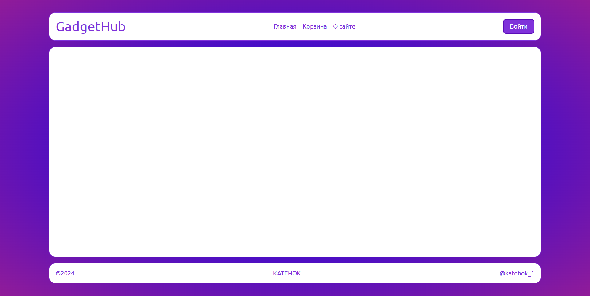

# Домашка к 2024-12-15

Сегодня на занятии мы продолжили рассмотрение CSS-стилизации.

## Теория

### [Градиент](https://developer.mozilla.org/ru/docs/Web/CSS/CSS_images/Using_CSS_gradients)

Градиенты в CSS позволяют создавать плавные переходы между двумя или более цветами. Это особый тип фона, который можно использовать вместо изображений.

Есть три основных типа градиентов:
1. **Линейный градиент** – создаёт плавный переход цветов по прямой линии. Используется функция [`linear-gradient()`](https://doka-guide.vercel.app/css/linear-gradient/).
2. **Круговой градиент** – создаёт переход цветов в виде круга. Используется функция [`radial-gradient()`](https://doka-guide.vercel.app/css/radial-gradient/).
3. **Конический градиент** – переход цветов идёт по кругу, как сегменты пирога. Используется функция [`conic-gradient()`](https://doka-guide.vercel.app/css/conic-gradient/).

Также существуют **повторяющиеся градиенты**, которые позволяют делать узоры. Для этого есть функции:
- [`repeating-linear-gradient()`](https://doka-guide.vercel.app/css/repeating-linear-gradient/)
- [`repeating-radial-gradient()`](https://doka-guide.vercel.app/css/repeating-radial-gradient/)
- [`repeating-conic-gradient()`](https://doka-guide.vercel.app/css/repeating-conic-gradient/)

Градиенты полезны, потому что:
- их можно использовать там, где обычно применяются изображения, например, для фона страницы.
- они создаются браузером в реальном времени, поэтому не теряют качества при масштабировании.
- их использование позволяет избежать лишних загрузок изображений, что ускоряет работу сайта.

#### [`linear-gradient()`](https://doka-guide.vercel.app/css/linear-gradient/)

Градиент — это плавный переход между цветами. Линейный градиент описывает изменение цвета вдоль прямой линии. В отличие от фоновых изображений градиент не может иметь конкретных размеров и его фактический размер совпадает с размером элемента.

Самый простой вид градиента — переход между двумя цветами:
```css
.element { background-image: linear-gradient(#2E9AFF, #F498AD); }
```

##### [Количество цветов](https://doka-guide.vercel.app/css/linear-gradient/#kolichestvo-cvetov)

Градиент может состоять из любого количества цветов. Укажите нужное количество значений через запятую внутри круглых скобок. Цвета могут быть указаны в любом доступном формате.

##### [Точки остановки цвета](https://doka-guide.vercel.app/css/linear-gradient/#tochki-ostanovki-cveta)

Через пробел после значения цвета можно задавать начальную и конечную точки цвета. Можно использовать любую единицу длины либо проценты. В начальной точке заканчивается плавный переход из предыдущего цвета. Конечная точка — это точка, с которой начинается плавный переход в следующий цвет. Если конечная точка предыдущего цвета и начальная точка следующего совпадают, то переход будет в виде чёткой линии:
```css
.element { background-image: linear-gradient(#F498AD 25%, #2E9AFF 25% 50%, #FFD829 75%); }
```
По умолчанию градиент рисуется сверху вниз. В `25%` высоты от верха должен начаться плавный переход от цвета `#F498AD` в цвет `#2E9AFF`. Но начальная точка второго цвета тоже `25%`, поэтому мы наблюдаем чёткую границу между цветами. Конечная точка цвета `#2E9AFF` — `50%` от верха. В этой точке начинается плавный переход в последний цвет. Конечная точка жёлтого цвета — `75%` от верха. В этой точке заканчивается плавный переход между цветами, и дальше весь фон будет равномерно жёлтым. Таким образом, ширина плавного перехода между цветами `#2E9AFF` и `#FFD829` будет `25%` (от `50` до `75%`) высоты.

##### [Направление градиента](https://doka-guide.vercel.app/css/linear-gradient/#napravlenie-gradienta)

Первым параметром можно передать единицу измерения угла (`deg`, `turn`), и тогда линия, вдоль которой строится градиент, повернётся на нужный угол:
```css
.element-1 { background-image: linear-gradient(-30deg, #2E9AFF, #F498AD); }
.element-2 { background-image: linear-gradient(0.25turn, #2E9AFF, #FFD829); }
```
Мы можем задавать направление градиента, используя ключевые слова с приставкой `to`: `to left`, `to top`, `to right`, `to bottom` (по умолчанию). Значения имеют следующие эквиваленты в углах:
- `to top` — `0deg`;
- `to bottom` — `180deg`;
- `to right` — `90deg`;
- `to left` — `270deg`;
Ключевые слова можно сочетать, чтобы направить градиент в нужный угол элемента: `to top left` будет рисовать градиент из правого нижнего в левый верхний угол.

##### Пример:
```html
<div class="block grad-1">linear-gradient(#6e4aff, #49A16C)</div>
<div class="block grad-2">linear-gradient(to right, red, yellow)</div>
<div class="block grad-3">linear-gradient(-30deg, #2E9AFF, #F498AD);</div>
<div class="block grad-4">linear-gradient(#F498AD 25%, #2E9AFF 25% 50%, #FFD829 75%)</div>
```
```css
.block {
    height: 150px;
    width: 100%;
    margin-bottom: 5px;
}
.grad-1 { background-image: linear-gradient(#6e4aff, #49A16C); }
.grad-2 { background-image: linear-gradient(to right, red, yellow); }
.grad-3 { background-image: linear-gradient(-30deg, #2E9AFF, #F498AD); }
.grad-3:hover { background-image: linear-gradient(30deg, #2E9AFF, #F498AD); }
.grad-4 { background-image: linear-gradient(#F498AD 25%, #2E9AFF 25% 50%, #FFD829 75%); }
```
[Здесь](https://jsbin.com/pimemikaqi/edit?html,css,output) вы можете посмотреть работу этого кода.

#### [`radial-gradient()`](https://doka-guide.vercel.app/css/radial-gradient/)

Градиент — это плавный переход между цветами. Радиальный градиент — это переход, который начинается в точке и расходится от неё подобно кругам на воде. Радиальный градиент не обязательно должен быть круговым. Форма по умолчанию — это эллипс, который заполняет всю площадь элемента.

Самый простой градиент задаётся двумя цветами:
```css
.element { background-image: radial-gradient(#6e4aff, #49A16C); }
```
В этом случае начальная точка помещается в центр элемента, а градиент рисуется таким образом, чтобы в углах элемента был последний указанный в скобках цвет.

Цветов мы можем перечислить сколько угодно. Браузер сам распределит градиент таким образом, чтобы последний цвет всегда заходил в угол элемента:
```css
.element { background-image: radial-gradient(yellow, coral, blue, green, white, black); }
```

##### [Форма градиента](https://doka-guide.vercel.app/css/radial-gradient/#forma-gradienta)

Задаётся ключевым словом `circle` или `ellipse` (по умолчанию):
```css
.element { background-image: radial-gradient(circle, #09ff00, red); }
```

##### [Положение центра](https://doka-guide.vercel.app/css/radial-gradient/#polozhenie-centra)

Мы можем задавать положение центральной точки, используя те же ключевые слова, что и для `background-position`, но с приставкой `at`: `at left`, `at top`, `at right`, `at bottom`, `at center` (по умолчанию). Значения можно сочетать, чтобы поместить центр градиента в нужный угол элемента: `at top left` — центр градиента в верхнем левом углу. Вместо ключевых слов мы можем использовать точные значения: `at 20% 50%` или `at 130px 500px`.

##### [Размер градиента](https://doka-guide.vercel.app/css/radial-gradient/#razmer-gradienta)

Используя следующие ключевые слова, можно задать размер конечной формы градиента:
- `closest-side` — градиент имеет такую форму, что заканчивается у ближайшей к центру границы элемента;
- `farthest-side` — градиент заканчивается у дальней от центра границы элемента;
- `closest-corner` — форма градиента подбирается таким образом, чтобы его край проходил через ближайший к центру угол;
- `farthest-corner` — край градиента будет проходить через дальний от центра угол.

##### Пример:
```html
<div class="blocks">
    <div class="block grad-1">radial-gradient(#6e4aff, #49A16C)</div>
    <div class="block grad-2">radial-gradient(yellow, coral, blue, green, white, black)</div>
    <div class="block grad-3">radial-gradient(ellipse, blue, white)</div>
</div>
```
```css
.blocks {
    display: flex;
    flex-wrap: wrap;
    gap: 10px;
}
.block {
    height: 200px;
    width: 200%;
}
.grad-1 { background-image: radial-gradient(#6e4aff, #49A16C); }
.grad-2 { background-image: radial-gradient(yellow, coral, blue, green, white, black); }
.grad-3 { background-image: radial-gradient(ellipse, blue, white); }
.grad-3:hover { background-image: radial-gradient(circle, #09ff00, red); }
```
[Здесь](https://jsbin.com/tuwutenafe/edit?html,css,output) вы можете посмотреть работу этого кода.

#### [`conic-gradient()`](https://doka-guide.vercel.app/css/conic-gradient/)

CSS-функция `conic-gradient()` создаёт конический градиент — фоновое изображение из цветовых переходов, повёрнутых вокруг центральной точки.

```css
.element { background-image: conic-gradient(#3590eb, #ee82cf); }
```

Градиент — это плавный переход между цветами. В коническом градиенте цвета поворачиваются по кругу вокруг центральной точки, будто стрелки часов (или как в круговой диаграмме). Название градиента не имеет ничего общего с конями, а произошло от того, что получаемое изображение часто напоминает конус сверху.

Простейшая запись конического градиента с двумя цветами:
```css
.element { background-image: conic-gradient(white, black); }
```
По умолчанию начало градиента (первый цвет в списке) будет проходить линией через центральную и верхнюю точки элемента (как стрелки круговых часов в 12:00) и далее цвета будут следовать по кругу по часовой стрелке. Компактная запись `white, black` на самом деле состоит из нескольких умолчаний: начальный угол, положение центра и координаты цветов:
```css
.element { background-image: conic-gradient(from 0turn at 50% 50%, white 0%, black 100%); }
```

##### [Начальный угол и положение центра](https://doka-guide.vercel.app/css/conic-gradient/#nachalnyy-ugol-i-polozhenie-centra)

Угол начала следования цветов можно изменить, например поворот на четверть круга можно записать как `from 0.25turn` (повороты) или `from 90deg` (градусы) или `from 1.57rad` (радианы) или `100grad` (грады). Также можно менять координаты центральной точки, вокруг которой рисуется градиент, например `at 20% 70%` или `at center top`.

##### [Границы цветов](https://doka-guide.vercel.app/css/conic-gradient/#granicy-cvetov)

Можно указывать любое количество цветов в любом доступном формате. Если цвета просто перечислять через запятую, то они равномерно распределятся по кругу, плавно переходя один в другой. Можно задать свои границы расположения цветов с помощью тех же единиц измерения, что и для задания начального угла градиента, плюс ещё используется значение в процентах. Например в `conic-gradient(white, grey 25%, black)` середина серого цвета будет на `25%`.

Ещё одной возможностью является указание средней точки, в которой будут перемешиваться два соседних цвета (средняя точка перехода). Например в `conic-gradient(white, black)` цвета смешаются посередине, на `0.5turn`, а при `conic-gradient(white, 0.25turn, black)` середина смешения цветов наступит на первой четверти круга.

Для создания жёстких переходов, без плавного градиента, можно для каждого цвета задать по две точки (границы их начала и конца), а следующий цвет должен начинаться с той же точки, на которой остановился предыдущий. Например `conic-gradient(#fff 25%, #bbb 25% 50%, #666 50% 75%, #000 75%)`.

##### Пример:
```html
<div class="blocks">
    <div class="block grad-1">conic-gradient(#3590eb, #ee82cf)</div>
    <div class="block grad-2">conic-gradient(#fff 25%, #bbb 25% 50%, #666 50% 75%, #000 75%)</div>
    <div class="block grad-3">
        conic-gradient(from 45deg at 25% center, white, #d6f78a 25%, 0.45turn, rgb(127, 235, 235) 210deg 5.9rad, hsl(278, 81%, 79%) 361grad)
    </div>
</div>
```
```css
.blocks {
    display: flex;
    flex-wrap: wrap;
    gap: 10px;
}
.block {
    height: 200px;
    width: 200%;
}
.grad-1 { background-image: conic-gradient(#3590eb, #ee82cf); }
.grad-2 { background-image: conic-gradient(#fff 25%, #bbb 25% 50%, #666 50% 75%, #000 75%); }
.grad-3 {
    background-image: conic-gradient(
        from 45deg at 25% center,
        white,
        #d6f78a 25%,
        0.45turn,
        rgb(127, 235, 235)
        210deg 5.9rad,
        hsl(278, 81%, 79%)
        361grad
    );
}
.grad-3:hover { background-image: conic-gradient(red, green, blue) }
```
[Здесь](https://jsbin.com/soxekiluta/edit?html,css,output) вы можете посмотреть работу этого кода.

### [Псевдоэлементы](https://developer.mozilla.org/ru/docs/Web/CSS/Pseudo-elements)

Псевдоэлемент в CSS — это ключевое слово, добавляемое к селектору, которое позволяет стилизовать определённую часть выбранного элемента. Например, псевдоэлемент `::first-line` может быть использован для изменения шрифта первой строки абзаца:
```css
/* Первая строка каждого элемента <p>. */
p::first-line {
    color: blue;
    text-transform: uppercase;
}
```

Общий синтаксис следующий:
```css
selector::pseudo-element {
    property: value;
}
```

[Стандартные псевдоэлементы](https://developer.mozilla.org/ru/docs/Web/CSS/Pseudo-elements#%D1%81%D0%BF%D0%B8%D1%81%D0%BE%D0%BA_%D1%81%D1%82%D0%B0%D0%BD%D0%B4%D0%B0%D1%80%D1%82%D0%BD%D1%8B%D1%85_%D0%BF%D1%81%D0%B5%D0%B2%D0%B4%D0%BE%D1%8D%D0%BB%D0%B5%D0%BC%D0%B5%D0%BD%D1%82%D0%BE%D0%B2):
- [`::after`](https://developer.mozilla.org/ru/docs/Web/CSS/::after)
- [`::before`](https://developer.mozilla.org/ru/docs/Web/CSS/::before)
- [`::cue`](https://developer.mozilla.org/ru/docs/Web/CSS/::cue)
- [`::first-letter`](https://developer.mozilla.org/ru/docs/Web/CSS/::first-letter)
- [`::first-line`](https://developer.mozilla.org/ru/docs/Web/CSS/::first-line)
- [`::selection`](https://developer.mozilla.org/ru/docs/Web/CSS/::selection)
- [`::slotted`](https://developer.mozilla.org/ru/docs/Web/CSS/::slotted)
- [`::backdrop`](https://developer.mozilla.org/ru/docs/Web/CSS/::backdrop)
- [`::placeholder`](https://developer.mozilla.org/ru/docs/Web/CSS/::placeholder)
- [`::marker`](https://developer.mozilla.org/ru/docs/Web/CSS/::marker)
- [`::spelling-error`](https://developer.mozilla.org/en-US/docs/Web/CSS/::spelling-error)
- [`::grammar-error`](https://developer.mozilla.org/ru/docs/Web/CSS/::grammar-error)

#### [`::after`](https://developer.mozilla.org/ru/docs/Web/CSS/::after)

В CSS, `::after` создаёт псевдоэлемент, который является последним потомком выбранного элемента. Часто используется для добавления косметического содержимого в элемент с помощью свойства `content`. По умолчанию является инлайновым.

```html
<div class="block-after">
    <a>Стрелка после ссылки</a>
    <a>Стрелка после ссылки</a>
    <a>Стрелка после ссылки</a>
</div>
<div class="block-after">
    <p>Символ конца параграфа</p>
    <p>Символ конца параграфа</p>
    <p>Символ конца параграфа</p>
</div>
<div class="block-after">
    <h3>Горизонтальная линия</h3>
    <h3>Горизонтальная линия</h3>
    <h3>Горизонтальная линия</h3>
</div>
```
```css
.block-after a { display: block; }
.block-after a::after { content: " →"; }
.block-after p::after {
    content: " ~ Конец параграфа";
    color: gray;
}
.block-after h3::after {
    content: "";
    display: block;
    width: 100%;
    height: 2px;
    background: black;
}
```
[Здесь](https://jsbin.com/dikufapida/edit?html,css,output) вы можете посмотреть работу этого кода.

#### [`::before`](https://developer.mozilla.org/ru/docs/Web/CSS/::before)

В CSS, `::before` создаёт псевдоэлемент,который является первым потомком выбранного элемента. Часто используется для добавления косметического содержимого в элемент с помощью свойства `content`. По умолчания является инлайновым.

```html
<div class="block-before">
    <a>Маркер - звездочка</a>
    <a>Маркер - звездочка</a>
    <a>Маркер - звездочка</a>
</div>
<div class="block-before">
    <p>Символ раздела</p>
    <p>Символ раздела</p>
    <p>Символ раздела</p>
</div>
<div class="block-before">
    <blockquote>Кавычки</blockquote>
    <blockquote>Кавычки</blockquote>
    <blockquote>Кавычки</blockquote>
</div>
```
```css
.block-before a { display: block; }
.block-before a::before { 
    content: "★ ";
    color: gold;
}
.block-before p::before {
    content: "Раздел: ";
    font-weight: bold;
}
.block-before blockquote::before { content: "«"; }
.block-before blockquote::after { content: "»"; }
```
[Здесь](https://jsbin.com/cehinogocu/edit?html,css,output) вы можете посмотреть работу этого кода.

#### [`::first-letter`](https://developer.mozilla.org/ru/docs/Web/CSS/::first-letter)

CSS псевдоэлемент `::first-letter` применяет стили к первой букве первой строки блочного элемента, но только если нету другого предшествующего содержимого (такого как изображения или инлайн таблицы).

```html
<div class="block-first-letter">
    <a>Большая красная первая буква</a>
    <a>Большая красная первая буква</a>
    <a>Большая красная первая буква</a>
</div>
<div class="block-first-letter">
    <p>первая буква - заглавная</p>
    <p>первая буква - заглавная</p>
    <p>первая буква - заглавная</p>
</div>
<div class="block-first-letter">
    <blockquote>Первая буква - в рамке</blockquote>
    <blockquote>Первая буква - в рамке</blockquote>
    <blockquote>Первая буква - в рамке</blockquote>
</div>
```
```css
.block-first-letter a { display: block; }
.block-first-letter a::first-letter {
    font-size: 2em;
    color: red;
}
.block-first-letter p::first-letter { text-transform: uppercase; }
.block-first-letter blockquote::first-letter { border: 2px solid blue; }
```
[Здесь](https://jsbin.com/pobokabaco/edit?html,css,output) вы можете посмотреть работу этого кода.

#### [`::first-line`](https://developer.mozilla.org/ru/docs/Web/CSS/::first-line)

CSS псевдоэлемент `::first-line` применяет стили к первой строке блочного элемента. Обратите внимание, что длина первой строки зависит от многих факторов, включая ширину элемента, ширину документа и размер шрифта текста.

```html
<div class="block-first-line">
    <a>Первая строчка теперь зеленая</a>
    <a>Первая строчка теперь зеленая</a>
    <a>Первая строчка теперь зеленая</a>
</div>
<div class="block-first-line">
    <p>Первая строчка имеет увеличенный размер шрифта</p>
    <p>Первая строчка имеет увеличенный размер шрифта</p>
    <p>Первая строчка имеет увеличенный размер шрифта</p>
</div>
<div class="block-first-line">
    <blockquote>Жирная первая строчка</blockquote>
    <blockquote>Жирная первая строчка</blockquote>
    <blockquote>Жирная первая строчка</blockquote>
</div>
```
```css
.block-first-line a,
.block-first-line p,
.block-first-line blockquote {
    padding: 0;
    display: block;
    width: 100px;
}
.block-first-line a::first-line { color: green; }
.block-first-line p::first-line { font-size: 1.2em; }
.block-first-line blockquote::first-line { font-weight: bold; }
```
[Здесь](https://jsbin.com/jurugadivi/edit?html,css,output) вы можете посмотреть работу этого кода.

#### [`::selection`](https://developer.mozilla.org/ru/docs/Web/CSS/::selection)

Псевдоэлемент `::selection` позволяет применить стили к части документа, который был выделен пользователем (например, с помощью мыши).

```html
<p>Инвертированные цвета выделенной части текста</p>
```
```css
p::selection {
    color: white;
    background-color: black;
}
```
[Здесь](https://jsbin.com/nojirizolo/edit?html,css,output) вы можете посмотреть работу этого кода.

#### [`::placeholder`](https://developer.mozilla.org/ru/docs/Web/CSS/::placeholder)

CSS псевдоэлемент `::placeholder` представляет собой текст `placeholder` в `<input>` или `<textarea>` элементах.
[Здесь]() вы можете посмотреть работу этого кода.

```html
<input type="text" placeholder="Красный цвет подсказки">
<br>
<textarea placeholder="Курсивное начертание подсказки"></textarea>
```
```css
input::placeholder { color: red; }
textarea::placeholder { font-style: italic; }
```
[Здесь](https://jsbin.com/dexayuyewo/edit?html,css,output) вы можете посмотреть работу этого кода.

#### [`::marker`](https://developer.mozilla.org/ru/docs/Web/CSS/::marker)

Псевдоэлемент `::marker` применяет стили к маркеру элемента списка, которые обычно содержит значок или номер. Работает с любым элементом или псевдоэлементом, к которого установлен `display: list-item`, например, у такого как `<li>` или `<summary>`.

```html
<ul>
    <li class="color">Красный цвет маркера</li>
    <li class="type">Тип маркера - стрелочка</li>
    <li class="size">Размер маркера увеличен</li>
</ul>
```
```css
.color::marker { color: red; }
.type::marker { content: "→ "; }
.size::marker { font-size: 1.5em; }
```
[Здесь](https://jsbin.com/niyojonezo/edit?html,css,output) вы можете посмотреть работу этого кода.

### [`!important`](https://developer.mozilla.org/en-US/docs/Web/CSS/important)

Разделитель `!`, за которым следует ключевое слово `important`, отмечает объявление как "важное". Флаг `!important` изменяет правила выбора объявлений внутри каскада. Объявление, которое не является важным, называется обычным. Чтобы отметить объявление как важное, добавьте флаг (`!important`) после значения в объявлении. Хотя между разделителем и ключевым словом допускается пробел, флаг обычно записывается как `!important` без пробелов.

## Домашка

### Download changes

Перед непосредственным выполнением домашней работы необходимо синхронизировать локальный и удаленный репозитории. Для этого скачиваем все изменения из удаленного репозитория с помощью команды:

```bash
git pull
```

Если на этом или последующих этапе возникает вопрос, ошибка или нестандартное поведение программы, пишите мне в личку, прикладывая скрин проблемы/ошибки, постараюсь помочь.

### Интернет-магазин электроники

#### Цель работы
Разработать HTML и CSS для страницы сайта интернет-магазина электроники. Вёрстка должна быть адаптивной, с чистым и структурированным кодом. Шрифт для текста — [`'Ubuntu'`](https://fonts.google.com/specimen/Ubuntu) (подключаем с Google Fonts). 

#### Основные требования

1. **Цветовая гамма:** выберите два основных цвета - для фона и для текста, цвета должны быть контрастными, чтобы текст был хорошо виден на цветном фоне. Также понадобятся немного измененные оттенки основных цветов для различных визуальных эффектов.
2. **Размеры отступов и шрифтов:** внутренние отступы у объекта `body` размером в 40 пикселей, внешние отступы у различных элементов станицы и размер шрифта текста - половина от внутренних отступов `body`, размер шрифта у самого большого заголовка - примерно 3/4 от размера внутренних отступов `body`, для заголовков меньших уровней размер шрифта уменьшается согласно уровню с шагом примерно в 6-8 пикселей (например, `h1` - `44px`, `h2` - `36px`,  `h3` - `28px`, ...). Конкретные значения можно немного изменить, главное - сохранить пропорции. Страница должна быть визуально сбалансированной.
3. **HTML:** семантичная структура страницы.
4. **CSS:** минималистичный и логичный стиль. Используйте классы, чтобы отделять элементы.

---

#### Структура HTML

##### Основные блоки страницы:

1. **Шапка (header):** Содержит название сайта (ссылка на главную страницу), навигационное меню и кнопку для входа на сайт. 
    - **Класс `main-header`** — общее оформление шапки.
    - **Класс `main-title`** — оформление заголовка с названием сайта.
    - **Класс `main-nav`** — оформление навигационного меню.
    - **Класс `link`** — для ссылок внутри меню.
    - **Класс `btn`** — для кнопки входа.

Помимо тематических элементам `header` и `nav` необходимо добавить общий класс `one-line-flex-container`, а элементу `header` надо дополнительно добавить класс `main-container`. Дочерним элементам блоков `header` и `nav` надо добавить класс `item` - в дальнейшем будет использоваться для их стилизации.

2. **Основная часть (main):** Этот блок будет заполняться позже. Пока просто оставьте пустым.  
    - **Класс `main`** — основной контейнер, который будет заполняться контентом.

Также блоку `main` нужно добавить класс `main-container`.

3. **Футер (footer):** Содержит копирайт, ссылку на GitHub и ссылку на Telegram. 
    - **Класс `main-footer`** — общее оформление футера.
    - **Класс `link`** — для ссылок внутри футера.

Также блоку `footer` нужно добавить класс `main-container`. Дочерним элементам блока `footer` нужно добавить класс `item` - в дальнейшем с его помощью будем их стилизовать.

---

#### CSS-оформление

##### Классы флекс-контейнеров:

1. **Класс `one-column-flex-container`:** флекс-контейнер, элементы выстраиваются в одну колонку, растягиваясь на всю допустимую ширину, между элементами - отступы стандартного размера.

2. **Класс `one-line-flex-container`:** флекс-контейнер, элементы выстраиваются в одну строку, центрируются по вертикали, между элементами - отступы стандартного размера.

3. **Класс `body`:** контейнер, зполняющий собой все пространство сайта, по высоте растягивается до высоты окна браузера, даже если контента на странице не так много, жанимает всю ширину. Фон - радиальный градиент из двух цветов: одного из основных и какого-нибудь с ним сочетающегося (на ваш выбор). Имеет большой внутренний отступ (см раздел с требованиями).

4. **Класс `main-container`:** основной контейнер для базовых блоков (`header`, `main`, `footer`). Фон - один из базовых цветов (не тот, который был у `body`). по ширине контейнер занимает все доступное пространство, однако ограничен минимальным (например `720` пикселей) и максимальным (например `1600` пикселей) значениями. С помощью правила `margin: 0 auto;` центрируется по горизонтали. Внутренние отступы маленького базового размера (см раздел с требованиями), углы блока закруглены на величину маленкого базового размера. По желанию можете добавить рамку (не толстую).

---

##### Описание элементов:

1. **Ссылки (`link`):** Ссылки должны быть без подчёркивания. При наведении их цвет и размер немного меняются. Анимация должна быть плавной и занимать примерно 100 миллисекунд. При клике ссылка должна немного уменьшаться.

2. **Кнопка (`btn`):** Кнопка имеет цветной фон и белый текст. При наведении цвет кнопки меняется, а размер увеличивается. При клике кнопка становится меньше.

3. **Заголовок (`main-title`):** Название сайта выделяется крупным шрифтом. Оно тоже является ссылкой, но без эффекта изменения размера.

4. **Навигационное меню (`main-nav`):** Ссылки располагаются в одну строку, центрируются п о горизонтали и имеют стандартный малый отступ между друг другом.

5. **Футер:** Содержит элементы, расположенные горизонтально: текст с копирайтом и две ссылки. Они выравниваются по краям, оставляя пространство между собой.

---

##### Дополнительно
- Включите поддержку выделения текста (поменяйте фон и цвет выделенных участков).
- Следите за аккуратностью и читаемостью кода.
- Все стили пишем в отдельном CSS-файле (`main.css`).
- Не забывайте про адаптивность. Код должен хорошо выглядеть на экранах от 600 до 1600 пикселей шириной.

#### Результат

Если вы все правильно сделаете, то у вас должно получиться что-то подобное:


### Pass task
Когда выполнили все задания, добавляете измененные файлы проекта в индекс гита, создаете коммит, отправляете на GitHub:
```bash
# Добавляем измененные файлы в индекс гита (. - добавить все)
git add .

# Создаем коммит на основании изщменений, добавленных в индекс гита, задаем сообщение коммита
git commit -m "Finally done my homework to 2024-12-15"

# Загружаем изменения в удаленный репозиторий на гитхабе
git push
```
После этого скидываете мне в личку ссылку на ваш гитхаб-репозиторий. Если скинете до пятницы 6 часов вечера, то в течение суток гарантированно получите обратную связь с разбором ошибок и предложениями по улучшению.

### Recomendations
- группируйте CSS-селекторы разных объектов вместе, если задаете им одинаковые правила,
- делайте и сдавайте дз как можно раньше, чтобы я успел проверить и дать фидбэк.

#### Всем удачи!