# Домашка к 2024-12-22

Сегодня на занятии мы продолжили рассмотрение CSS-стилизации.

## Теория

### [Псевдоэлементы](https://developer.mozilla.org/ru/docs/Web/CSS/Pseudo-elements)

Псевдоэлемент в CSS — это ключевое слово, добавляемое к селектору, которое позволяет стилизовать определённую часть выбранного элемента. Например, псевдоэлемент `::first-line` может быть использован для изменения шрифта первой строки абзаца:
```css
/* Первая строка каждого элемента <p>. */
p::first-line {
    color: blue;
    text-transform: uppercase;
}
```

Общий синтаксис следующий:
```css
selector::pseudo-element {
    property: value;
}
```

[Стандартные псевдоэлементы](https://developer.mozilla.org/ru/docs/Web/CSS/Pseudo-elements#%D1%81%D0%BF%D0%B8%D1%81%D0%BE%D0%BA_%D1%81%D1%82%D0%B0%D0%BD%D0%B4%D0%B0%D1%80%D1%82%D0%BD%D1%8B%D1%85_%D0%BF%D1%81%D0%B5%D0%B2%D0%B4%D0%BE%D1%8D%D0%BB%D0%B5%D0%BC%D0%B5%D0%BD%D1%82%D0%BE%D0%B2):
- [`::after`](https://developer.mozilla.org/ru/docs/Web/CSS/::after)
- [`::before`](https://developer.mozilla.org/ru/docs/Web/CSS/::before)
- [`::cue`](https://developer.mozilla.org/ru/docs/Web/CSS/::cue)
- [`::first-letter`](https://developer.mozilla.org/ru/docs/Web/CSS/::first-letter)
- [`::first-line`](https://developer.mozilla.org/ru/docs/Web/CSS/::first-line)
- [`::selection`](https://developer.mozilla.org/ru/docs/Web/CSS/::selection)
- [`::slotted`](https://developer.mozilla.org/ru/docs/Web/CSS/::slotted)
- [`::backdrop`](https://developer.mozilla.org/ru/docs/Web/CSS/::backdrop)
- [`::placeholder`](https://developer.mozilla.org/ru/docs/Web/CSS/::placeholder)
- [`::marker`](https://developer.mozilla.org/ru/docs/Web/CSS/::marker)
- [`::spelling-error`](https://developer.mozilla.org/en-US/docs/Web/CSS/::spelling-error)
- [`::grammar-error`](https://developer.mozilla.org/ru/docs/Web/CSS/::grammar-error)

#### [`::after`](https://developer.mozilla.org/ru/docs/Web/CSS/::after)

В CSS, `::after` создаёт псевдоэлемент, который является последним потомком выбранного элемента. Часто используется для добавления косметического содержимого в элемент с помощью свойства `content`. По умолчанию является инлайновым.

```html
<div class="block-after">
    <a>Стрелка после ссылки</a>
    <a>Стрелка после ссылки</a>
    <a>Стрелка после ссылки</a>
</div>
<div class="block-after">
    <p>Символ конца параграфа</p>
    <p>Символ конца параграфа</p>
    <p>Символ конца параграфа</p>
</div>
<div class="block-after">
    <h3>Горизонтальная линия</h3>
    <h3>Горизонтальная линия</h3>
    <h3>Горизонтальная линия</h3>
</div>
```
```css
.block-after a { display: block; }
.block-after a::after { content: " →"; }
.block-after p::after {
    content: " ~ Конец параграфа";
    color: gray;
}
.block-after h3::after {
    content: "";
    display: block;
    width: 100%;
    height: 2px;
    background: black;
}
```
[Здесь](https://jsbin.com/dikufapida/edit?html,css,output) вы можете посмотреть работу этого кода.

#### [`::before`](https://developer.mozilla.org/ru/docs/Web/CSS/::before)

В CSS, `::before` создаёт псевдоэлемент,который является первым потомком выбранного элемента. Часто используется для добавления косметического содержимого в элемент с помощью свойства `content`. По умолчания является инлайновым.

```html
<div class="block-before">
    <a>Маркер - звездочка</a>
    <a>Маркер - звездочка</a>
    <a>Маркер - звездочка</a>
</div>
<div class="block-before">
    <p>Символ раздела</p>
    <p>Символ раздела</p>
    <p>Символ раздела</p>
</div>
<div class="block-before">
    <blockquote>Кавычки</blockquote>
    <blockquote>Кавычки</blockquote>
    <blockquote>Кавычки</blockquote>
</div>
```
```css
.block-before a { display: block; }
.block-before a::before { 
    content: "★ ";
    color: gold;
}
.block-before p::before {
    content: "Раздел: ";
    font-weight: bold;
}
.block-before blockquote::before { content: "«"; }
.block-before blockquote::after { content: "»"; }
```
[Здесь](https://jsbin.com/cehinogocu/edit?html,css,output) вы можете посмотреть работу этого кода.

#### [`::first-letter`](https://developer.mozilla.org/ru/docs/Web/CSS/::first-letter)

CSS псевдоэлемент `::first-letter` применяет стили к первой букве первой строки блочного элемента, но только если нету другого предшествующего содержимого (такого как изображения или инлайн таблицы).

```html
<div class="block-first-letter">
    <a>Большая красная первая буква</a>
    <a>Большая красная первая буква</a>
    <a>Большая красная первая буква</a>
</div>
<div class="block-first-letter">
    <p>первая буква - заглавная</p>
    <p>первая буква - заглавная</p>
    <p>первая буква - заглавная</p>
</div>
<div class="block-first-letter">
    <blockquote>Первая буква - в рамке</blockquote>
    <blockquote>Первая буква - в рамке</blockquote>
    <blockquote>Первая буква - в рамке</blockquote>
</div>
```
```css
.block-first-letter a { display: block; }
.block-first-letter a::first-letter {
    font-size: 2em;
    color: red;
}
.block-first-letter p::first-letter { text-transform: uppercase; }
.block-first-letter blockquote::first-letter { border: 2px solid blue; }
```
[Здесь](https://jsbin.com/pobokabaco/edit?html,css,output) вы можете посмотреть работу этого кода.

#### [`::first-line`](https://developer.mozilla.org/ru/docs/Web/CSS/::first-line)

CSS псевдоэлемент `::first-line` применяет стили к первой строке блочного элемента. Обратите внимание, что длина первой строки зависит от многих факторов, включая ширину элемента, ширину документа и размер шрифта текста.

```html
<div class="block-first-line">
    <a>Первая строчка теперь зеленая</a>
    <a>Первая строчка теперь зеленая</a>
    <a>Первая строчка теперь зеленая</a>
</div>
<div class="block-first-line">
    <p>Первая строчка имеет увеличенный размер шрифта</p>
    <p>Первая строчка имеет увеличенный размер шрифта</p>
    <p>Первая строчка имеет увеличенный размер шрифта</p>
</div>
<div class="block-first-line">
    <blockquote>Жирная первая строчка</blockquote>
    <blockquote>Жирная первая строчка</blockquote>
    <blockquote>Жирная первая строчка</blockquote>
</div>
```
```css
.block-first-line a,
.block-first-line p,
.block-first-line blockquote {
    padding: 0;
    display: block;
    width: 100px;
}
.block-first-line a::first-line { color: green; }
.block-first-line p::first-line { font-size: 1.2em; }
.block-first-line blockquote::first-line { font-weight: bold; }
```
[Здесь](https://jsbin.com/jurugadivi/edit?html,css,output) вы можете посмотреть работу этого кода.

#### [`::selection`](https://developer.mozilla.org/ru/docs/Web/CSS/::selection)

Псевдоэлемент `::selection` позволяет применить стили к части документа, который был выделен пользователем (например, с помощью мыши).

```html
<p>Инвертированные цвета выделенной части текста</p>
```
```css
p::selection {
    color: white;
    background-color: black;
}
```
[Здесь](https://jsbin.com/nojirizolo/edit?html,css,output) вы можете посмотреть работу этого кода.

#### [`::placeholder`](https://developer.mozilla.org/ru/docs/Web/CSS/::placeholder)

CSS псевдоэлемент `::placeholder` представляет собой текст `placeholder` в `<input>` или `<textarea>` элементах.
[Здесь]() вы можете посмотреть работу этого кода.

```html
<input type="text" placeholder="Красный цвет подсказки">
<br>
<textarea placeholder="Курсивное начертание подсказки"></textarea>
```
```css
input::placeholder { color: red; }
textarea::placeholder { font-style: italic; }
```
[Здесь](https://jsbin.com/dexayuyewo/edit?html,css,output) вы можете посмотреть работу этого кода.

#### [`::marker`](https://developer.mozilla.org/ru/docs/Web/CSS/::marker)

Псевдоэлемент `::marker` применяет стили к маркеру элемента списка, которые обычно содержит значок или номер. Работает с любым элементом или псевдоэлементом, к которого установлен `display: list-item`, например, у такого как `<li>` или `<summary>`.

```html
<ul>
    <li class="color">Красный цвет маркера</li>
    <li class="type">Тип маркера - стрелочка</li>
    <li class="size">Размер маркера увеличен</li>
</ul>
```
```css
.color::marker { color: red; }
.type::marker { content: "→ "; }
.size::marker { font-size: 1.5em; }
```
[Здесь](https://jsbin.com/niyojonezo/edit?html,css,output) вы можете посмотреть работу этого кода.

### [Grid Layout](https://doka.guide/css/grid-guide/)

CSS Grid Layout (спецификация) или просто гриды — это удобная технология для раскладки элементов на веб-страницах. В отличие от флексбоксов, одновременно работающих только с одним измерением, гриды дают возможность работать одновременно с двумя: горизонталью и вертикалью.

Принцип работы гридов чем-то похож на таблицы. Вместо работы только с рядами или только с колонками с помощью гридов можно работать с так называемыми грид-ячейками, позиционируя элементы по вертикали и горизонтали одновременно.

#### [Основные термины](https://doka.guide/css/grid-guide/#osnovnye-terminy)

**Грид-контейнер**: родительский элемент, к которому применяется свойство `display: grid;`.

**Грид-элемент**: дочерний элемент, прямой потомок грид-контейнера. Подчиняется правилам раскладки гридов.

**Грид-линия**: разделительная линия, формирующая структуру грида. Может быть как вертикальной (грид-линия колонки), так и горизонтальной (грид-линия ряда). Располагается по обе стороны от колонки или ряда. Используется для привязки грид-элементов.

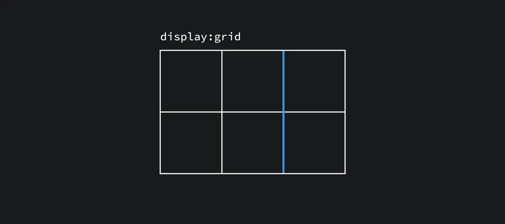

**Грид-ячейка**: пространство между соседними грид-линиями. Единица грид-сетки.


**Грид-полоса**: пространство между двумя соседними грид-линиями. Может быть проще думать о грид-полосе как о ряде или колонке.

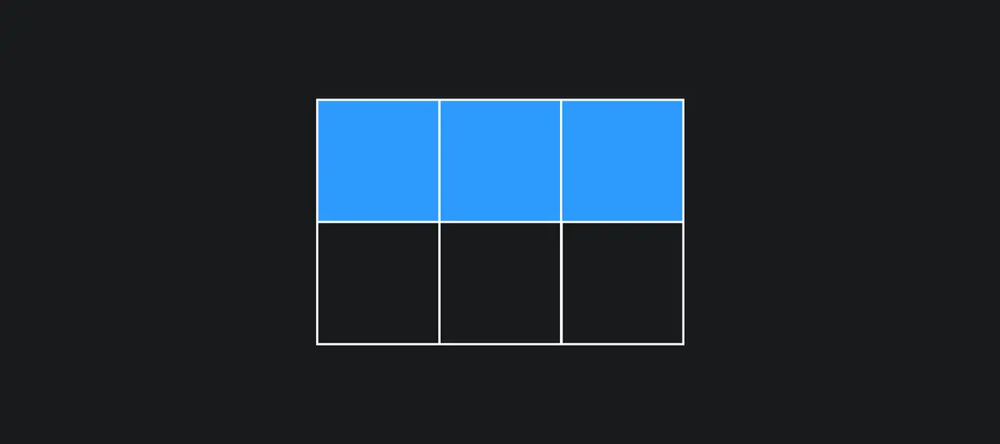

**Грид-область**: область, ограниченная четырьмя грид-линиями. Может состоять из любого количества ячеек как по горизонтали, так и по вертикали.

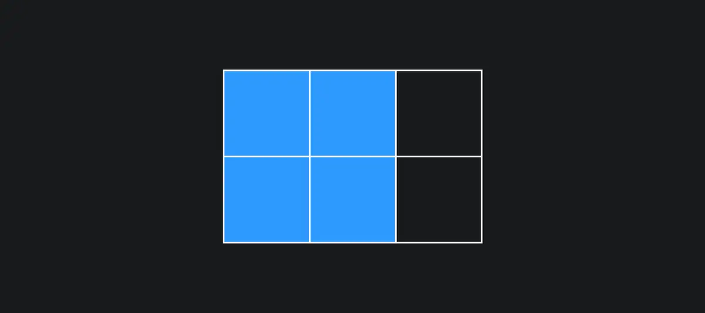

#### [Свойства грид-контейнера](https://doka.guide/css/grid-guide/#svoystva-grid-konteynera)

Если элементу задано свойство `display` со значением `grid`, то такой элемент становится грид-контейнером. Дочерние элементы этого контейнера начинают подчиняться правилам грид-раскладки. Снаружи грид-контейнер ведёт себя как блок.

```css
.container { display: grid; }
```

Практически аналогичное предыдущему значению — за тем исключением, что снаружи грид-контейнер, созданный с помощью `inline-grid`, будет вести себя как строчный элемент.

```css
.container { display: inline-grid; }
```

##### [`grid-template-columns`, `grid-template-rows`](https://doka.guide/css/grid-guide/#grid-template-columns-grid-template-rows)

Свойства, задающие размеры и количество колонок или рядов грид-раскладки соответственно.

```css
.container {
    display: grid;
    /* Будет создано 3 колонки */
    grid-template-columns: 150px auto 40%;
    /* Будет создано 3 ряда */
    grid-template-rows: 250px 10vw 15rem;
}
```

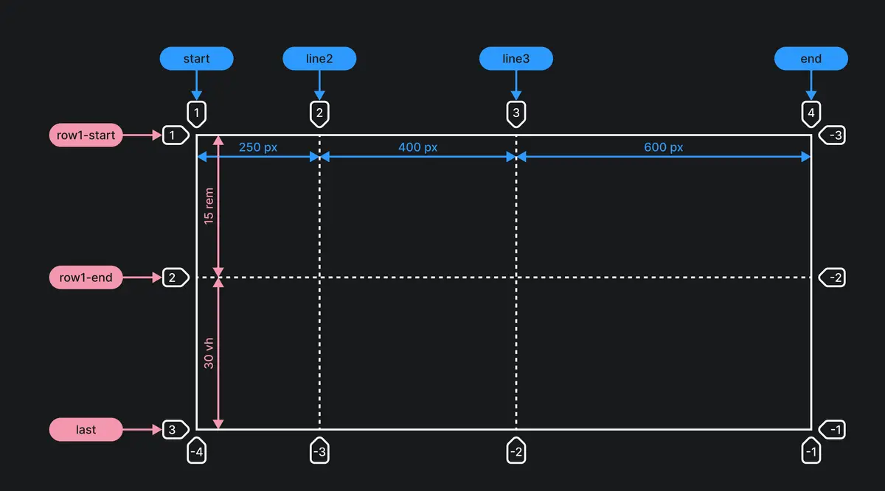

Каждая линия может иметь больше одного имени. Это чем-то похоже на классы в HTML — вы можете задать элементу больше одного класса. Тут аналогичная ситуация. Например, такой код будет совершенно валиден, у второй и третьей грид-линий колонки по два имени:

```css
.container {
    display: grid;
    grid-template-columns: [start] 140px [line2 col2-start] 250px [col2-end end];
    grid-template-rows: [row1-start] 25rem [row1-end] 10vh [last];
}
```

Если нужны одинаковые колонки или ряды, то можно воспользоваться функцией `repeat()`.

Будет создано 3 колонки по 250 пикселей:

```css
.container {
    display: grid;
    grid-template-columns: repeat(3, 250px);
}
```

С появлением гридов у нас появилась и новая единица измерения: `fr`. `fr` (от *fraction* — доля, часть) отвечает за свободное пространство внутри грид-контейнера.

Например, этот код создаст три колонки, каждая из которых будет занимать 1/3 ширины родителя:

```css
.container {
    display: grid;
    grid-template-columns: repeat(3, 1fr);
}
```

Что аналогично записи:

```css
.container {
    display: grid;
    grid-template-columns: 1fr 1fr 1fr;
}
```

Свободное пространство рассчитывается после того, как место отдано всем фиксированным размерам. К примеру, в коде ниже сначала будет создана колонка шириной 200 пикселей, а затем свободное пространство — ширина родителя минус 200 пикселей — будет поделено между остальными колонками. Каждая будет занимать ширину `(100% - 200px) / 2`:

```css
.container {
    display: grid;
    grid-template-columns: 1fr 200px 1fr;
}
```

##### [`auto-fill` и `auto-fit`](https://doka.guide/css/grid-guide/#auto-fill-i-auto-fit)

В тех случаях, когда количество колонок или строк не известно для свойств `grid-template-columns` и `grid-template-rows` можно установить значения `auto-fill` или `auto-fit` в формате:

```css
.container { grid-template-columns: repeat(/* auto-fill или auto-fit */, /* размер колонки */); }
```

Оба эти параметра (`auto-fill` и `auto-fit`) автоматически добавляют в грид-сетку из примера выше колонки. Но эти колонки ведут себя немного по-разному:

- `auto-fill` стремится заполнить колонками всё доступное пространство, а когда элементы заканчиваются, создаёт пустые колонки, равномерно распределяя доступную область между существующими и «виртуальными» колонками.
- `auto-fit` действует похожим образом, но, схлопывает пустые колонки и отдаёт больше места под заполненные.
Аналогично можно использовать для создания рядов.

##### [`grid-auto-columns` и `grid-auto-rows`](https://doka.guide/css/grid-guide/#grid-auto-columns-grid-auto-rows)

Если элементов внутри грид-контейнера больше, чем может поместиться в заданные явно ряды и колонки, то для них создаются автоматические, неявные ряды и колонки. При помощи свойств `grid-auto-columns` и `grid-auto-rows` можно управлять размерами этих автоматических рядов и колонок.

```css
.container {
    display: grid;
    grid-template-rows: 50px 140px;
    grid-auto-rows: 40px;
    gap: 20px;
}
```

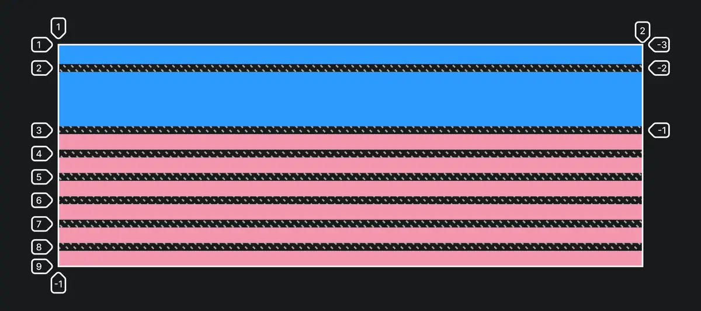

В этом примере создаются два явных ряда размером 50 и 140 пикселей. Элементы, начиная с третьего, в эти два ряда не помещаются, и для них создаются автоматические ряды. При помощи свойства `grid-auto-rows` мы указываем, что автоматические ряды должны иметь размер 40 пикселей.

Можно задавать больше одного значения для автоматических колонок или рядов. Тогда паттерн размера будет повторяться до тех пор, пока не кончатся грид-элементы.

```css
.container {
    display: grid;
    grid-template-columns: 200px 500px;
    grid-auto-columns: 75px 100px 50px;
    grid-auto-flow: column;
    gap: 20px;
}
```

Важно указать при помощи `grid-auto-flow: column`, что элементы должны вставать в колонки, чтобы элементы без контента были видны.

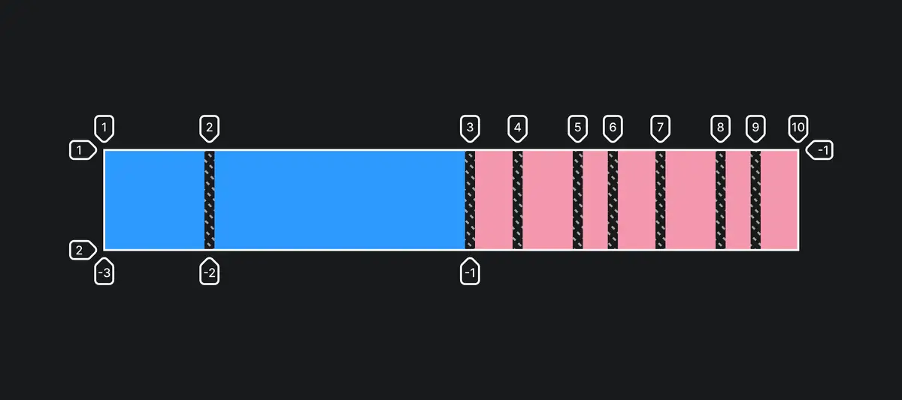

Как видите, автоматически создаются колонки размером 75, 100 и затем 50 пикселей. И так до тех пор, пока элементы не закончатся.

##### [`grid-auto-flow`](https://doka.guide/css/grid-guide/#grid-auto-flow)

Если грид-элементов больше, чем явно объявленных колонок или рядов, то они автоматически размещаются внутри родителя. А вот каким образом — в ряд или в колонку — можно указать при помощи свойства `grid-auto-flow`. По умолчанию значение у этого свойства `row`, лишние элементы будут выстраиваться в ряды в рамках явно заданных колонок.

Возможные значения:

- `row` (значение по умолчанию) — автоматически размещаемые элементы выстраиваются в ряды.
- `column` — автоматически размещаемые элементы выстраиваются в колонки.
- `dense` — браузер старается заполнить дырки (пустые ячейки) в разметке, если размеры элементов позволяют. Можно сочетать с остальными значениями.

Принципы работы этого свойства удобнее всего изучать на примере, когда есть большой блок, который не помещается в одну грид-ячейку.

```css
.container {
    display: grid;
    /* Три колонки */
    grid-template-columns: auto auto auto;
    /* Два ряда */
    grid-template-rows: auto auto;
    /* Автоматическое размещение в ряд */
    grid-auto-flow: row;
    /* Отступы между ячейками */
    gap: 20px;
}

.item3 {
    /* Занимает один ряд и
    растягивается на две колонки */
    grid-column: span 2;
}
```

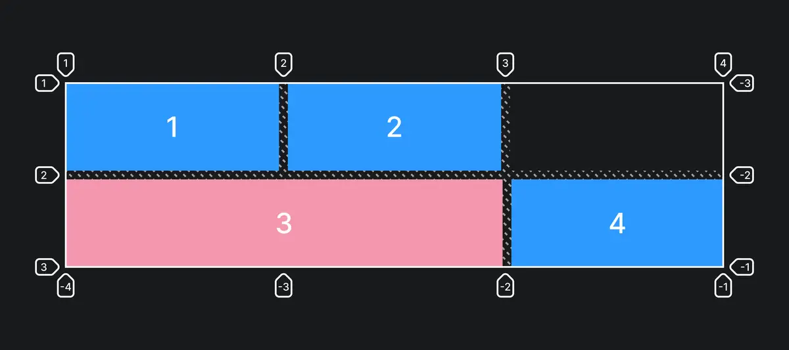

Как видите, третий элемент не поместился в последнюю ячейку первого ряда и был перенесён в следующий ряд. Следующий за ним четвёртый элемент встал в ближайшую доступную ячейку во втором ряду.

Добавим к значению свойства `grid-auto-flow` слово `dense`:

```css
.container {
    /* Автоматическое размещение в ряд */
    grid-auto-flow: row dense;
}
```

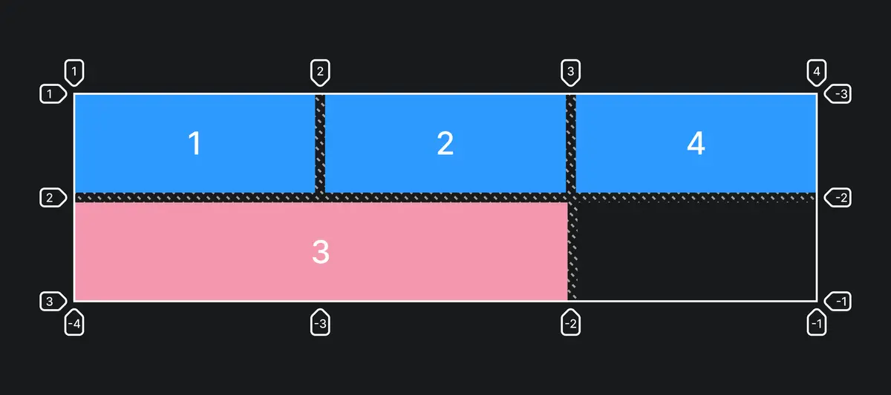

Теперь четвёртый элемент встал в ряд, но занял при этом пустую ячейку в первом ряду. Браузер старается закрыть все дырки в сетке, переставляя подходящие элементы на свободные места.

Посмотрим пример со значением `column`:

```css
.container {
    grid-template-columns: auto auto;
    grid-template-rows: auto auto auto;
    /* Автоматическое размещение в колонку */
    grid-auto-flow: column;
}

.item3 { grid-row: span 2; }
```

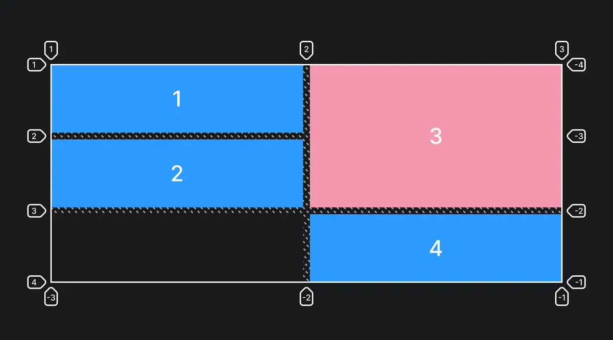

Видим аналогичную картину: третий элемент не поместился в последнюю ячейку первой колонки и встал во вторую колонку. Следующий за ним четвёртый элемент встал ниже во второй колонке.

Добавим `dense` к текущему значению:

```css
.container {
    /* Автоматическое размещение в ряд */
    grid-auto-flow: column dense;
}
```

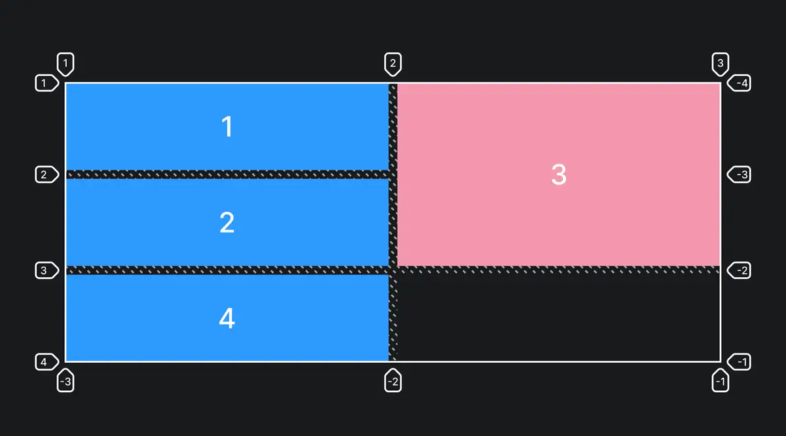

В результате четвёртый элемент занял пустую ячейку в первой колонке.

##### [`grid-template-areas`](https://doka.guide/css/grid-guide/#grid-template-areas)

Позволяет задать шаблон сетки расположения элементов внутри грид-контейнера. Имена областей задаются при помощи свойства `grid-area`. Текущее свойство `grid-template-areas` просто указывает, где должны располагаться эти грид-области.

Возможные значения:

- `none` (значение по умолчанию) — области сетки не задано имя.
- `.` — означает пустую ячейку.
- `<название>` — название области, может быть абсолютно любым словом или даже эмодзи! 🤯
Обратите внимание, что нужно называть каждую из ячеек. Например, если шапка или подвал нашего сайта будут занимать все три существующие колонки, то нужно будет трижды написать названия этих областей. Удобнее всего будет подписывать области в виде некой таблицы. Подобный способ записи чем-то похож на таблицы в Markdown:

```css
.container {
    display: grid;
    grid-template-columns: repeat(3, 500px);
    grid-template-rows: repeat(4, 1fr);
    grid-template-areas:
        "header header header"
        "content content 👾"
        "content content ."
        "footer footer footer";
}

.item1 { grid-area: header; }
.item2 { grid-area: content; }
.item3 { grid-area: 👾; }
.item4 { grid-area: footer; }
```

Обратите внимание, что между строками не ставятся запятые или какие-то другие символы, имена разделяются пробелами. Получится такая раскладка:

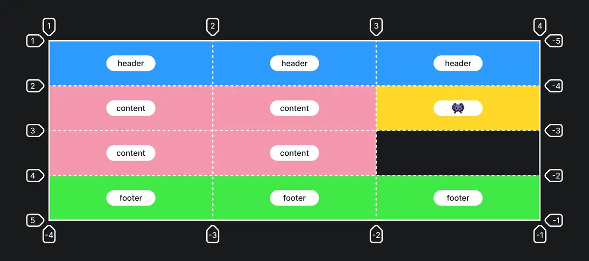

Имена областей должны разделяться пробелами. Это важно, особенно в том случае, если вы хотите расположить две пустых ячейки рядом. Разделите точки пробелами, иначе браузер подумает, что это одна пустая ячейка.

##### [`grid-template`](https://doka.guide/css/grid-guide/#grid-template)

Свойство-шорткат для свойств `grid-template-rows`, `grid-template-columns`. Позволяет записать все значения в одну строку. Главное после этого не запутаться при чтении. Можно прописать все колонки и ряды сразу, разделяя их слэшем `/`. Сперва идут ряды, а затем колонки, не перепутайте!

```css
.container {
    display: grid;
    grid-template: repeat(4, 1fr) / repeat(3, 500px);
}
```

В этом же свойстве можно задавать значение и для свойства `grid-template-areas`, но тогда код превращается в кашу и становится совершенно нечитабельным.

Лучше так?

```css
.container {
    display: grid;
    grid-template:
        [row1-start] "header header header" 25px [row1-end]
        [row2-start] "footer footer footer" 25px [row2-end]
        / auto 50px auto;
}
```

Или так?

```css
.container {
    display: grid;
    grid-template:
        [row1-start] 25px [row1-end]
        [row2-start] 25px [row2-end]
        / auto 50px auto;
    grid-template-areas:
        "header header header"
        "footer footer footer";
}
```

Но техническая возможность есть, выбирать вам! 😉

##### [`row-gap`, `column-gap`](https://doka.guide/css/grid-guide/#row-gap-column-gap)

Задают отступы между рядами или колонками.

```css
.container {
    display: grid;
    grid-template-columns: 1fr 350px 1fr;
    grid-template-rows: repeat(3, 150px);
    /* Отступы между рядами */
    row-gap: 50px;
    /* Отступы между колонками */
    column-gap: 20px;
}
```

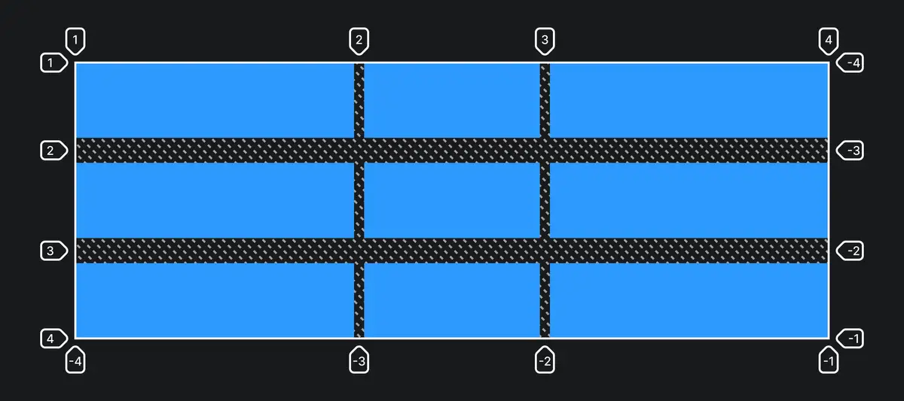

В инспекторе отступы заштриховываются, так их можно отличить от грид-элементов. В этом примере между рядами отступы по 50 пикселей, а между колонками — по 20 пикселей.

##### [`gap`](https://doka.guide/css/grid-guide/#gap)

Шорткат для записи значений свойств row-gap и column-gap. Значения разделяются пробелом:

```css
.container {
    display: grid;
    grid-template-columns: 1fr 350px 1fr;
    grid-template-rows: repeat(3, 150px);
    gap: 50px 20px;
}
```

##### [`justify-content`](https://doka.guide/css/grid-guide/#justify-content)

Свойство, с помощью которого можно выровнять элементы вдоль оси строки. Данное свойство работает, только если общая ширина столбцов меньше ширины контейнера сетки. Другими словами, вам нужно свободное пространство вдоль оси строки контейнера, чтобы выровнять его столбцы слева или справа.

Возможные значения:

- `start` — выравнивает сетку по левой стороне грид-контейнера.

```css
.container {
    display: grid;
    grid-template-columns: repeat(3, 300px);
    gap: 20px;

    justify-content: start;
}
```

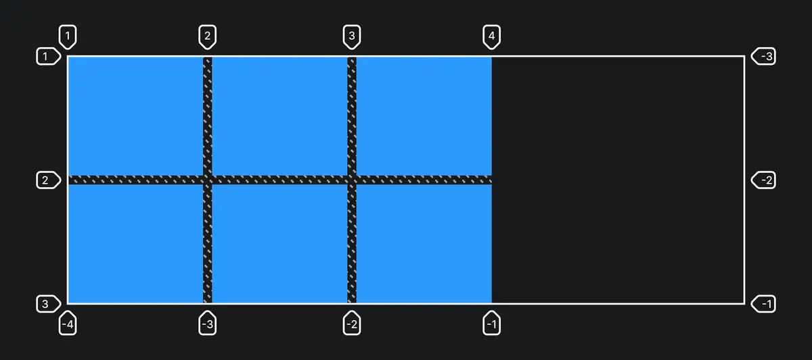

- `end` — выравнивает сетку по правой стороне грид-контейнера.

```css
.container {
    display: grid;
    grid-template-columns: repeat(3, 300px);
    gap: 20px;

    justify-content: end;
}
```

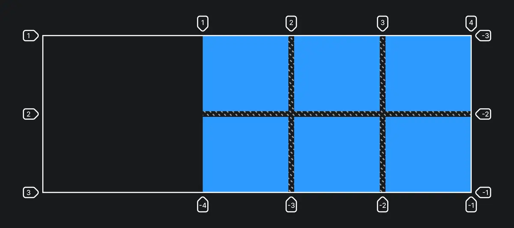

- `center` — выравнивает сетку по центру грид-контейнера.

```css
.container {
    display: grid;
    grid-template-columns: repeat(3, 300px);
    gap: 20px;

    justify-content: center;
}
```

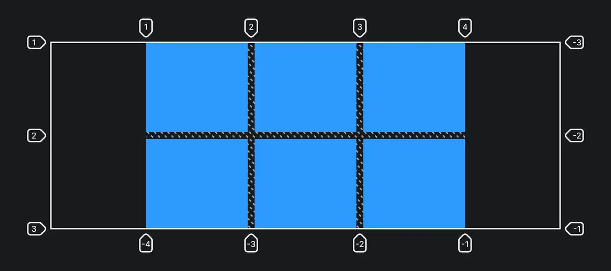

- `stretch` — масштабирует элементы, чтобы сетка могла заполнить всю ширину грид-контейнера.

```css
.container {
    display: grid;
    grid-template-columns: 1fr 1fr 1fr;
    gap: 20px;

    justify-content: stretch;
}
```


- `space-around` — одинаковое пространство между элементами и полуразмерные отступы по краям.

```css
.container {
    display: grid;
    grid-template-columns: repeat(3, 300px);
    gap: 20px;

    justify-content: space-around;
}
```

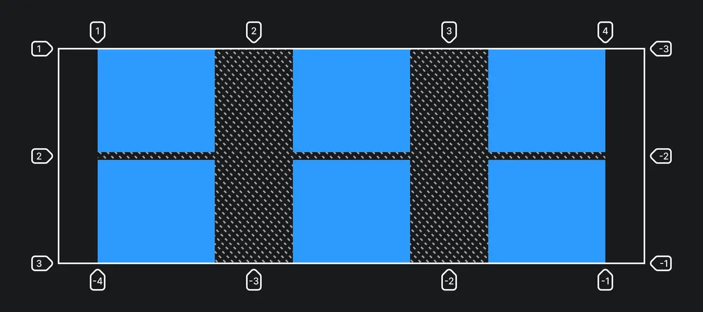

- `space-evenly` — одинаковое пространство между элементами и полноразмерные отступы по краям.

```css
.container {
    display: grid;
    grid-template-columns: repeat(3, 300px);
    gap: 20px;

    justify-content: space-evenly;
}
```

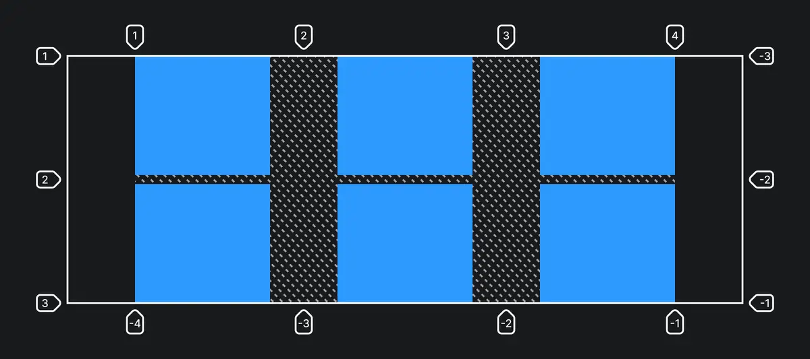

- `space-between` — одинаковое пространство между элементами без отступов по краям.

```css
.container {
    display: grid;
    grid-template-columns: repeat(3, 300px);
    gap: 20px;

    justify-content: space-between;
}
```

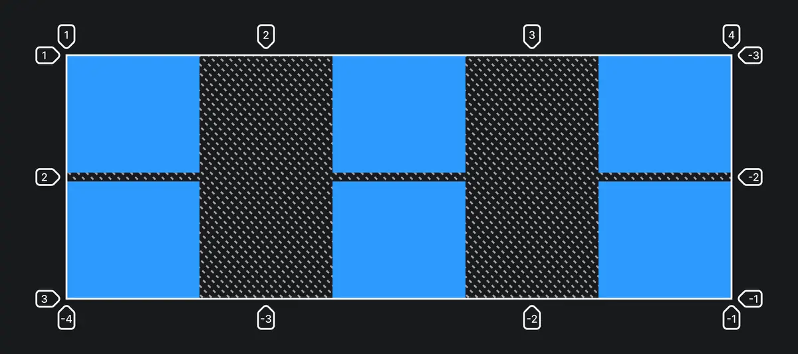

##### [`justify-items`](https://doka.guide/css/grid-guide/#justify-items)

Свойство, с помощью которого задаётся выравнивание грид-элементов по горизонтальной оси. Применяется ко всем элементам внутри грид-родителя.

Возможные значения:

- `start` — выравнивает элемент по начальной (левой для LTR) линии.

```css
.container {
    display: grid;
    grid-template-columns: 1fr 400px 1fr;
    grid-template-rows: repeat(3, 170px);
    gap: 20px;

    justify-items: start;
}

.item { min-width: 300px; }
```

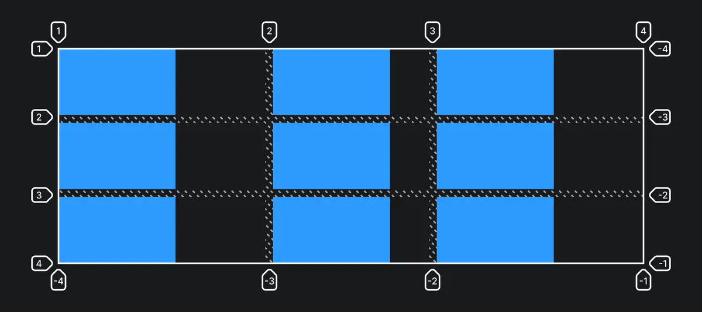

- `end` — выравнивает элемент по конечной (правой для LTR) линии.

```css
.container { justify-items: end; }
```


- `center` — выравнивает элемент по центру грид-ячейки.

```css
.container { justify-items: center; }
```

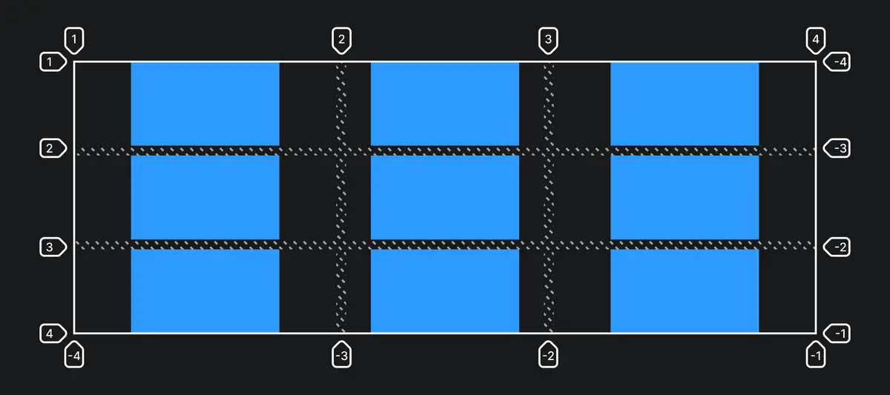

- `stretch` — растягивает элемент на всю ширину грид-ячейки, при условии, что у него не задана фиксированная ширина.

```css
.container { justify-items: stretch; }
```


Можно управлять выравниванием отдельных грид-элементов при помощи свойства `justify-self`.

##### [`align-items`](https://doka.guide/css/grid-guide/#align-items)

Свойство, с помощью которого можно выровнять элементы по вертикальной оси внутри грид-контейнера.

Возможные значения:

- `start` — выравнивает элемент по начальной (верхней) линии.

```css
.container {
    display: grid;
    grid-template-columns: 1fr 400px 1fr;
    grid-template-rows: repeat(3, 170px);
    gap: 20px;

    align-items: start;
}

.item {
  min-height: 100px;
}
```

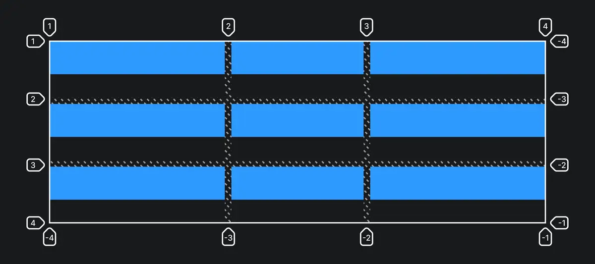

- `end` — выравнивает элемент по конечной (нижней) линии.

```css
.container { align-items: end; }
```

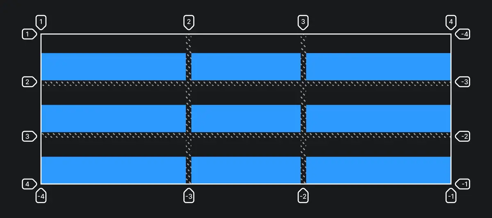

- `center` — выравнивает элемент по центру грид-ячейки.

```css
.container { align-items: center; }
```

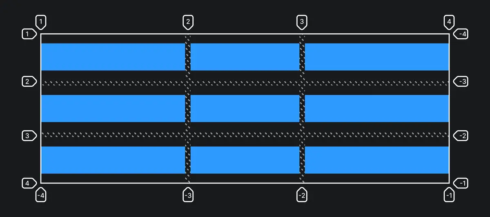

- `stretch` — растягивает элемент на всю высоту грид-ячейки.

```css
.container { align-items: stretch; }
```

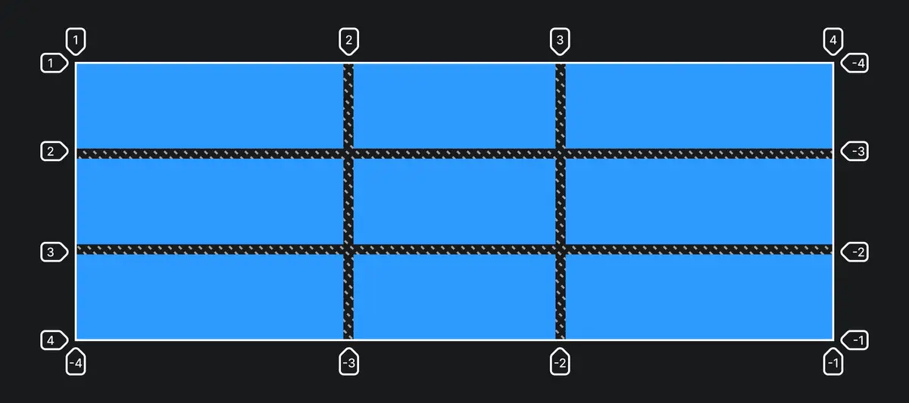

Можно также управлять выравниванием отдельных грид-элементов при помощи свойства align-self.

##### [`place-items`](https://doka.guide/css/grid-guide/#place-items)

Шорткат для указания значений сразу и для `align-items` и для `justify-items`. Указывать нужно именно в таком порядке.

```css
.container {
    display: grid;
    place-items: stretch end;
}
```

##### [`grid`](https://doka.guide/css/grid-guide/#grid)

Мегашорткат, позволяющий задать значения всему и сразу. А конкретно с его помощью можно указать значения для следующих свойств:

- `grid-template-rows;`
- `grid-template-columns;`
- `grid-template-areas;`
- `grid-auto-rows;`
- `grid-auto-columns;`
- `grid-auto-flow.`

Перед тем как соблазниться возможностью расписать всё в одном свойстве, дважды (а то и трижды) подумайте о читабельности кода. Учтите и то, что гриды относительно новая и не такая уж простая технология. Не каждый коллега сможет прочесть этот шорткат.

Возможные значения:

- `none` — значение по умолчанию. Это ключевое слово сбрасывает значения для всех свойств, входящих в этот шорткат.

```css
.container {
    display: grid;
    grid: none;
}

```

Можно указать допустимые значения для шортката `grid-template`:

```css
.container {
    display: grid;
    grid: repeat(4, 150px) / 1fr 200px 1fr;
}
```

В том числе можно указать имена линий:

```css
.container {
    display: grid;
    grid:
        [row1-start] 25px [row1-end row2-start] 25px [row2-end]
        / auto 50px auto;
}
```

Можно задать размеры колонок и рядов. Создадим два ряда и две колонки:

```css
.container {
    display: grid;
    grid: 200px 100px / 30% 30%;
}
```

- `auto-flow` — это ключевое слово даёт браузеру понять, что создавать при необходимости: колонки или ряды.

Если `auto-flow` стоит справа от слэша, то будут создаваться автоматические колонки:

```css
.container {
    display: grid;
    grid: 200px 100px / auto-flow 30%;
}
```

Если `auto-flow` стоит слева от слэша, то будут создаваться автоматические ряды:

```css
.container {
    display: grid;
    grid: auto-flow 30% / 200px 100px;
}
```

`dense` — к ключевому слову `auto-flow` можно добавить `dense`. Это укажет браузеру, что элементы должны стараться заполнить свободные ячейки. Подробнее про работу этого ключевого слова можно почитать в статье про `grid-auto-flow`.

Важно ставить это слово сразу после `auto-flow`:

```css
.container {
    display: grid;
    grid:  auto-flow dense 30% / 200px 100px;
}
```

Ниже будет несколько примеров с блоками кода, которые делают одно и то же, в первом случае через шорткат, во втором — как обычно.

Задаёт размеры и количество колонок и рядов:

```css
.container { grid: 50px 150px / 2fr 1fr; }
.container {
    grid-template-rows: 50px 150px;
    grid-template-columns: 2fr 1fr;
}
```

Задаёт размеры и количество рядов, а также автоматические колонки:

```css
.container { grid: 200px 1fr / auto-flow 200px;}
.container {
  grid-auto-flow: column;
  grid-template-rows: 200px 1fr;
  grid-auto-columns: 200px;
}
```

Задаёт размеры и количество рядов, автоматические колонки и распределение dense:

```css
.container { grid: auto-flow dense 300px / 2fr 3fr; }
.container {
    grid-auto-flow: row dense;
    grid-auto-rows: 300px;
    grid-template-columns: 2fr 3fr;
}
```

Возможны и более сложные комбинации значений этого свойства. Например, можно сразу задать имена областям:

```css
.container {
    grid:
        [row1-start] "header header header" 1fr [row1-end]
        [row2-start] "footer footer footer" 25px [row2-end]
        / auto 50px auto;
}
```

Что соответствует такому коду:

```css
.container {
    grid-template-areas:
        "header header header"
        "footer footer footer";
    grid-template-rows: [row1-start] 1fr [row1-end row2-start] 25px [row2-end];
    grid-template-columns: auto 50px auto;
}
```

#### [Свойства грид-элемента](https://doka.guide/css/grid-guide/#svoystva-grid-elementov)

Важное замечание: свойства `float`, `display: inline-block`, `display: table-cell`, `vertical-align` и `column-*` не дают никакого эффекта, когда применяются к грид-элементам.

##### [`grid-column-start`, `grid-column-end`, `grid-row-start`, `grid-row-end`](https://doka.guide/css/grid-guide/#grid-column-start-grid-column-end-grid-row-start-grid-row-end)

Определяют положение элемента внутри грид-сетки при помощи указания на конкретные направляющие линии.

Возможные значения:

- `<название>` или `<номер линии>` — может быть порядковым номером или названием конкретной линии.
- `<span число>` — элемент растянется на указанное количество ячеек.
- `<span имя>` — элемент будет растягиваться до следующей указанной линии.
- `auto` — означает автоматическое размещение, автоматический диапазон клеток или дефолтное растягивание элемента, равное одному.

```css
.container {
    display: grid;
    grid-template-columns: [one] 1fr [two] 1fr [three] 1fr [four] 1fr [five] 1fr [six];
    grid-template-rows: [row1-start] 1fr [row1-end] 1fr 1fr;
}

.item1 {
    grid-column-start: 2;
    grid-column-end: five;
    grid-row-start: row1-start;
    grid-row-end: 3;
}
```


Элемент разместился по горизонтали от второй грид-линии до линии с названием `[five]`, а по вертикали — от линии с именем `[row1-start]` до линии под номером 3.

```css
.container {
    display: grid;
    grid-template-columns: [first] 1fr [line2] 1fr [line3] 1fr [col4-start] 1fr [five] 1fr [end];
    grid-template-rows: [row1-start] 1fr [row1-end] 1fr [third-line] 1fr [last-line];
}

.item1 {
    grid-column-start: 1;
    grid-column-end: span col4-start;
    grid-row-start: 2;
    grid-row-end: span 2;
}
```


Элемент расположился по вертикали от второй грид-линии и растянулся на две ячейки, а по горизонтали — от первой линии и растянулся до линии с названием `[col4-start]`.

Если не указать значения для свойств `grid-column-end` и `grid-row-end`, то элемент по умолчанию будет размером в одну грид-ячейку.

Элементы могут перекрывать друг друга, накладываться друг на друга. Можно использовать свойство `z-index` для управления контекстом наложения.

##### [`grid-column`, `grid-row`](https://doka.guide/css/grid-guide/#grid-column-grid-row)

Свойства-шорткаты для `grid-column-start`, `grid-column-end` и `grid-row-start`, `grid-row-end` соответственно.

Значения для `*-start` и `*-end` разделяются слэшем.

Можно использовать ключевое слово `span`, буквально говорящее «растянись на столько-то». А на сколько, указывает стоящая за ним цифра.

```css
.item1 {
    grid-column: 3 / span 2;
    grid-row: 3 / 4;
}
```

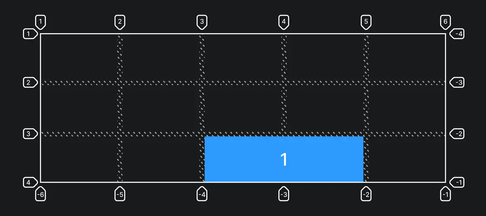

Элемент начинается с третьей линии по горизонтали и растягивается на 2 ячейки. По вертикали элемент начинается от третьей линии и заканчивается у четвёртой линии.

Если опустить слэш и второе значение, то элемент будет размером в одну ячейку.

##### [`grid-area`](https://doka.guide/css/grid-guide/#grid-area)

Двуличное свойство 🧐, которое может как указывать элементу, какую из именованных областей ему нужно занять, так и служить шорткатом для одновременного указания значений для четырёх свойств: `grid-column-start`, `grid-column-end`, `grid-row-start` и `grid-row-end`.

Пример с указанием на именованную область:

```css
.item1 {
    /* Займёт область content внутри грид-сетки */
    grid-area: content;
}
```

А теперь пример с указанием всех четырёх значений в строку. При таком указании значений есть скользкое место: значения указываются в таком порядке: `row-start` / `column-start` / `row-end` / `column-end`, то есть сначала указываем оба начала, а потом оба конца.

```css
.item2 { grid-area: 1 / col4-start / last-line / 6; }
```

##### [`justify-self`](https://doka.guide/css/grid-guide/#justify-self)

С помощью этого свойства можно установить горизонтальное выравнивание для отдельного элемента, отличное от выравнивания, заданного грид-родителю.

Возможные значения аналогичны значениям свойства `justify-items`.

```css
.container { justify-items: stretch;}
.item1 { justify-self: center; }
```

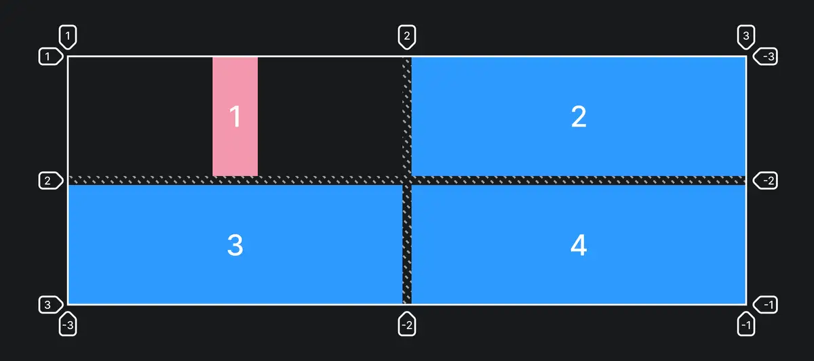

##### [`align-self`](https://doka.guide/css/grid-guide/#align-self)

А это свойство, как нетрудно догадаться, выравнивает отдельный элемент по вертикальной оси. Возможные значения аналогичны значениям свойства `align-items`.

```css
.container { align-items: stretch; }
.item1 { align-self: start; }
```

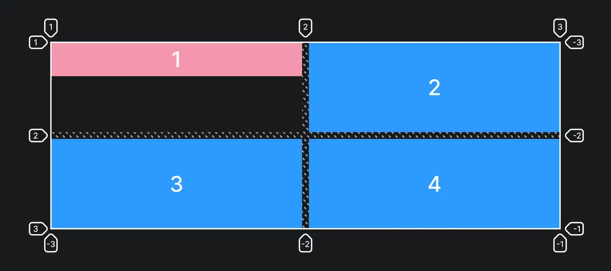

##### [`place-self`](https://doka.guide/css/grid-guide/#place-self)

Шорткат для одновременного указания значений свойствам `justify-self` и `align-self`.

Возможные значения:

- `auto` (значение по умолчанию) — стандартное значение, можно использовать для сброса ранее заданных значений.
- `<align-self> <justify-self>` — первое значение задаёт значение свойству `align-self`, второе значение устанавливает значение свойства `justify-self`. Если указано всего одно значение, то оно устанавливается для обоих свойств. Например, `place-self: center` отцентрирует элемент по горизонтальной и по вертикальной осям одновременно.

#### [Специальные функции и ключевые слова](https://doka.guide/css/grid-guide/#specialnye-funkcii-i-klyuchevye-slova)

Когда вы задаёте размеры колонкам и рядам, вам доступны не только давно известные единицы измерения (`px`, `vw`, `rem`, `%` и так далее), но и очень крутые ключевые слова `min-content`, `max-content` и `auto`. И уже упомянутые единицы измерения `fr`.

Гриды подарили нам ещё одну волшебную функцию, позволяющую одновременно задавать минимальный и максимальный размер — `minmax()`. Например, в случае записи `grid-template-columns: minmax(200px, 1fr);` колонка займёт 1 часть свободного пространства грид-контейнера, но не меньше 200 пикселей.

Ещё одна полезная функция, появившаяся в гридах, это `repeat()`. Сэкономит вам кучу лишних букв и времени.

#### [Анимация свойств](https://doka.guide/css/grid-guide/#animaciya-svoystv)

Для анимации доступны следующие свойства и их значения:

- Значения свойств `gap`, `row-gap`, `column-gap`, указанные в единицах измерения, процентах или при помощи `calc()`.
- Значения свойств `grid-template-columns`, `grid-template-rows`, указанные в единицах измерения, процентах или при помощи функции `calc()` при условии, что анимируются аналогичные значения.

#### Пример

```html
<div class="cart-product">
    <p class="image">Изображение</p>
    <p class="title">Название</p>
    <p class="price">Цена</p>
    <p class="rating">Рейтинг</p>
    <p class="features">Характеристики</p>
    <p class="payment">Оплата</p>
    <p class="description">Описание</p>
    <p class="reviews">Отзывы</p>
    <p class="shipping">Доставка</p>
    <p class="contact">Связь</p>
    <p class="availability">Наличие</p>
    <p class="warranty">Гарантия</p>
    <p class="sizes">Размеры</p>
    <p class="material">Материал</p>
    <p class="related">Сопутствующие</p>
</div>
```

```css
p {
    font-size: 16px;
    font-weight: bold;
    color: black;
    padding: 10px;
    margin: 0;
}

.cart-product {
    display: grid;
    grid-template-columns: repeat(6, 1fr);
    grid-template-rows: repeat(5, 1fr);
    grid-template-areas:
        "image       image       image         title        title    title"
        "image       image       image         price        rating   rating"
        "features    features    features      price        payment  payment"
        "description description description   description  reviews  reviews"
        "shipping    contact     availability  availability warranty sizes"
        "material    material    related       related      related  related";
    gap: 5px;
}
.image { grid-area: image; background-color: #4FC3F7; }
.title { grid-area: title; background-color: #BA68C8; }
.price { grid-area: price; background-color: #FFEB3B; }
.rating { grid-area: rating; background-color: #F48FB1; }
.features { grid-area: features; background-color: #81C784; }
.payment { grid-area: payment; background-color: #66BB6A; }
.description { grid-area: description; background-color: #8BC34A; }
.reviews { grid-area: reviews; background-color: #4DB6AC; }
.shipping { grid-area: shipping; background-color: #FF9800; }
.contact { grid-area: contact; background-color: #42A5F5; }
.availability { grid-area: availability; background-color: #FFEB3B; }
.warranty { grid-area: warranty; background-color: #BA68C8; }
.sizes { grid-area: sizes; background-color: #F48FB1; }
.material { grid-area: material; background-color: #BA68C8; }
.related { grid-area: related; background-color: #FF9800; }
```

[Здесь](https://jsbin.com/mipaveqepu/edit?html,css,output) вы можете посмотреть работу этого кода.

## Домашка

### Download changes

Перед непосредственным выполнением домашней работы необходимо синхронизировать локальный и удаленный репозитории. Для этого скачиваем все изменения из удаленного репозитория с помощью команды:

```bash
git pull
```

Если на этом или последующих этапе возникает вопрос, ошибка или нестандартное поведение программы, пишите мне в личку, прикладывая скрин проблемы/ошибки, постараюсь помочь.

### Для нубиков, которые не сделали на уроке

Внутри блока `main` нужно создать `div` с классами: `cards` и `three-column-grid-container`. Внутри этого `div` нужно создать 7 элементов `article` с классом `card` и произвольным коротким текстом, например `Card` (чтоб не ошибиться, можете использовать это сокращение Emmet: `.cards.three-column-grid-container>(article.card{Card})*7`).

Блок стилизации для объектов с классом `three-column-grid-container` расположите сразу после блоков для классов `one-column-flex-container` и `one-line-flex-container`, а блоки стилизации для классов `cards` и `card` - сразу после блока стилизации для класса `main`.

Добавим стили для класса `card`:
- цвет фона (`background-color`) - один из основных цветов, не тот, который у блоков с классом `main-container`.
- цвет текста (`color`) - один из основных цветов, такой же, как цвет фона у блоков с классом `main-container`.
- внутренние отступы (`padding`) - 20 пикселей.
- сглаживание углов (`border-radius`) - 15 пикселей.

Теперь приступим стилизовать элементы с классом `three-column-grid-container`. Как ясно из названия класса, это будет грид-контейнер, в котором будет 3 колонки элементов:
- отображение в виде сетки грид (`display`).
- отступы между грид-элементами (`gap`) - 20 пикселей (или другое значение, если для других контейнеров уже указывали отличное).
- шаблон грид-колонок (`grid-template-columns`) - нужно сделать три колонки одинаковой ширины, занимающие вместе всю ширину контейнера (используйте функцию `repeat()`).

### Контент карточек (html-разметка)

В каждую карточку нужно добавить следующие объекты:

- `h3` с классом `sub-title` и текстом - короткое (1-2 слова) название товара (можно для всех карточек использовать одно и то же название товара)

- `p` с классом `card-price` и текстом - символ валюты и цена товара, например, `$123` (можно для всех карточек использовать одну и ту же цену товара)

- `img` с классом `img` и источником в виде изображения товара (скачайте из инета, можно для всех карточек использовать одно и то же изображение товара), желательно использовать картинки с прозрачным фоном. Если совсем лень искать, скачайте [эту](./shop/img/computer.png) картинку.

- `p` с классом `txt` и текстом-описанием товара `lorem` - единичной длины (то есть просто `lorem` и жмете `Tab`, можно для всех карточек использовать одно и то же описание товара)

- `a` с классом `btn` и текстом `More` или `Подробнее`

### Стилизация карточек (css)

#### Заголовок

Так как фон карточки изменен, то нужно изменить цвет шрифта всех текстовых элементов внутри карточек, включая заголовок. Используйте тот цвет, который задан в качестве фона для элементов с классом `main-container`.

Дело вкуса, но мне не очень нравится жирный шрифт в названиях карточек, поэтому меняем его (свойство `font-weight`).

Также нужно обозначить имя для грид-области, которую будет занимать заголовок: `grid-area: title;`.

#### Цена

Также, как у заголовка, меняем цвет шрифта.

Размер шрифта поставьте чуть меньше, чем стоит у заголовка (например, у меня заголовок - 28 пикселей, а цена - 24 пикселя).

В качестве имени грид-области укажите `price`.

#### Изображение

Делаем изображение блочным элементом (свойство `display`).

Изображение должно занимать все доступное пространство по ширине (свойство `width`). Если используете разные изображения для разных карточек, то убедитесь, что они одинакового размера, иначе фестко задавайте всем изображениям высоту (это некрасиво, но чо поделать).

В качестве имени грид-области укажите `img`.

#### Описание

Также, как у заголовка, меняем цвет шрифта.

В качестве имени грид-области укажите `txt`.

#### Кнопка

В качестве имени грид-области укажите `btn`.

#### Карточка

Добавьте небольшую тень карточкам (свойство `box-shadow`). Смещение по горизонтали и вертикали - `5px`, размытие - `5px`, цвет - смещенный в серую сторону оттенок цвета, заданного в качестве цвета фона (например, у меня цвет фона - `blueviolet`, а цвет тени - `rgb(143, 114, 170)`).

Меняем отображение карточки на грид (свойство `display`).

Задаем отступы между элементами карточки (свойство `gap`).

Задаем две грид-колонки (свойство `grid-template-columns`), причем первая колонка должна быть в два раза больше, чем вторая.

Задаем размер для одного грид-ряда: `grid-template-rows: 1.5em;` - нужно, чтобы заголовок занимал по высоте полторы строки (сразу эффект не проявится, увидите результат позже).

С помощью свойства `grid-template-areas` распределяем грид области согласно схеме:

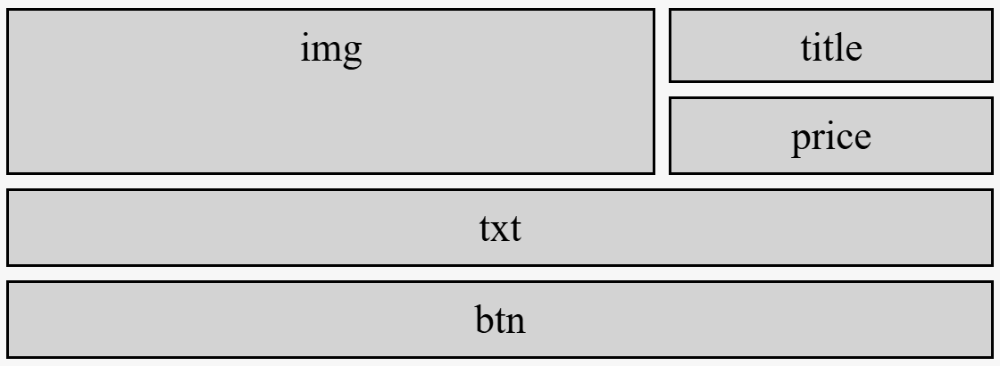

### Результат

Когда/если вы все правильно сделаете, ваша страничка должна быть похожа на что-то подобное:

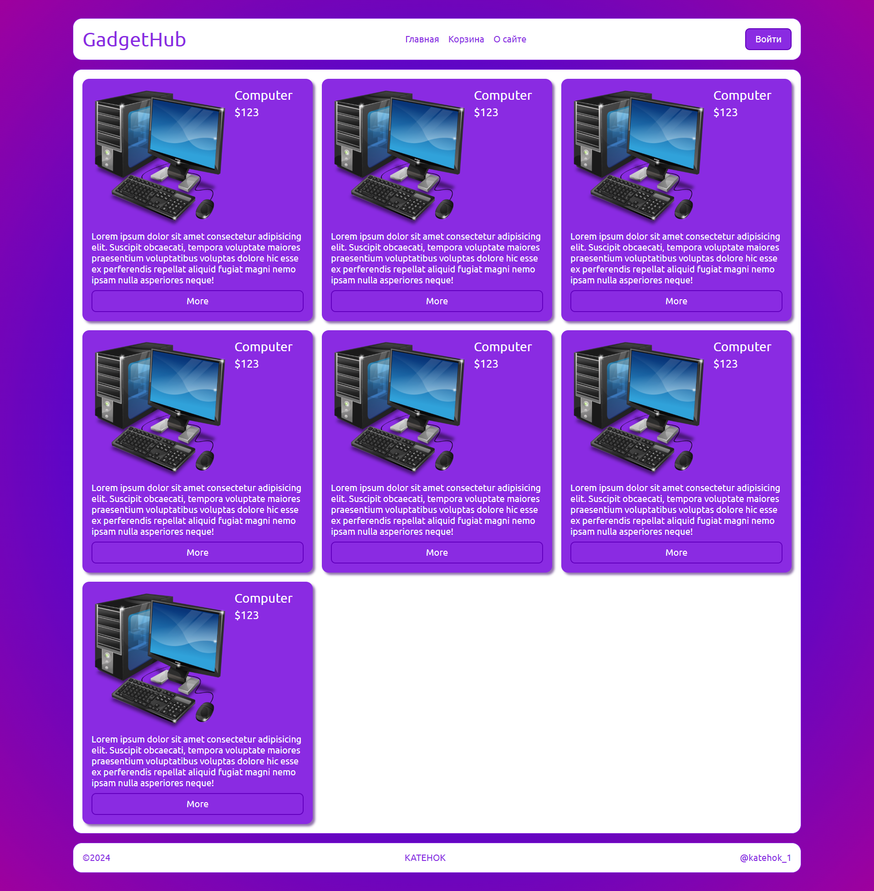

### Pass task
Когда выполнили все задания, добавляете измененные файлы проекта в индекс гита, создаете коммит, отправляете на GitHub:
```bash
# Добавляем измененные файлы в индекс гита (. - добавить все)
git add .

# Создаем коммит на основании изщменений, добавленных в индекс гита, задаем сообщение коммита
git commit -m "Finally done my homework to 2024-12-22"

# Загружаем изменения в удаленный репозиторий на гитхабе
git push
```
После этого скидываете мне в личку ссылку на ваш гитхаб-репозиторий. Если скинете до пятницы 6 часов вечера, то в течение суток гарантированно получите обратную связь с разбором ошибок и предложениями по улучшению.

### Recomendations
- группируйте CSS-селекторы разных объектов вместе, если задаете им одинаковые правила,
- делайте и сдавайте дз как можно раньше, чтобы я успел проверить и дать фидбэк.

#### Всем удачи!