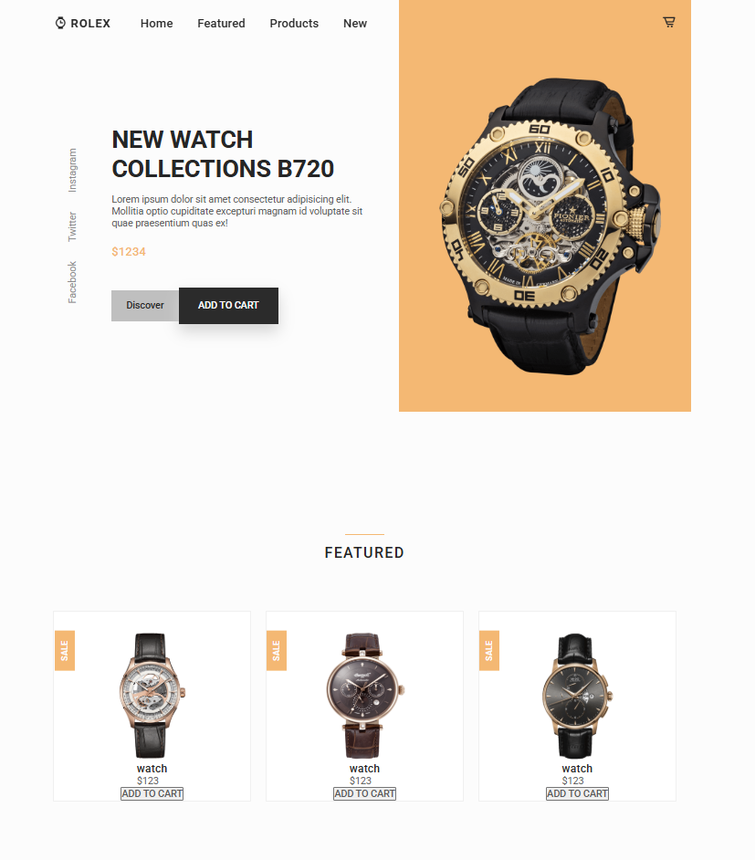
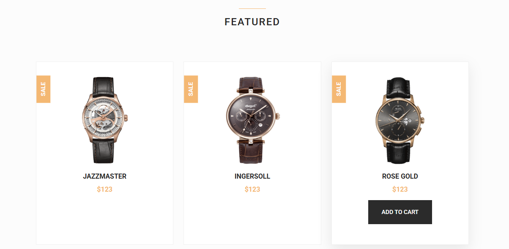

# К 2025-03-02

## Теория

Рекомендую канал [Александр Ламков — Friendly Frontend | YouTube](https://www.youtube.com/@AleksanderLamkov/). Автор снимает крутейшие видосы по фронденд-разработке, объясняя понятным языком различные аспекты.

## Занятие

Сегодня на занятии мы доделали секцию home и начали делать секцию futured сайта rolex-shop.

На данный момент сайт должен у всех выглядеть так:



Если кто-то не успел что-то доделать, можете воспользоваться [моим вариантом](./rolex-shop/).

## Домашка

Сегодняшняя домашка посвящена завершению секции featured.

### Download changes

Перед непосредственным выполнением домашней работы необходимо синхронизировать локальный и удаленный репозитории. Для этого скачиваем все изменения из удаленного репозитория с помощью команды:

```bash
git pull
```

Если на этом или последующих этапе возникает вопрос, ошибка или нестандартное поведение программы, пишите мне в личку, прикладывая скрин проблемы/ошибки, постараюсь помочь.

### `article.featured-card`

Для начала, добавьте флекс-элементам внутри тэга `article` с классом `featured-card` вертикальный отступ размером `1rem` (`row-gap`) и длительность перехода - `.3s` (`transition-duration`).

Для этого же элемента добавьте эффект наведения:
- внутренний нижний отступ - `3rem` (`padding-bottom`);
- тень:
    + смещение по горизонтали - `0`;
    + смещение по вертикали - `12px`;
    + размытие - `32px`;
    + цвет - `hsla(0, 0%, 20%, .1)`.

### `article.featured-card-data`

Для блока `div` с классом `featured-card-data` добавьте свойства:
- флекс-контейнер (`display`);
- основная флекс-ось - вниз (`flex-direction`);
- центрирование элементов по побочной оси (`align-items`);
- вертикальные отступы между элементами контейнера зармером `.75rem` (`row-gap`).

### `h3.featured-card-title`

Для заголовков карточек измените текст:
1) `jazzmaster`;
2) `ingersoll`;
3) `rose gold`.

С помощью CSS:
- приведите текст этих заголовков к верхнему регисру (`text-transform`);
- размер шрифта - `1rem`;
- жирное начертание (`font-weight`, значение возьмите из переменной).

### `span.featured-card-price`

Для блока с ценой часов добавьте CSS-свойства:
- размер шрифта - `1rem`;
- жирное начертание (`font-weight`, значение возьмите из переменной);
- цвет текста - из переменной `--first-color`.

### `button.featured-card-button`

С помощью CSS стилизуйте кнопку добавления часов в корзину:
- уберите рамку (`border`);
- цвет фона - из переменной `--button-color`;
- внутренние отступы:
    + вертикальные - `.5rem`;
    + горизонтальные - `2rem`;
- размер шрифта - `.875rem`;
- средняя жирность начертания (`font-weight`, значение возьмите из переменной);
- цвет текста - белый;
- длительность перехода - `.3s` (`transition-duration`);
- смещение по вертикали на `-1rem` (`transform`)
- полная прозрачность (`opacity`).

Сделайте эффект наведения на `article.featured-card`, чтобы менялись свойства кнопки `button.featured-card-button` (используйте составной селектор: `.featured-card:hover .featured-card-button`):
- вертикальные внутренние отступы - `1.25rem` (`padding-block`);
- непрозрачность (`opacity`);
- отмена смещения по вертикали (`transform`).

Сделайте эффект наведения на кнопку (`button.featured-card-button`): цвет фона меняется на значение из переменной `--button-color-alt`.

### Результат

Если вы все правильно сделали, раздел `featured` должен вы глядеть примерно так:



Если же что-то не получится или возникнут вопросы, пишите в личку, удачи)

### Pass task
Когда выполнили все задания, добавляете измененные файлы проекта в индекс гита, создаете коммит, отправляете на GitHub:
```bash
# Добавляем измененные файлы в индекс гита (. - добавить все)
git add .

# Создаем коммит на основании изменений, добавленных в индекс гита, задаем сообщение коммита
git commit -m "Finally done my homework to 2025-03-02"

# Загружаем изменения в удаленный репозиторий на гитхабе
git push
```
После этого скидываете мне в личку ссылку на ваш гитхаб-репозиторий. Если скинете до пятницы 6 часов вечера, то в течение суток гарантированно получите обратную связь с разбором ошибок и предложениями по улучшению.

**Делайте и сдавайте дз как можно раньше, чтобы я успел проверить и дать фидбэк.**

**Всем удачи!**