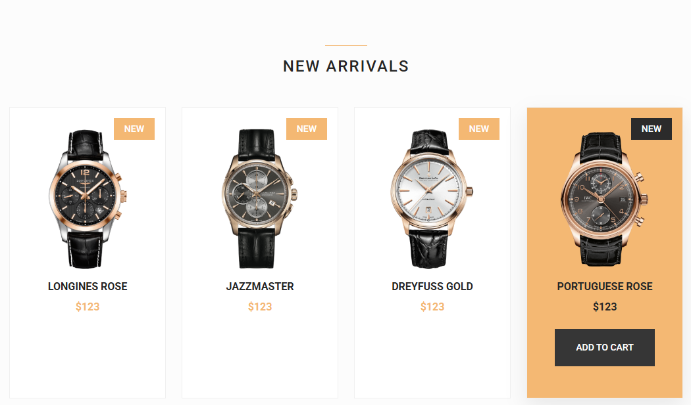
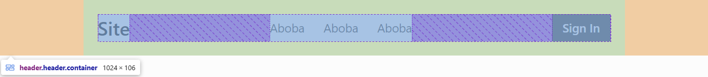
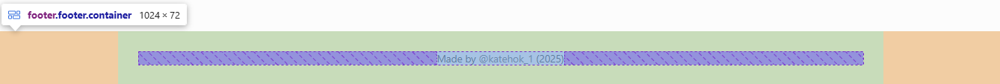
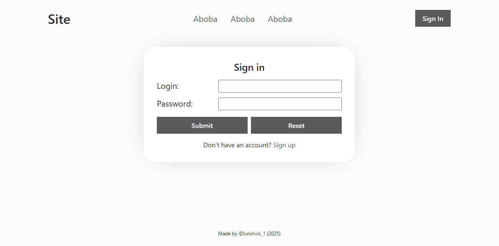
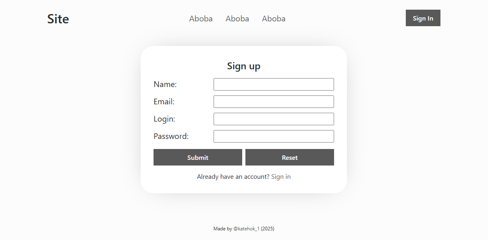

# К 2025-03-23

## Теория

Рекомендую канал [Александр Ламков — Friendly Frontend | YouTube](https://www.youtube.com/@AleksanderLamkov/). Автор снимает крутейшие видосы по фронденд-разработке, объясняя понятным языком различные аспекты.

### [Медиаконтент](https://youtu.be/6PL2TqBdz0I?si=Wqab0BFNpalwQivm)

Переписывать инфу не вижу смысла, так что смотрим видос по ссылке в заголовке и читаем статьи:
- [`video`](https://doka.guide/html/video/);
- [`audio`](https://doka.guide/html/audio/);
- [`iframe`](https://doka.guide/html/iframe/).

### [Формы](https://youtu.be/_in4LAdxAUA?si=kVrUu5Dabk1NwiIl)

Переписывать инфу не вижу смысла, так что смотрим видос по [этой](https://youtu.be/ScPhhvz1z5Q?si=5zm2X_xGLNnh1GGg) ссылке, а также по ссылке в заголовке, ну и конечно же читаем статьи:
- [`form`](https://doka.guide/html/form/);
- [`fieldset`](https://doka.guide/html/fieldset/);
- [`legend`](https://doka.guide/html/legend/);
- [`input`](https://doka.guide/html/input/);
- [`label`](https://doka.guide/html/label/).

## Занятие

Сегодня на занятии мы познакомились с тэгами медиаконтента (`video`, `audio`, `iframe`), а также с формами.

Если кто-то не успел что-то доделать, можете воспользоваться [моим вариантом](./test/).

## Домашка

Сегодняшняя домашка состоит из двух этапов: создание секции new и страничек авторизации и регистрации.

### Download changes

Перед непосредственным выполнением домашней работы необходимо синхронизировать локальный и удаленный репозитории. Для этого скачиваем все изменения из удаленного репозитория с помощью команды:

```bash
git pull
```

Если на этом или последующих этапе возникает вопрос, ошибка или нестандартное поведение программы, пишите мне в личку, прикладывая скрин проблемы/ошибки, постараюсь помочь.

### Секция `new`

В этом задании необходимо создать и стилизовать секцию `new`.

#### `rolex-shop/index.html`

Сразу после секции `testimonial` создайте секцию с классами: `container`, `section` и `new`, а также id-шником `new`.

Внутри этой секции создайте заголовок второго уровня с классом `section-title` и содержимым: `new arrivals`.

После заголовка создайте div-контейнер с классом `new-cards`, внутри которого создайте 4 тэга статьи с классом `new-card`.

Каждая статья должна содержать:
- тэг `span` с классом `new-card-tag` и содержимым: `new`;
- тэг `img` с классом `new-card-img` и источником: `new$.png` - где вместо символа доллара - номер карточки (от 1 до 4);
- тэг `div` с классом `new-card-info` и содержимым:
    + заголовок 3 уровня с классом `new-card-title` и содержимым:
        1. `longines rose`;
        2. `jazzmaster`;
        3. `dreyfuss gold`;
        4. `portuguese rose`;
    + тэг `span` с классом `new-card-price` и содержимым: `$123` (или любое другое 3-4-значное число);
- кнопка с классами: `button` и `new-card-button` - и содержимым: `add to cart`.

#### `rolex-shop/main.css`

Для селектора по классу `new-cards` превратить объект в флекс-контейнер, у всех кроме последнего флекс-элементов которого существует внешний правый отступ в `24` пикселя (используйте [псевдоклассы](https://doka.guide/css/pseudoclasses/)).

Для статей с классом `new-card`:
- превратить в флекс-контейнер;
- основная флекс-ось направлена вертикально вниз;
- флекс-элементы центрированы вдоль поперечной оси;
- установлено относительное позиционирование;
- внутренний внешний отступ - `2rem`;
- объекты, переполняющие контейнер, скрыты ([`overflow`](https://doka.guide/css/overflow/?ysclid=m8brg8yrdh701866647));
- ширина - `100%`;
- белый цвет фона;
- однопиксельная сплошная рамка, цвет - из переменной `--border-color`;
- длительность перехода - `.3s`.

При наведении курсора на статьи с классом `new-card` у них:
- цвет фона меняется на значение из переменной `--first-color`;
- появляется легкая тень: `0 12px 32px hsla(0, 0%, 20%, .1)`;
- внутренние отступы:
    + верхний - `2rem`;
    + нижний - `3rem`.

Для объекта метки с классом `new-card-tag`:
- абсолютное позиционирование;
- смещение по вертикали - `1rem` (`top`);
- смещение по горизонтали - `1rem` (`right`);
- цвет фона - из переменной `--first-color`;
- внутренние отступы:
    + вертикальные - `.5rem`;
    + горизонтальные - `1rem`;
- белый цвет текста;
- все буквы - в верхнем регистре;
- размер шрифта - `.875rem`;
- средняя жирность шрифта (из переменной `--fw-medium`);
- длительность перехода - `.3s`.

При наведении курсора мыши на тэг с классом `new-card` у объекта `.new-card-tag` внутри него цвет фона меняется на значение из переменной `--button-color`.

Для картинок с классом `new-card-img`:
- высота - `215px`;
- внешний нижний отступ - `1rem`.

Для контейнера с классом `new-card-info`:
- флекс-контейнер;
- основная флекс-ось направлена вертикально вниз;
- флекс-элементы центрированы по поперечной оси;
- время перехода - `.3s`.

При наведении курсора мыши на тэг с классом `new-card` у объекта `.new-card-info` внутри него появляется внешний нижний отступ в `1.5rem`.

Для заголовка с классом `new-card-title`:
- размер шрифта - `1rem`;
- внешний нижний отступ - `.75rem`;
- все буквы в верхнем регистре;
- жирный шрифт (из меременной `--fw-bold`).

Для цены товара с классом `new-card-price`:
- размер шрифта - `1rem`;
- цвет текста - из переменной `--first-color`;
- жирный шрифт (из меременной `--fw-bold`);
- длительность перехода - `.3s`.

При наведении курсора мыши на тэг с классом `new-card` у объекта `.new-card-price` внутри него цвет текста меняется на `hsl(0, 0%, 15%)`.

Для цены товара с классом `new-card-button`:
- размер шрифта - `.875rem`;
- белый цвет текста;
- внутренние отступы:
    + вертикальные - `1.25rem`;
    + горизонтальные - `2rem`;
- цвет фона - из переменной `--button-color`;
- рамка отсутствует;
- смещение по вертикали на `-1rem` ([`transform`](https://doka.guide/css/transform/));
- полная прозрачность ([`opacity`](https://doka.guide/css/opacity/)).

При наведении на эту кнопку у нее цвет фона меняется на значение из переменной `--button-color-alt`.

При наведении курсора мыши на тэг с классом `new-card` у объекта `.new-card-button` внутри него:
- отменяется смещение по вертикали;
- кнопка перестает быть прозрачной.

#### Результат

Если вы все правильно сделаете, то у вас получится что-то вроде:



### Авторизация/регистрация

В этом задании нужно создать две стилизованные странички для форм авторизации и регистрации.

#### Подготовка

В папке `test/` создайте два файла: `2025-03-23-login.html` и `2025-03-23-register.html`, а также папку `css/`, в которую поместите файл `2025-04-23-login.css`.

У вас должна получиться такая струтура папок:
- `test/`:
    + `2025-03-23-login.html`
    + `2025-03-23-register.html`
    + `css/`:
        - `2025-04-23-login.css`
    + `video/`
    + ...

##### `test/2025-03-23...html`

В созданных html-файлах создайте базовую струтуру (`!` - сокращение Emmet). При желании поменяйте в тэге `title` заголовок на соответствующий странице. Подключите созданный css-файл в оба html-документа.

Тэгу `body` добавьте класс `body`

##### `test/css/2025-03-23-login.css`

Определим css-переменные в блоке стилей для селектора `:root`:
```css
:root {
    --ff-base: 'Segoe UI', Tahoma, Geneva, Verdana, sans-serif;
    
    --fw-normal: 400;
    --fw-medium: 500;
    --fw-bold: 700;

    --fs-base: 16px;

    --width-base: 1024px;

    --color-dark: #2b2b2b;
    --color-dark-alt: #363636;
    --color-grey: #595959;
    --color-grey-alt: #8c8c8c;
    --color-light: #fcfcfc;
    --color-light-alt: #fff;
    --color-bright: #ffb566;

    --link-color: var(--color-grey);
    --link-color-alt: var(--color-grey-alt);

    --btn-color: var(--color-light);
    --btn-color-alt: var(--color-grey);

    --transition-duration: .2s;
}
```

В добавьте обнуление отступов всем объектам, а также заддайте для них `box-sizing: border-box;`.

Для тэга `html` добавьте семейство шрифтов из переменной `--ff-base`, размер шрифта - из переменной `--fs-base`, цвет фона - из переменной `--color-light`, а цвет шрифта - из переменной `--color-dark`.

Для тэгов: `a`, `input`, `textarea`, `select` и `button` - добавьте наследование свойств `font` и `color`.

Для тэгов ненумерованных списков уберите отображение маркеров.

Для тэгов заголовков всех уровней установите цвет текста - из переменной `--color-dark`, а жирность - из переменной `--fw-medium`.

Добавьте стилизацию для утилитарного класса `visually-hidden`, используемого для визуального скрытия объектов:
```css
.visually-hidden {
    position: absolute      !important;
    width: 1px              !important;
    height: 1px             !important;
    margin: -1px            !important;
    border: 0               !important;
    padding: 0              !important;
    white-space: nowrap     !important;
    clip-path: inset(100%)  !important;
    clip: rect(0 0 0 0)     !important;
    overflow: hidden        !important;
}
```

Добавьте стилизацию для селектора по классу `link`. Время перехода из переменной `--transition-duration`, уберите нижнее подчеркивание, цвет текста - из переменной `--link-color`, при наведении курсора цвет текста меняется на `--link-color-alt` и появляется нижнее подчеркивание.

Добавьте стилизацию для объектов с классом `.btn`. Внутренние оступы: вертикальные - `.5rem`, горизонтальные - `1rem`. 2-пиксельная сплошная рамка цвета из переменной `--btn-color-alt`. Убрать подчеркивание текста. Каждое новое слово начинается с буквы в верхнем регистре. Жирность текста - средняя (из переменной `--fw-medium`). Размер шрифта - `1rem`. Длительность перехода - из переменной `--transition-duration`. Цвет фона - из переменной `--btn-color-alt`, цвет текста - из `--btn-color`. Эффект наведения: значения цветов фона и текста меняются местами.

Добавьте стилизацию для утилитарного класса `container`: ширина - из переменной `--width-base`, центрирование при помощи [`margin-inline`](https://doka.guide/css/margin/) и внутренние отступы размером в `1.5rem`.

#### header

Создадим шапку сайта.

Внутри `body` добавьте тэг `header` с классами: `header` и `container`.

Внутри `header` создайте:
- ссылку с классом `header-logo` и содержимым - `Site`
- тэг навигации с классом `header-nav`, внутри которого ненумерованный список с классом `nav-list` и тремя элементами с классом `nav-list-item`, внутри которых - ссылки с классами: `nav-link` и `link` - и содержимым `Aboba` (или любой другой текст).
- тэг ссылки с классами: `btn` и `header-btn`, в атрибуте `href` - относительный путь до файла `2025-03-23-login.html`.

Стилизуйте шапку сайта таким образом, чтобы она выглядела примерно так:



#### footer

Создадим подвал сайта.

После `header` в html-файле сделайте отступ (потом там будет `main`) и создайте объект `footer` с одноименным классом. Внутри `footer` поместите объект параграфа с классом `footer-info` и содержимым `Made by tglink (2025)`, где вместо `tglink` подставьте объект ссылки с классами: `footer-link` и `link` - и содержимым - вашим ников в ТГ, при клике по ссылке должна открываться новая вкладка с последующим переходом на ваш профиль в ТГ.

Стилизуйте подвал, чтобы он выглядел примерно так:



#### main

Создадим основную часть сайта для обеих страниц.

Для начала, после `header` до `footer` создайте тэг `main` с классами: `main` и `container`.

Сразу растяните `body` по высоте на весь экран (`min-height`), сделайте его флекс-контейнером с основной флекс-осью, направленной вниз. А сам же объект `main` должен занять максимум свободного места внктри `body` ([`flex-grow`](https://doka.guide/css/flex-grow/)).

Внутри `main` добавьте заголовок первого уровня с классом `visually-hidden` и содержимым `login` или `sign up` - соответственно.

После заголовка добавьте тэг формы с классом `form` и методом `post`.

Внутри формы добавьте заголовок второго уровня с классом `form-title` и содержимым: `Sign in` - в login-файле, `Sign up` - в register файле.

После заголовка добавьте div-контейнер с классом `form-fields`. Внутри него создайте 2 div-блока с классом `form-field`, внутри каждого из них - 2 элемента:
- `label` с классом `input-label`, атрибут `for` имеет значение `login` или `password`, содержимое - `Login:&nbsp;` или `Password:&nbsp;`;
- `input` с классом `input`, типом `text` или `password`, именем `login` или `password` и идентификатором `login` или `password`.

После блока `.form-fields` - div-объект с классом `form-controllers`, внутри которого - две кнопки с типами `submit` или `reset`, классами: `btn` и `form-btn` - и содержимым: `submit` (отправить) или `reset` (сбросить).

После блока `.form-controllers` добавьте параграф с классом `form-addition` и содержимым, зависящим от текущего html-файла:
- `Don't have an account? Sign up` - в login-файле, фрагмент `Sign up` - ссылка с классами: `form-addition-link` и `link`, ведущая на страницу регистрации;
- `Already have an account? Sign in` - в register-файле, фрагмент `Sign in` - ссылка с классами: `form-addition-link` и `link`, ведущая на login-страницу.

На этом заканчивается общая часть обоих html-файлов.

##### `2025-03-23-register.html`

Внутри объекта `.form-fields` до полей логина и пароля создайте такие же два поля для имени пользователя и его почты - соответственно.

Их лэйблы:
- содержимое: `Name:&nbsp;` или `Email:&nbsp;`;
- `for`: `name` или `email`;
- класс: `input-label`.

Инпуты:
- тип: `text` или `email`;
- имя: `name` или `email`;
- индекс: `name` или `email`;
- класс: `input`.

##### `css/2025-03-23-login.css`

Стилизуйте формы, чтобы они выглядели примерно так:


#### Результат

Если вы все правильно сделали, то login-страничка должна выглядеть примерно так:



В то же время, register-страничка должна выглядеть примерно так:



### Pass task
Когда выполнили все задания, добавляете измененные файлы проекта в индекс гита, создаете коммит, отправляете на GitHub:
```bash
# Добавляем измененные файлы в индекс гита (. - добавить все)
git add .

# Создаем коммит на основании изменений, добавленных в индекс гита, задаем сообщение коммита
git commit -m "Finally done my homework to 2025-03-23"

# Загружаем изменения в удаленный репозиторий на гитхабе
git push
```
После этого скидываете мне в личку ссылку на ваш гитхаб-репозиторий. Если скинете до пятницы 6 часов вечера, то в течение суток гарантированно получите обратную связь с разбором ошибок и предложениями по улучшению.

**Делайте и сдавайте дз как можно раньше, чтобы я успел проверить и дать фидбэк.**

**Всем удачи!**